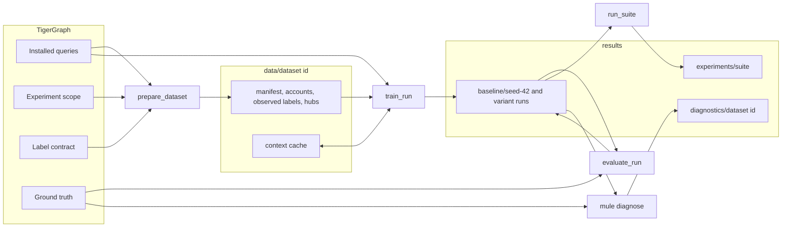

# Architecture

How the code is organised, how data flows from TigerGraph to `results/`, and the
decisions that shaped it, each with its reason. The guides in `docs/how-to/` say how to
use it, `docs/reference/` what each part holds, and `docs/explanation/` why the model and
its evaluation work as they do.

## The system

One model, `TGAT`, trains on one TigerGraph graph through REST: TigerGraph filters each
account's history by time and by experiment partition, computes its features and returns
a bounded pool of candidate neighbours; the client resamples a fan-out, assembles
tensors and trains with a non-negative positive-unlabelled loss on the mules the graph
reveals. Everything is driven by one console script, `mule`, with built-in settings, plus
a script for the control experiments.



1. **Install.** `mule install` installs the queries of `gsql/queries/` and
   `gsql/evaluation/` whose text differs, adds the scope vertex type if it is missing, and
   then drops the retired query names. A preparation that connects (`mule train`, `mule
   diagnose` or the experiments script, when no ready dataset exists) installs the same
   way and drops nothing ([Queries](reference/queries.md#installation)).
2. **Scope and reveal.** On a fresh graph the first preparation creates the frozen
   experiment scope (ownership groups partitioned into train, validation and test) and
   reveals the mules a bank would have discovered, into the graph's label contract
   ([Label reveal](explanation/label-reveal.md)).
3. **Prepare.** `pipeline.prepare.prepare_dataset` pages the scope population into
   label-blind seed reservoirs plus the revealed positives, resolves the cutoffs and
   builds the hub registry into `data/<dataset id>/`. Contexts are not prepared: training
   requests them.
4. **Train.** `pipeline.train.train_run` checks the graph against the dataset's frozen
   source, opens a context source (memory, then the dataset's disk cache, then
   TigerGraph), and trains into `results/<variant>/seed-<n>/`: the selected model, proxy
   predictions, metrics, history, figures and `report.md`.
5. **Audit.** `pipeline.evaluate.evaluate_run` reads the ground truth once and audits the
   frozen model on validation and test into the run's `audit/`.
6. **Compare and study.** `experiments.runner.run_suite` trains, audits and compares
   variants over seeds into `results/experiments/<suite>/`; `mule diagnose` studies the
   dataset into `results/diagnostics/<dataset id>/`.
7. **Report.** `reporting` draws every figure and `report.md` from saved files only, so
   `mule report` redraws any of them offline.

## Layers

The package `mule_pattern_learner` is a stack of layers. A module imports only from
layers below it, and modules separated by `|` are independent of each other:

```
cli                                              entry point
experiments                                      the control experiments
pipeline                                         composition root: the only place adapters are built
diagnostics                                      the diagnostic study, on its own ports
training | evaluation | reporting | tigergraph   use cases, figures, the TigerGraph adapter
inference                                        the saved model, the one scoring loop
batching                                         contexts to the model's inputs
data | sampling | model                          dataset, ports and contexts; neighbour sampling; nn modules
runtime                                          device, worker pool, progress lines
artifacts | metrics                              file schemas; pure metrics
config | paths                                   the built-in run; the filesystem layout
contract                                         definitions shared with GSQL
(reference, testing, __main__: outside the stack)
```

| Package | Responsibility |
|---|---|
| `contract` | What the GSQL and the client share, with no I/O and no torch: query names, `CONTEXT_CONTRACT` and the retired names (`server`), the graph's types, relations and splits (`graph_schema`), the training feature groups (`feature_groups`) and the analytics ones (`analytics_features`), the sampler plan, every numeric bound (`bounds`), the time basis, fingerprints, clocks, the reveal's draws and the frozen salts |
| `config`, `paths` | The run's settings as frozen dataclasses, `DEFAULT_CONFIG` the built-in run; where datasets and results go and the name of every file |
| `artifacts`, `metrics` | The column schemas and reading and writing of every file, with the one atomic write and file digest; pure ranking metrics, curves, review budgets and bootstrap intervals |
| `runtime` | The device and determinism, the one bounded worker pool, and `emit`, the one structured output line |
| `data` | The read ports, the seed reservoirs, observed labels, the hub registry, the manifest and dataset id, preparation, and the context source with its cache tiers |
| `sampling` | Candidate tables and the torch and cuGraph subset samplers |
| `model` | The torch modules (`TGAT`, `SummaryMLP`), the nnPU loss and the model builder; it imports only `contract` and `config` |
| `batching` | Contexts to tensors: feature matrices, pool counts, the device-side Fourier basis, batch limits and assembly |
| `inference` | `model.pt` (`SavedModel`), the one scoring loop (`predictor`), rejection limits and scoring arbitrary accounts |
| `training` | The trainer and its schedule, objective, weight average, resume state, history and summary |
| `evaluation` | The truth port, the audit sample and the ground-truth audit |
| `reporting` | Every figure and `report.md`, from saved files only; the only package that imports matplotlib |
| `tigergraph` | The only code that speaks REST or GSQL: the connection, the retrying executor, the installer, the query renderer and one adapter per port |
| `pipeline` | The use cases the commands run (prepare, train, evaluate, score, check, and the study with its graph reads), and the only place adapters are built |
| `experiments` | The variants, the suite runner and the comparison tables |
| `diagnostics` | The diagnostic study's feature table and analyses, on ports that `pipeline.diagnose` fills |
| `cli` | `mule`: parses the command, calls the use case, prints one JSON result |
| `reference` | CPU mirrors of the GSQL features, the label reveal and the batch features, used by the tests and by `diagnostics` |
| `testing` | The fakes and builders the tests share |

The rules behind the layers:

- **Ports belong to the code that reads through them.** `data.ports` holds the read
  ports preparation, training, inference and the audit use; `evaluation.truth.TruthReader`
  is evaluation's own, so ground truth is not even on training's import surface.
  `tigergraph` satisfies them structurally.
- **The pipeline is the composition root.** Only `pipeline` builds adapters, with the
  configuration's retry budgets; `pipeline.connect` builds every connection and every
  context source. The command line and the experiment runner both call
  `pipeline.train.train_run` and `pipeline.evaluate.evaluate_run`, and neither builds an
  adapter: the command line parses, calls a use case and prints, and the runner opens a
  `pipeline.connect.Session` and a `pipeline.evaluate.SharedTruth` on it, which build
  their adapters inside `pipeline`. From `tigergraph` the runner imports only the outage
  error that stops a suite (`TigerGraphUnavailableError`) and the summary of an error.
- **Graph writes** (the install, the scope's creation, the reveal) happen only in
  `pipeline.prepare`, `pipeline.diagnose` and `tigergraph`; `data.preparation` gets read
  ports only.
- **The model knows nothing about storage.** `model` imports only `contract` and
  `config`; `batching` adapts data to its inputs.
- **Metrics are pure and sit low**, so training, evaluation, experiments, diagnostics and
  reporting share one implementation.
- **Reporting reads saved files only**, never a model, torch or the graph, so a figure
  can always be redrawn and a plotting error never loses a model.

### Ports and adapters

A port is a Protocol named after what it reads or runs: a role noun and `Reader`,
`Fetcher` or `Executor`. An adapter is named `<Technology><Port>` after the port it
satisfies, and a fake `Fake<Technology>` after what it stands in for.

| Port | Owner | Adapters | Fakes |
|---|---|---|---|
| `ContextFetcher` | `data.ports` | `tigergraph.context_query.TigerGraphContextFetcher` | the adapter on `FakeTigerGraph` |
| `ScopeReader` | `data.ports` | `tigergraph.scope.TigerGraphScopeReader` | the adapter on `FakeTigerGraph` |
| `CutoffReader` | `data.ports` | `tigergraph.cutoffs.TigerGraphCutoffReader` | the adapter on `FakeTigerGraph` |
| `HubReader` | `data.ports` | `tigergraph.hubs.TigerGraphHubReader` | the adapter on `FakeTigerGraph` |
| `ObservedLabelReader` | `data.ports` | `tigergraph.labels.TigerGraphObservedLabelReader` | the fake graph's population |
| `TruthReader` | `evaluation.truth` | `tigergraph.oracle.TigerGraphTruthReader`, `evaluation.truth.ParquetTruthReader`, and `pipeline.evaluate.SharedTruth`, which reads the graph's truth once for a suite | `testing.builders.ground_truth_rows` behind `FakeTigerGraph` |
| `ContextReader` | `data.contexts` | `data.contexts.ContextSource`, the one source that streams contexts | `testing.fake_graph.FakeSource`, `FakeStore` |
| `AnalyticsFetcher` | `diagnostics.feature_table` | `tigergraph.analytics_query.TigerGraphAnalyticsFetcher` | the adapter on `FakeTigerGraph` |
| `StudyReader` | `diagnostics.study` | `pipeline.diagnose.TigerGraphStudyReader` | |
| `QueryExecutor`, `ConnectionExecutor` | `tigergraph.executor` | `TigerGraphExecutor`: failure classes, retry and outage budgets, paging | `testing.fake_graph.FakeTigerGraph` |

`FakeTigerGraph` is the one fake executor: it answers the repository's queries the way
the GSQL does, and its connection answers `SHOW QUERY`, the endpoint listing, the schema,
vertex counts, scope headers, and creates, installs and drops queries. The executor
protocols belong to `tigergraph` itself, since only adapters run queries; `FakeTigerGraph`
behind the real adapters is what the tests use.

**The study is composed by the pipeline.** `diagnostics` sits below `pipeline` and may
import neither it nor `tigergraph` (the contract "Use cases reach TigerGraph only through
ports" checks indirect imports), so `pipeline.diagnose.diagnose_built_in` prepares the
dataset with `pipeline.prepare.prepare_dataset` on a `pipeline.connect.Session` and hands
`diagnostics.study.diagnose` a `pipeline.diagnose.TigerGraphStudyReader` on the same
session. The study reads the graph only through that port: `oracle()` (a `TruthReader`,
read once), `scope()`, `contexts()` (with the dataset's disk tier), `analytics()`,
`reveal_inputs()` and `reveal_parameters()`. The reader checks the frozen source on its
first read, and installs the analytics queries before it hands out the analytics
fetcher, so `mule diagnose` is the only command that installs them.

**A suite shares one connection.** `pipeline.connect.Session` opens a single connection
the first time a use case needs the graph; `prepare_dataset`, `train_run` and
`evaluate_run` accept it, and each still checks the frozen source on it.

### Import contracts

import-linter enforces the layers in the gate (`lint-imports`, configured in
`pyproject.toml`), and no contract ignores an import:

| Contract | Why |
|---|---|
| Layers run one way | The stack above: one way down, independent siblings |
| Use cases reach TigerGraph only through ports | Training, evaluation, data, batching, inference, sampling, model, reporting and diagnostics never import `tigergraph` or pyTigerGraph, so every use case runs on a fake |
| Training never reads ground truth | Training's packages, `config`, the training context fetcher (`tigergraph.context_query`) and the pipeline's preparing, training, checking and scoring modules never import `evaluation`, `diagnostics` or `tigergraph.oracle` |
| Training never reads the analytics features | The same modules never import `contract.analytics_features` |
| Only reporting draws | No other package imports matplotlib; the pipeline, the command line, the experiments and the diagnostics reach it only by calling `reporting` |
| Reporting reads files, not models or the graph | `reporting` imports neither torch nor `model`, `inference` or `training` |
| Fakes stay out of the package | No package imports `testing` |
| Only diagnostics uses the verification mirrors | No package but `diagnostics` imports `reference`; the command line and `pipeline.diagnose` reach it only through `diagnostics` |
| The model knows nothing about storage | `model` imports neither pandas, pyarrow, requests nor `data` |

import-linter checks only the source modules a contract names, so
`tests/test_import_contracts.py` checks that the contracts which list every package but a
few leave none out, and that no module imports `matplotlib.pyplot`.

## Why training reads only pu_label

The model trains on the mules the graph reveals, as a bank's model would, and on nothing
else. Two things keep the ground truth (`is_mule`) out of its reach:

- **The queries.** The population query exports only the label contract's revealed
  positive (`pu_label == 1 AND is_mule == 1 AND mule_label_known AND NOT is_mule_masked`)
  and its discovery time, and only when preparation asks; no feature, cutoff or hub query
  reads a label attribute, and the tests check the rendered context queries for oracle
  names. Only the reveal (once, before training), the label-contract check and the oracle
  export read the truth.
- **The imports.** The code that reads truth (`tigergraph.oracle`, `evaluation`,
  `diagnostics`) is unreachable from training's modules by contract, and the label
  interface refuses oracle columns. The audits read truth only after the model and
  threshold are fixed, and decisions use the validation audit.

Every run reads the graph's labels; there is no label file and no table label reader. A
production system writes its known positives and their discovery times into the graph's
label contract, and the model and loss need no change. [Leakage and
scaling](explanation/leakage-and-scaling.md) covers the other channels: time, held-out
groups and selection.

## The training query and the analytics queries

`fetch_training_context` computes only what the model reads: the server-side groups of
the built-in run (`entity_meta`, `message_core`, `time_encoding`, `pair_history`,
`flow_timing`), each message's channel and sampling stratum, and nothing else. The client
computes the hub indicator and the pool counts. `fetch_analytics_context` is generated by
the same renderer (`tigergraph.render`, run by `scripts/render_queries.py`) from
`contract.analytics_features`, and computes every group, training's included, for
analysis. Each query prints a contract derived from its own text (`CONTEXT_CONTRACT`,
`ANALYTICS_CONTRACT`); a render test keeps the constants equal to the texts, the client
refuses rows of another contract, saved models record it, and the context cache names
its entries with it, so a changed query can never be read as the old one. Only `mule
diagnose` installs the analytics queries, and no training module may import the analytics
groups. [Features](reference/features.md) lists both.

## Configuration

The run's settings are Python: frozen dataclasses in `config.py`, one section per
concern, whose defaults are the built-in run, `DEFAULT_CONFIG`. Each component receives
only its own section, and each section checks its values against `contract.bounds` when
it is built. `.env` holds only the connection and is read when a command connects, never
at import. There is no configuration file, no `--config` and no option: another run is a
`RunConfig` built in Python, or a declared variant.

- `RunConfig.fingerprint` names the settings that can change results (everything but
  `transport`, `runtime` and the sampler backend). A run records it, a resume must match
  it, and a complete run of another fingerprint is never overwritten.
- The dataset id is the fingerprint of the dataset settings: the source id, `scope.id`,
  `scope.unowned`, the `dataset` section and the sampler's candidate pools.
- The audit's constants (`AUDIT_NEGATIVES`, `REVIEW_BUDGETS`, `BOOTSTRAP_REPLICATES`,
  `INTERVAL`, `BOOTSTRAP_SEED`) are not run configuration: each audit records them.
- Each real choice is made in one place: the architecture (`model.build.build_model`),
  the sampler backend (`sampling.backend.resolve_backend`) and the positive weight
  (`training.objective.nnpu_objective`). There are no class resolvers; the only registries
  are two plain tables, the feature groups and the variants.
- GSQL stays at the repository root, found through `paths.GSQL_DIR`: the package is used
  as an editable install, `data/` and `results/` tie it to the root anyway, and reviewers
  read GSQL as files. `mule install` applies the one schema change it owns (the scope
  vertex type) before it installs any query, since a schema change invalidates installed
  queries; a folder of numbered migrations comes back only if a second schema change
  appears.

[Configuration](reference/configuration.md) lists every setting.

## Plots

- Every figure function has the shape `plot_<thing>(ax, data) -> Axes`: it takes
  computed inputs, never reads a file and never saves.
- The reports alone read files: `reporting.run_report` a run's, `reporting.suite_report` a
  suite's and `reporting.study_report` a diagnostic study's, and `reporting.report`
  redraws whichever a directory holds. `reporting.document` saves every figure, built as a
  `matplotlib.figure.Figure` and saved through the Agg canvas, so pyplot is never
  imported.
- Curves come from `metrics` (weighted precision-recall, ROC and capture curves), never
  from sklearn's display classes, which import pyplot.
- Every figure is a PNG at 150 dpi with fixed colours (`reporting.style`): mules orange,
  non-mules blue, the baseline in ink, each audited split its own colour, checked for
  colour-blind separation.
- Figures are drawn after the files they show are saved: after training has saved the
  model and every run file, after the audits, by the experiment runner and by `mule
  diagnose`. A figure that fails loses its older PNG, the others and `report.md` are still
  written, and the command then fails naming it.
- Findings recorded in `docs/research/` embed PNGs copied into `docs/research/figures/`.

## Naming

| Thing | Rule | Examples |
|---|---|---|
| Packages, modules | Lowercase role nouns, never a grab-bag name such as `utils`, `common` or `helpers`, nor a word of the old layout (`FORBIDDEN` in `tests/test_naming.py`); no two modules with the same name | `training/trainer.py`, `data/contexts.py` |
| Classes | CapWords, a role suffix, no project prefix | `Predictor`, `SavedModel`, `ContextSource`, `DiskTier` |
| Ports and adapters | See [Ports and adapters](#ports-and-adapters) | `ScopeReader`, `TigerGraphScopeReader`, `FakeTigerGraph` |
| Functions | Verbs for use cases and factories; `*_curve` returns arrays, `bootstrap_*` intervals, `plot_*` draws | `prepare_dataset`, `train_run`, `capture_curve`, `plot_capture` |
| Constants | UPPER_CASE, defined once | `BUILT_IN_GROUPS`, `GRAPH_NAME` |
| Settings | Section-qualified snake_case, units as suffixes | `scope.id`, `loss.positive_weight`, `transport.max_outage_s` |
| Variants | "Variant", never "arm": `baseline`, `no_<mechanism>`, `drop_<group>` or a control's own name | `no_attention`, `drop_pair_history`, `prior_weight` |
| Concepts | One name each: a **dataset** is what preparation stages; the **source id** is the identity of the data loaded into the graph; the **audit** is the ground-truth report, and `evaluate` the command that writes it; a context source parameter is always `contexts` | |
| Runs and figures | `results/<variant>/seed-<n>/`; a run's and a suite's figures `plots/<topic>_<figure>.png`, a study's named for what they show, after the analysis that draws them where it draws one | `audit_capture.png`, `learning_curve.png`, `ring_coverage.png` |
| GSQL | A file is named after the responsibility its queries share; a query verb first, with no prefix | `hub_accounts.gsql` defines `list_hub_accounts` |
| Tests | `tests/<package>/test_<module>.py`; the checks against the graph or a GPU in `tests/integration/`, and the checks that span the repository (names, import contracts, links, scripts) at the top of `tests/`; markers `graph`, `graph_write`, `cuda` | `tests/sampling/test_cugraph_sampler.py` |
| Docs | Kebab-case in the Diataxis folders | `docs/how-to/run-control-experiments.md` |

`tests/test_naming.py` checks file and folder names (the docs' included), the
identifiers the code defines, the command line, the run paths and the GSQL query names;
it does not check prose. No name holds a word of its `FORBIDDEN` list except the values
the graph and the seeded draws hold, which keep their names; its `ALLOWED` lists each with
its reason: the `Temporal_Training_Scope` vertex type and the salts of the seeded draws
(`temporal_live_step`, `marginal_cohort`). The scope's edge types and the built-in scope id
are persisted too, and hold no such word. The names the queries had before they were
renamed are allowed only in `contract.server.RETIRED_QUERIES`, which `mule install` drops.
Names another library defines are that library's: the code calls pylibcugraph's sampler
by its name, and the tests' imitation of pylibcugraph gives its names as keywords.

## Decisions and their reasons

The owner's decisions that shape the code, each with its reason.

- **Commands take no options.** Every input comes from the built-in settings and the
  latest run, so `mule train` always trains the one reproducible run, and a run's settings
  are always the code's or a `RunConfig` recorded in its `config.json`. `RUN` defaults to
  `results/baseline/seed-42`.
- **One model** (the layered layout the owner approved on 2026-09-27). `TGAT` is the
  model; `SummaryMLP` exists only for the controls. The variant axis, the `single`
  architecture, the feature groups only earlier models read, the `recent` and
  `stratified` samplers, SQLite storage, the `shared_history` protocol and the label file
  were deleted: the built-in run used none of them, and each was a second path to keep
  correct.
- **Training keeps only the built-in run's feature groups** (decided on 2026-09-28). The
  training query computes nothing no model reads (it shrank from 1,833 to 1,282 lines, and
  a message from 34 fields to 27); the other ten groups moved to the analytics query,
  which still serves analysis. A group returns to training only by moving it into the
  training query on purpose, with a new contract.
- **Queries are named after their responsibility** (verb first, no prefix, since the graph
  is dedicated), and only queries the project uses remain: pipeline queries in
  `gsql/queries/`, the oracle in `gsql/evaluation/`, analysis in `gsql/analytics/`.
- **Only `mule install` drops the retired names.** Once every query is installed, it drops
  the installed queries on the fixed list `contract.server.RETIRED_QUERIES`, callers first,
  and never any other: a fixed list cannot drop someone else's query. It needs no option.
  Code from before the rename calls the old names, and nothing can tell whether such a
  job still runs on another machine, so the drop is a step of its own: the owner runs
  `mule install` once no job of that code runs anywhere, and the installs of the other
  commands leave the old names in place.
- **Decisions use the validation audit; the test audit is for reporting.** Choosing on
  test would make the reported number optimistic, and the pool groups were already
  designed after reading test-split mules.
- **Every run reads the graph's labels** (decided on 2026-09-28). The model trains only on
  the revealed positives (`pu_label`), so there is one label path, no label file and no
  table reader, and tests serve their labels through the fake graph.
- **The dataset id leaves out the scope's one-time settings** (decided on 2026-09-28):
  of the scope, only `scope.id` and `scope.unowned` name a dataset, because
  `scope.create`, `scope.reveal_per_split` and `scope.reveal_salt` act once on the graph
  (whether a missing scope is created, and the one-time reveal), so changing them later
  names no other dataset.
- **Names for the data and the outputs.** "Dataset" names what preparation stages;
  "source id" names the data loaded into the graph; `data/<dataset id>/` holds prepared
  datasets and `results/` everything the commands write; "variant" replaces "arm"; the
  "audit" is the ground-truth report.
- **Control experiments are a script with names only.** `python scripts/run_experiments.py
  [SUITE or VARIANT ...]` with no flags: suite `controls` by default, the seeds fixed in
  code, variants declared in `experiments/variants.py`, complete runs kept, mismatched runs
  moved to `results/archive/` and never deleted, the tables and figures always written.
  Nothing is read from or written to `/tmp`, so every suite can be repeated from the
  commit.
- **Only what this code writes is read.** The owner retrains from scratch with this
  code, so `SavedModel` reads only a payload of its own `FORMAT` and contract, a dataset
  is used only when the settings and query texts it records are this code's, and nothing
  converts the settings, contracts or datasets of earlier code: each conversion was a
  second path to keep correct. The saved-model test's fixtures are models this code saved.
- **One branch, `main`, the same on both remotes** (decided on 2026-09-27 and 2026-09-28).
  The layered code replaces the old `main` by a fast-forward, so the history before it
  stays in `main`; `origin` and `learner` hold the same `main`, and nothing is pushed and
  no branch is deleted without the owner's confirmation.

Other choices and their reasons:

- **Packaging.** The src layout and pip; torch and matplotlib are core dependencies, with
  the extras `dev`, `cuda12` and `cuda13`. No lock file is committed, because the CUDA
  torch wheels come from per-CUDA indexes; `config.json` records the versions instead.
  pytest imports the installed package (`--import-mode=importlib`).
- **One scoring loop, one worker pool, one atomic write, one population pager.** Each
  exists once (`inference.predictor`, `runtime.workers.DaemonPool`,
  `artifacts.atomic_write`, `data.accounts.scope_accounts`), so a fix lands everywhere.
- **The context cache lives with the dataset.** Its entries are the rows of one frozen
  source, so they are named by the dataset, the source and the query's contract, opened
  only after the frozen-source check, and shared by every run and audit of the dataset.
- **No experiment or analysis writes to `/tmp`.** Their results go under `results/`,
  so the runs, the comparison and the study can be redrawn and audited later.
- **An analysis that should run again becomes code; a one-off answer becomes a note.** An
  analysis to repeat whenever the dataset, the features or the model change is a `mule
  diagnose` analysis; one that answered a single question, or tested a path that is gone
  or became a variant, is recorded in `docs/research/`.
- **`mule`, not `mule-pattern-learner`**, as a short command in the manner of Ludwig's
  `ludwig train`, paired with `__main__.py` as the PyPA guide pairs a console script;
  `python -m mule_pattern_learner` covers a machine where another tool (a MuleSoft runtime,
  say) also installs `mule`. **`score`, not `predict`**, since the output is a risk score.
  **Experiments are a script, not a command**, as the owner asked.

## Sources

The patterns the layout follows, for a reader who wants the longer argument:

- The composition root: [Cosmic Python](https://www.cosmicpython.com/book/chapter_13_dependency_injection.html);
  a pipeline function as the one wiring point, as in GraphStorm's
  [`gsgnn_np`](https://github.com/awslabs/graphstorm/blob/main/python/graphstorm/run/gsgnn_np/gsgnn_np.py)
  and PyKEEN's [`pipeline()`](https://github.com/pykeen/pykeen/blob/master/src/pykeen/pipeline/api.py).
- Read ports around a remote graph: PyG's
  [`FeatureStore` and `GraphStore`](https://github.com/pyg-team/pytorch_geometric/blob/master/torch_geometric/data/feature_store.py),
  whose [docs](https://pytorch-geometric.readthedocs.io/en/latest/advanced/remote.html)
  name TigerGraph as a graph store.
- A model package that imports only its configuration: PyG's `nn/models` and
  Transformers, where configuration never imports modeling.
- Pure metrics apart from plotting: scikit-learn's split between `_ranking.py` and
  `_plot/`; figures that read saved files only: the
  [Cookiecutter Data Science opinions](https://cookiecutter-data-science.drivendata.org/opinions/)
  and PyKEEN's `plot_utils.py`; matplotlib's
  [object-oriented style](https://matplotlib.org/stable/users/explain/quick_start.html)
  and the [Agg canvas without pyplot](https://matplotlib.org/stable/gallery/user_interfaces/web_application_server_sgskip.html).
- Configuration in code: [Twelve-Factor](https://12factor.net/config) for the connection,
  and dataclass defaults as in Transformers.
- Import contracts: import-linter's
  [layers](https://github.com/seddonym/import-linter/blob/main/docs/contract_types/layers.md)
  and [forbidden](https://github.com/seddonym/import-linter/blob/main/docs/contract_types/forbidden.md)
  contracts.
- The packaging: the PyPA guides to the
  [src layout](https://packaging.python.org/en/latest/discussions/src-layout-vs-flat-layout/)
  and to [command-line tools](https://packaging.python.org/en/latest/guides/creating-command-line-tools/);
  pytest's [import modes](https://docs.pytest.org/en/stable/explanation/goodpractices.html).
- Seeds as an axis and variants compared over them: Ludwig's `MetricDiff` and
  [GADBench](https://github.com/squareRoot3/GADBench/tree/master); every variant built and
  checked offline, as in PyKEEN's `test_experiment_integrity.py`.
- Docs in the [Diataxis](https://diataxis.fr/) folders.
