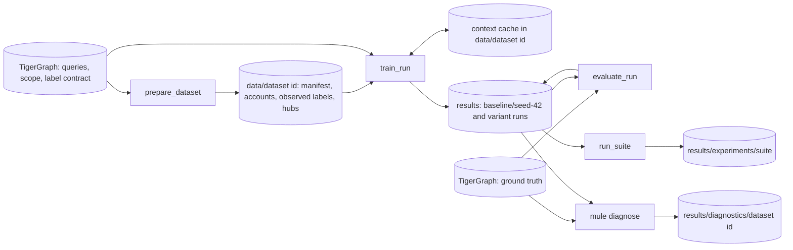

# Architecture

How the code is organised, how data flows from TigerGraph to `results/`, and the decisions
behind it. `docs/how-to/` says how to use it, `docs/reference/` what each part holds,
`docs/explanation/` why the model and its evaluation work as they do.

## The system

One model, `TGAT`, trains on one TigerGraph graph through REST: TigerGraph filters each
account's history by time and experiment partition, computes its features and returns a
bounded pool of candidate neighbours; the client resamples a fan-out, assembles tensors
and trains with a non-negative positive-unlabelled loss on the revealed mules. The console
script `mule` (built-in settings) drives it, plus a control experiments script.



1. **Install.** `mule install` installs the stale queries of `gsql/queries/` and
   `gsql/evaluation/`, adds the scope vertex type if missing or replaces it if outdated,
   then drops the retired names; a preparation that connects installs the same way and
   drops nothing ([Installation](reference/queries.md#installation)).
2. **Scope and reveal.** On a fresh graph the first preparation creates the frozen scope
   (ownership groups partitioned into train, validation and test) and reveals the mules a
   bank would have discovered ([Label reveal](explanation/label-reveal.md)).
3. **Prepare.** `pipeline.prepare.prepare_dataset` pages the scope population into
   label-blind seed reservoirs plus the revealed positives, resolves the cutoffs and
   builds the hub registry into `data/<dataset id>/`; training requests contexts itself.
4. **Train.** `pipeline.train.train_run` checks the dataset's frozen source, reads
   contexts from memory, then the dataset's disk cache, then TigerGraph, and trains into
   `results/<variant>/seed-<n>/`.
5. **Audit.** `pipeline.evaluate.evaluate_run` reads the ground truth once and audits the
   frozen model on validation and test into the run's `audit/`.
6. **Compare and study.** `experiments.runner.run_suite` writes
   `results/experiments/<suite>/`; `mule diagnose` writes `results/diagnostics/<dataset id>/`.
7. **Report.** `reporting` draws every figure and `report.md` from saved files only, so
   `mule report` redraws them offline.

## Layers

A module of `mule_pattern_learner` imports only from layers below it; modules separated by
`|` are independent:

```
cli                                              entry point
experiments                                      the control experiments
pipeline                                         composition root: the only place adapters are built
diagnostics                                      the diagnostic study, on its own ports
training | evaluation | reporting | tigergraph   use cases, figures, the TigerGraph adapter
inference                                        the saved model, the one scoring loop
batching                                         contexts to the model's inputs
data | sampling | model                          dataset, ports and contexts; neighbour sampling; nn modules
runtime                                          device, worker pool, progress lines
artifacts | metrics                              file schemas; pure metrics
config | paths                                   the built-in run; the filesystem layout
contract                                         definitions shared with GSQL
(reference, testing, __main__: outside the stack)
```

| Package | Responsibility |
|---|---|
| `contract` | What GSQL and client share, no I/O, no torch: query names, `CONTEXT_CONTRACT` and the retired names (`server`), graph types, relations and splits (`graph_schema`), training feature groups (`feature_groups`) and analytics ones (`analytics_features`), the sampler plan, every numeric bound (`bounds`), the time basis, fingerprints, clocks, the reveal's draws, the frozen salts |
| `config`, `paths` | Settings as frozen dataclasses, `DEFAULT_CONFIG` the built-in run; where datasets and results go and every file's name |
| `artifacts`, `metrics` | Every file's columns, reading and writing, the one atomic write and file digest; pure ranking metrics, curves, review budgets, bootstrap intervals |
| `runtime` | Device and determinism, the one bounded worker pool, `emit` (each event's one structured record) and its console line (`console`) |
| `data` | Read ports, seed reservoirs, observed labels, hub registry, manifest and dataset id, preparation, the context source and its cache tiers |
| `sampling` | Candidate tables; torch and cuGraph subset samplers |
| `model` | Torch modules (`TGAT`; for the controls `SummaryMLP`, `LinearModel`, `WideAndDeep`), the nnPU loss, the model builder; imports only `contract` and `config` |
| `batching` | Contexts to tensors: feature matrices, pool counts, the device-side Fourier basis, batch limits and assembly |
| `inference` | `model.pt` (`SavedModel`), the one scoring loop (`predictor`), rejection limits, scoring arbitrary accounts |
| `training` | Trainer, schedule, objective, weight average, resume state, history, summary |
| `evaluation` | The truth port, the audit sample, the ground-truth audit |
| `reporting` | Every figure and `report.md`, from saved files only; the only importer of matplotlib |
| `tigergraph` | The only code that speaks REST or GSQL: connection, retrying executor, installer, query renderer, one adapter per port |
| `pipeline` | The commands' use cases (prepare, train, evaluate, score, check, the study and its graph reads); the only place adapters are built |
| `experiments` | Variants, suite runner, comparison tables |
| `diagnostics` | The study's feature table and analyses, on ports `pipeline.diagnose` fills |
| `cli` | `mule`: parses the command, calls the use case, prints a short summary |
| `reference` | CPU mirrors of the GSQL features, the label reveal and the batch features, for the tests and `diagnostics` |
| `testing` | Fakes and builders the tests share |

- **Ports belong to their readers.** `data.ports` holds the read ports of preparation,
  training, inference and the audit; `evaluation.truth.TruthReader` is evaluation's own, so
  ground truth is not on training's import surface. `tigergraph` satisfies them
  structurally.
- **The pipeline is the composition root.** Only `pipeline` builds adapters, with the
  configuration's retry budgets; `pipeline.connect` builds every connection and context
  source. The command line and the experiment runner call `pipeline.train.train_run` and
  `pipeline.evaluate.evaluate_run` and build no adapter; the runner opens a
  `pipeline.connect.Session` and a `pipeline.evaluate.SharedTruth` on it. From
  `tigergraph` the runner imports only `TigerGraphUnavailableError` (the outage that stops
  a suite) and the summary of an error.
- **Graph writes** (install, scope creation, reveal) happen only in `pipeline.prepare`,
  `pipeline.diagnose` and `tigergraph`; `data.preparation` gets read ports only.
- **Metrics are pure and sit low**, so training, evaluation, experiments, diagnostics and
  reporting share one implementation.
- **Reporting reads saved files only**, so a figure can always be redrawn and a plotting
  error never loses a model.

### Ports and adapters

A port is a Protocol named for what it reads or runs: a role noun and `Reader`, `Fetcher`
or `Executor`. An adapter is `<Technology><Port>`; a fake is `Fake<Technology>`.

| Port | Owner | Adapters | Fakes |
|---|---|---|---|
| `ContextFetcher` | `data.ports` | `tigergraph.context_query.TigerGraphContextFetcher` | the adapter on `FakeTigerGraph` |
| `ScopeReader` | `data.ports` | `tigergraph.scope.TigerGraphScopeReader` | the adapter on `FakeTigerGraph` |
| `CutoffReader` | `data.ports` | `tigergraph.cutoffs.TigerGraphCutoffReader` | the adapter on `FakeTigerGraph` |
| `HubReader` | `data.ports` | `tigergraph.hubs.TigerGraphHubReader` | the adapter on `FakeTigerGraph` |
| `ObservedLabelReader` | `data.ports` | `tigergraph.labels.TigerGraphObservedLabelReader` | the fake graph's population |
| `TruthReader` | `evaluation.truth` | `tigergraph.oracle.TigerGraphTruthReader`, `evaluation.truth.ParquetTruthReader`, and `pipeline.evaluate.SharedTruth`, which reads the graph's truth once for a suite | `testing.builders.ground_truth_rows` behind `FakeTigerGraph` |
| `ContextReader` | `data.contexts` | `data.contexts.ContextSource`, the one source that streams contexts | `testing.fake_graph.FakeSource`, `FakeStore` |
| `AnalyticsFetcher` | `diagnostics.feature_table` | `tigergraph.analytics_query.TigerGraphAnalyticsFetcher` | the adapter on `FakeTigerGraph` |
| `StudyReader` | `diagnostics.study` | `pipeline.diagnose.TigerGraphStudyReader` | |
| `QueryExecutor`, `ConnectionExecutor` | `tigergraph.executor` | `TigerGraphExecutor`: failure classes, retry and outage budgets, paging | `testing.fake_graph.FakeTigerGraph` |

- **One fake executor.** `FakeTigerGraph` answers the repository's queries as the GSQL
  does; its connection answers `SHOW QUERY`, the endpoint listing, the schema, vertex
  counts and scope headers, and creates, installs and drops queries. The tests run the
  real adapters on it; the executor protocols belong to `tigergraph`, since only adapters
  run queries. A few `tigergraph` tests script a pyTigerGraph connection behind the real
  executor (`testing.fake_connection`) for what the fake does not answer: the installer's
  compilation, the label reveal and the label-contract check.
- **The pipeline composes the study.** `diagnostics` may import neither `pipeline` nor
  `tigergraph`, even indirectly (the contract "Use cases reach TigerGraph only through
  ports"), so `pipeline.diagnose.diagnose_built_in` prepares the dataset
  (`pipeline.prepare.prepare_dataset`) on a `pipeline.connect.Session` and hands
  `diagnostics.study.diagnose` a `pipeline.diagnose.TigerGraphStudyReader` on it, the
  study's only graph access: `oracle()` (a `TruthReader`, read once), `scope()`,
  `contexts()` (with the dataset's disk tier), `analytics()`, `reveal_inputs()`,
  `reveal_parameters()`. It checks the frozen source on its first read and installs the
  analytics queries before handing out their fetcher, so only `mule diagnose` installs
  them.
- **A suite shares one connection.** `pipeline.connect.Session` opens it when a use case
  first needs the graph; `prepare_dataset`, `train_run` and `evaluate_run` accept it, and
  each still checks the frozen source.

### Import contracts

`lint-imports` enforces them in the gate (configured in `pyproject.toml`); no contract
ignores an import.

| Contract | Why |
|---|---|
| Layers run one way | The stack above: one way down, independent siblings |
| Use cases reach TigerGraph only through ports | Training, evaluation, data, batching, inference, sampling, model, reporting and diagnostics import neither `tigergraph` nor pyTigerGraph, so every use case runs on a fake |
| Training never reads ground truth | Training's packages, `config`, the training context fetcher (`tigergraph.context_query`) and the pipeline's preparing, training, checking and scoring modules never import `evaluation`, `diagnostics` or `tigergraph.oracle` |
| Training never reads the analytics features | The same modules never import `contract.analytics_features` |
| Only reporting draws | No other package imports matplotlib; pipeline, command line, experiments and diagnostics call `reporting` |
| Reporting reads files, not models or the graph | `reporting` imports neither torch nor `model`, `inference` or `training` |
| Fakes stay out of the package | No package imports `testing` |
| Only diagnostics uses the verification mirrors | Only `diagnostics` imports `reference`; the command line and `pipeline.diagnose` reach it through `diagnostics` |
| The model knows nothing about storage | `model` imports neither pandas, pyarrow, requests nor `data` |

import-linter checks only the modules a contract names, so `tests/test_import_contracts.py`
checks that the contracts listing every package but a few leave none out, and that no
module imports `matplotlib.pyplot`.

## Why training reads only pu_label

The model trains only on the revealed mules, as a bank's would; two things keep the ground
truth (`is_mule`) out of reach:

- **Queries.** The population query exports only the revealed positive (`pu_label == 1`
  with `is_mule == 1`, `mule_label_known` and not `is_mule_masked`) and its discovery
  time, when preparation asks. No feature, cutoff or hub query reads a label attribute,
  and the tests check the rendered context queries for oracle names; only the reveal
  (once, before training), the label-contract check and the oracle export read the truth.
- **Imports.** `tigergraph.oracle`, `evaluation` and `diagnostics` are unreachable from
  training by contract, and the label interface refuses oracle columns. The audits read
  truth only after the model and threshold are fixed.

A production system writes its known positives and discovery times into the graph's label
contract, with no change to model or loss ([Labels](reference/labels.md)).
[Leakage and scaling](explanation/leakage-and-scaling.md) covers time, held-out groups and
selection.

## The training query and the analytics queries

`fetch_training_context` computes only what the model reads: the built-in run's
server-side groups (`entity_meta`, `message_core`, `time_encoding`, `pair_history`,
`flow_timing`) and each message's channel and sampling stratum; the client computes the hub
indicator and pool counts. `fetch_analytics_context`, rendered by the same
`tigergraph.render` from `contract.analytics_features`, computes every group for analysis.
Each prints a contract derived from its text (`CONTEXT_CONTRACT`, `ANALYTICS_CONTRACT`): a
render test keeps the constants equal to the texts, the client refuses rows of another
contract, saved models record it and the context cache names entries with it, so a changed
query is never read as the old one ([Features](reference/features.md)).

## Configuration

Settings are frozen dataclasses in `config.py`, one section per concern, defaults being
the built-in run (`DEFAULT_CONFIG`). Each component receives only its section, checked
against `contract.bounds` when built. `.env` holds only the connection, read on connect,
never at import. No configuration file, `--config` or option: another run is a `RunConfig`
built in Python, or a declared variant. [Configuration](reference/configuration.md) lists
every setting, what the run fingerprint and the dataset id cover, and the audit's
constants, which are not run configuration.

- **Each real choice is made in one place**: the architecture (`model.build.build_model`),
  the sampler backend (`sampling.backend.resolve_backend`), the positive weight
  (`training.objective.nnpu_objective`). No class resolvers; the only registries are two
  plain tables, the feature groups and the variants.
- **GSQL stays at the repository root** (`paths.GSQL_DIR`): the package is an editable
  install, `data/` and `results/` tie it to the root anyway, and reviewers read GSQL as
  files. `mule install` applies its one schema change (the scope vertex type) before any
  query, since a schema change invalidates installed queries; numbered migrations return
  only with a second schema change.

## Plots

- A figure function is `plot_<thing>(ax, data) -> Axes`: computed inputs, no file read, no
  save.
- Only the reports read files (`reporting.run_report`, `reporting.suite_report`,
  `reporting.study_report`); `reporting.report` redraws whichever a directory holds.
  `reporting.document` saves each figure as a `matplotlib.figure.Figure` through the Agg
  canvas, so pyplot is never imported.
- Curves (weighted precision-recall, ROC, capture) come from `metrics`, never sklearn's
  display classes, which import pyplot.
- PNG at 150 dpi, fixed colours (`reporting.style`): mules orange, non-mules blue, the
  baseline in ink, each audited split its own colour, checked for colour-blind separation.
- Figures are drawn after the files they show are saved (after training saves the model
  and every run file, after the audits, by the experiment runner and `mule diagnose`). A
  failed figure loses its older PNG, the rest and `report.md` are still written, and the
  command then fails naming it.
- Findings in `docs/research/` embed PNGs copied into `docs/research/figures/`.

## Naming

| Thing | Rule | Examples |
|---|---|---|
| Packages, modules | Lowercase role nouns; no grab-bag name (`utils`, `common`, `helpers`) or old-layout word (`FORBIDDEN` in `tests/test_naming.py`); module names unique | `training/trainer.py`, `data/contexts.py` |
| Classes | CapWords, a role suffix, no project prefix | `Predictor`, `SavedModel`, `ContextSource`, `DiskTier` |
| Ports and adapters | See [Ports and adapters](#ports-and-adapters) | `ScopeReader`, `TigerGraphScopeReader`, `FakeTigerGraph` |
| Functions | Verbs for use cases and factories; `*_curve` returns arrays, `bootstrap_*` intervals, `plot_*` draws | `prepare_dataset`, `train_run`, `capture_curve`, `plot_capture` |
| Constants | UPPER_CASE, defined once | `BUILT_IN_GROUPS`, `GRAPH_NAME` |
| Settings | Section-qualified snake_case, units as suffixes | `scope.id`, `loss.positive_weight`, `transport.max_outage_s` |
| Variants | "Variant", never "arm": `baseline`, `no_<mechanism>`, `drop_<group>`, or a control's own name | `no_attention`, `drop_pair_history`, `prior_weight` |
| Concepts | One name each: **dataset**, what preparation stages; **source id**, the identity of the data loaded into the graph; **audit**, the ground-truth report, written by `evaluate`; a context source parameter is always `contexts` | |
| Runs and figures | `results/<variant>/seed-<n>/`; run and suite figures `plots/<topic>_<figure>.png`; a study's named for what they show, after the analysis that draws them where it draws one | `audit_capture.png`, `learning_curve.png`, `ring_coverage.png` |
| GSQL | A file after the responsibility its queries share; a query verb first, no prefix | `hub_accounts.gsql` defines `list_hub_accounts` |
| Tests | `tests/<package>/test_<module>.py`; graph and GPU checks in `tests/integration/`; repository-wide checks (names, import contracts, links, scripts) at the top of `tests/`; markers `graph`, `graph_write`, `cuda` | `tests/sampling/test_cugraph_sampler.py` |
| Docs | Kebab-case in the Diataxis folders | `docs/how-to/run-control-experiments.md` |

`tests/test_naming.py` checks file and folder names (docs included), the identifiers the
code defines, the command line, run paths and GSQL query names, not prose. No name holds a
`FORBIDDEN` word except persisted values of the graph and the seeded draws, each listed
with its reason in `ALLOWED`: the `Temporal_Training_Scope` vertex type and the salts
`temporal_live_step` and `marginal_cohort`. The scope's edge types and the built-in scope
id are persisted too and hold no such word. The queries' names from before the rename
appear only in `contract.server.RETIRED_QUERIES`, which `mule install` drops. Another
library's names stay its own: the code calls pylibcugraph's sampler by its name, and the
tests' imitation of pylibcugraph gives its names as keywords.

## Decisions and their reasons

The owner's decisions:

| Decision | Reason |
|---|---|
| **Commands take no options.** Inputs come from the built-in settings and the latest run; `RUN` defaults to `results/baseline/seed-42` | `mule train` always trains the one reproducible run; a run's settings are the code's or a `RunConfig` in its `config.json` |
| **One model** (layered layout, approved 2026-09-27): `TGAT`; `SummaryMLP`, `LinearModel` and `WideAndDeep` only for the controls. Deleted: the variant axis, the `single` architecture, feature groups only earlier models read, the `recent` and `stratified` samplers, SQLite storage, the `shared_history` protocol, the label file | The built-in run used none, and each was a second path to keep correct |
| **Training keeps only the built-in run's feature groups** (2026-09-28). The training query shrank from 1,833 to 1,282 lines, a message from 34 fields to 27; the other ten groups moved to the analytics query. A group returns only when moved into the training query on purpose, with a new contract | The training query computes nothing no model reads |
| **Queries are named after their responsibility**, verb first, no prefix; only used ones remain: pipeline in `gsql/queries/`, oracle in `gsql/evaluation/`, analysis in `gsql/analytics/` | The graph is dedicated |
| **Only `mule install` drops the retired names**: once every query is installed, those on the fixed list `contract.server.RETIRED_QUERIES`, callers first, never another, with no option; other commands' installs leave them | A fixed list cannot drop someone else's query. Pre-rename code calls the old names and nothing can tell whether such a job runs elsewhere, so the owner runs `mule install` once none runs anywhere |
| **Decisions use the validation audit; test is for reporting** | Choosing on test makes the reported number optimistic, and the pool groups were already designed after reading test-split mules |
| **The hidden mules lead, and decisions use their validation AP** (2026-10-04). Every audit ranks them against the non-mules with the revealed mules removed (as an investigator removes known cases), beside every mule's metrics; the run report, `mule evaluate`, suite comparisons and the diagnostics show them first; a suite ranks, compares and ensembles by their validation AP | The model exists to find mules nobody knows on the scoring date. On the reference graph the built-in run ranked revealed mules far better than hidden ones, so every mule's AP mostly measured the reveal |
| **Every run reads the graph's labels** (2026-09-28): one label path, no label file or table reader; tests serve labels through the fake graph | The model trains only on the revealed positives (`pu_label`) |
| **The dataset id leaves out the scope's one-time settings** (2026-09-28): of the scope, only `scope.id`, `scope.unowned` and the split shares (added 2026-10-04) name a dataset | `scope.create`, `scope.reveal_per_split` and `scope.reveal_salt` act once (creating a missing scope, the one-time reveal), so changing them later names no other dataset |
| **Control experiments are a script with names only**: `python scripts/run_experiments.py [SUITE or VARIANT ...]`, no flags; suite `controls` by default, seeds in code, variants in `experiments/variants.py`, complete runs kept, mismatched runs moved to `results/archive/`, never deleted, tables and figures always written | The owner asked for a script; with seeds in code and nothing in `/tmp`, every suite repeats from the commit |
| **Only what this code writes is read** (2026-10-03, replacing the 2026-09-28 decision to keep converting earlier saved settings until the new baseline run was audited). `SavedModel` reads only its own `FORMAT` and contract; a dataset is used only if its recorded settings and query texts are this code's; nothing converts earlier settings, contracts or datasets; the saved-model test's fixtures are models this code saved | The owner retrains from scratch, and each conversion was a second path to keep correct |
| **One exception** (2026-10-04): an `epochs.csv` from before the validation nnPU risk was recorded is read with exactly its earlier columns, the risk missing; a resume state saved then continues with that column empty in its earlier epochs. The payload is the same: the kept epoch's value under the selection rule sits in the validation AP's old slot. Any other column set is refused | It keeps the first control experiments' runs complete and resumable |
| **One branch, `main`, the same on both remotes** (2026-09-27 and 2026-09-28): the layered code replaced the old `main` by a fast-forward; `origin` and `learner` hold the same `main`; nothing is pushed and no branch deleted without the owner's confirmation | The earlier history stays in `main` |

Other choices:

- **Packaging**: src layout and pip; torch and matplotlib are core dependencies; extras
  `dev`, `cuda12`, `cuda13`. No lock file, since the CUDA torch wheels come from per-CUDA
  indexes; `config.json` records the versions. pytest imports the installed package
  (`--import-mode=importlib`).
- **One of each**, so a fix lands everywhere: scoring loop (`inference.predictor`), worker
  pool (`runtime.workers.DaemonPool`), atomic write (`artifacts.atomic_write`), population
  pager (`data.accounts.scope_accounts`).
- **The context cache lives with the dataset**: its entries are rows of one frozen source,
  so they are named by dataset, source and query contract, opened only after the
  frozen-source check, and shared by every run and audit of the dataset.
- **Nothing reads or writes `/tmp`**: experiments and analyses write under `results/`, so
  every suite repeats from the commit, and runs, comparisons and the study can be redrawn
  and audited later.
- **A repeatable analysis becomes code, a one-off answer a note**: an analysis to rerun
  when the dataset, features or model change is a `mule diagnose` analysis; one that
  answered a single question, or tested a path now gone or turned into a variant, goes in
  `docs/research/`.
- **`mule`, not `mule-pattern-learner`**: short, like Ludwig's `ludwig train`, paired with
  `__main__.py` as the PyPA guide pairs a console script; `python -m mule_pattern_learner`
  covers a machine where another tool (a MuleSoft runtime, say) also installs `mule`.
  **`score`, not `predict`**: the output is a risk score. **Experiments are a script, not a
  command**, as the owner asked.

## Sources

| Pattern | Followed from |
|---|---|
| Composition root | [Cosmic Python](https://www.cosmicpython.com/book/chapter_13_dependency_injection.html); a pipeline function as the one wiring point, as in GraphStorm's [`gsgnn_np`](https://github.com/awslabs/graphstorm/blob/main/python/graphstorm/run/gsgnn_np/gsgnn_np.py) and PyKEEN's [`pipeline()`](https://github.com/pykeen/pykeen/blob/master/src/pykeen/pipeline/api.py) |
| Read ports around a remote graph | PyG's [`FeatureStore` and `GraphStore`](https://github.com/pyg-team/pytorch_geometric/blob/master/torch_geometric/data/feature_store.py), whose [docs](https://pytorch-geometric.readthedocs.io/en/latest/advanced/remote.html) name TigerGraph as a graph store |
| A model package that imports only its configuration | PyG's `nn/models`; Transformers, where configuration never imports modeling |
| Pure metrics apart from plotting | scikit-learn's split between `_ranking.py` and `_plot/` |
| Figures from saved files only | The [Cookiecutter Data Science opinions](https://cookiecutter-data-science.drivendata.org/opinions/) and PyKEEN's `plot_utils.py`; matplotlib's [object-oriented style](https://matplotlib.org/stable/users/explain/quick_start.html) and [Agg canvas without pyplot](https://matplotlib.org/stable/gallery/user_interfaces/web_application_server_sgskip.html) |
| Configuration in code | [Twelve-Factor](https://12factor.net/config) for the connection; dataclass defaults as in Transformers |
| Import contracts | import-linter's [layers](https://github.com/seddonym/import-linter/blob/main/docs/contract_types/layers.md) and [forbidden](https://github.com/seddonym/import-linter/blob/main/docs/contract_types/forbidden.md) contracts |
| Packaging | The PyPA guides to the [src layout](https://packaging.python.org/en/latest/discussions/src-layout-vs-flat-layout/) and [command-line tools](https://packaging.python.org/en/latest/guides/creating-command-line-tools/); pytest's [import modes](https://docs.pytest.org/en/stable/explanation/goodpractices.html) |
| Seeds as an axis, variants compared over them | Ludwig's `MetricDiff` and [GADBench](https://github.com/squareRoot3/GADBench/tree/master); every variant built and checked offline, as in PyKEEN's `test_experiment_integrity.py` |
| Docs | The [Diataxis](https://diataxis.fr/) folders |
