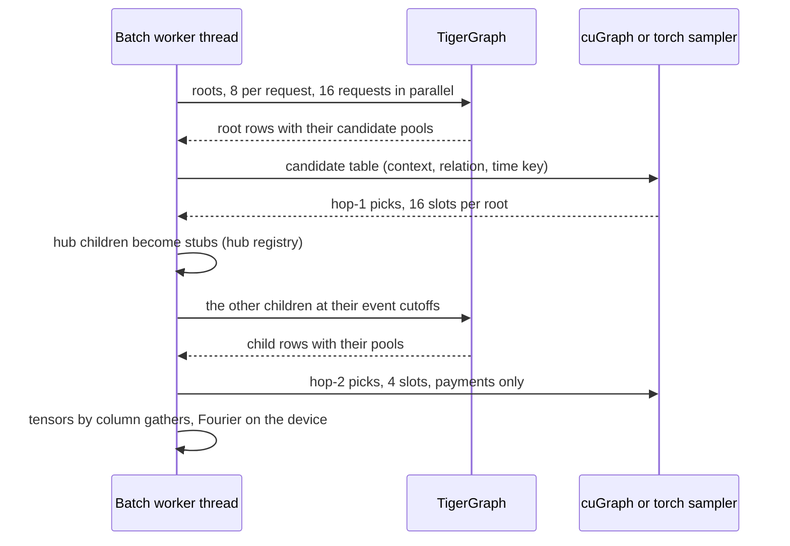

# Sampling

How a batch's two-hop neighbourhoods are built: TigerGraph returns a bounded, cutoff-safe
pool of candidates per context, and the client draws the fan-out from it, fresh at every
training step. The settings are the `sampler` section
([Configuration](../reference/configuration.md#sampler)).

## One training batch

`batching.assemble.build_batch` builds a two-hop computation tree for a batch of roots:
internal deposit accounts at one train cutoff and one scope phase (64 in the built-in
run, at most 128).

A context is an entity at a cutoff, so one account at two cutoffs is two contexts. A
payment neighbour is represented with its history strictly before that payment (whose
sequence becomes the child's cutoff), so its later activity never enters the earlier
message; an association neighbour keeps its parent's cutoff. Context indices are dense
and batch-local (`batching.limits.BatchIndex`): the model has no per-account parameters,
so there is no global id table and no tensor size depends on the graph's ids.

## Candidate pools

Per context and hop, TigerGraph returns for each of the four payment relations the
`recent` most recent visible events, `older` events at evenly spaced recency ranks and
`distinct` recent events with counterparties not yet in the pool, and for each of the 14
association relations the `associations` most recent active tenures. A pool holds at
most `4 x (recent + older + distinct) + 14 x associations` messages: built in, 4 x 16 +
14 x 2 = 92 for a root (at most 70 for an Account, which has three association
relations) and 4 x 8 = 32 for a child. Children ask for no associations, since hop 2
samples payments only. A context with more than `max_history` visible events in one
relation is rejected, not truncated.

The pools are dataset settings: changing them names another dataset, and changes what
the pool groups, which count over them, mean.

## Resampling the fan-out

The client (`sampling.backend`) keeps, per context and relation, a uniform random subset
without replacement of at most `relation_fanouts[hop - 1]` payment candidates (8 at hop
1, 4 at hop 2), and `association_fanout` (1) per association relation at hop 1. It then
fills fixed slots:

- **hop 1** (16 slots): payments interleaved position by position across `zelle_out`,
  `zelle_in`, `payment_out` and `payment_in`; up to `association_slots` (2, at most a
  quarter of the slots) reserved for associations; empty slots backfilled from the
  remaining payments and associations;
- **hop 2** (4 slots per child): payments only.

**Training** draws a fresh subset every step from the step seed (a stable hash of seed,
epoch and step, mixed with the hop), so each epoch sees other neighbours of an account
without extra queries. The torch sampler takes its keys from a CPU generator, so with
`sampler.backend = "torch"` a fixed seed gives the same neighbourhoods on every device;
cuGraph draws a different, equally distributed subset for the same seed, so only torch
reproduces neighbourhoods across devices and backends.

**Evaluation and scoring** always take the torch path with `splitmix64` hash keys of the
evaluation seed, hop, context key and candidate, so scores depend on neither machine,
torch version nor backend, and a root's hop-2 draw is independent of its hop-1 draw.
`model.pt` records the sampler's fingerprint, which includes this key scheme.

## cuGraph on CUDA

With `sampler.backend = "auto"` on a CUDA device, training samples with
`sampling.cugraph_sampler.CuGraphSampler` (pylibcugraph 26.8; 26.10 also works):

- The candidate table becomes a batch-local graph: a vertex per context and per
  candidate, an edge per candidate with the relation as edge type and a time key of
  `2 x event_seq` for payments and `2 x cutoff_seq - 1` for associations. A context seeds
  at `2 x cutoff_seq`, so cuGraph's single strict comparison (`strictly_decreasing`)
  matches the visibility rule: a payment is eligible exactly when `event_seq <
  cutoff_seq`, and every association of the context is.
- `heterogeneous_uniform_temporal_neighbor_sample` (26.8) or `neighbor_sample` with
  `starting_vertex_end_times` (26.10) samples a fan-out per relation without
  replacement, with the hop's seed as random state.
- Host arrays go to the device once, through DLPack; each thread has its own resource
  handle.
- Every result is checked on the GPU: each sampled edge is strictly earlier than its
  seed's time (a leakage assertion), belongs to its seed and is drawn once, and each
  context and relation gets exactly `min(candidates, fan-out)` picks, so over- and
  under-sampling fail loudly.

A probe runs once per process and device before cuGraph is chosen: it samples a tiny
table twice with one random state and requires exact counts, identical draws and the
leakage checks. On failure `"auto"` uses torch, warning `cugraph_probe` when cuGraph is
installed but failed (silently when cupy or pylibcugraph is absent), and `"cugraph"`
raises with the probe's reason. The backend is resolved once per run, before prefetching,
and recorded in `config.json`, `events.jsonl`, `metrics.json`, `resume.pt` and
`model.pt`. A resume on a host that resolves another backend is refused unless the
configuration names the new one; the remaining steps then sample a different stream,
recorded as a `sampler_backend` event.

On CPU, Apple MPS or without pylibcugraph, the torch grouped sampler draws from the same
distribution. At these batch sizes cuGraph's per-call overhead may exceed torch's, and
`"torch"` is always safe.

## Hubs and stubs

Some accounts have more history than any request should scan: on the reference graph
4,988 have more than 2,048 incoming payments, all external, and 95% of internal deposit
accounts had one among their eight most recent payments. Scanning a hub's history per
neighbour context would cost seconds each and exceed the history cap.

Preparation therefore saves the registry of
[`list_hub_accounts`](../reference/queries.md#list_hub_accounts) for the dataset's cutoffs
in `hubs.parquet`. An Account is a hub at a root's cutoff and phase when its visible
history in some payment relation (events before that cutoff, visible in that phase)
exceeds the smaller of the two pools' `max_history`; all-time degree never decides it.
The registry of `strict_mule_v2` on the reference graph:

| Cutoff | Phase 1 (train) | Phase 2 (validation) | Phase 3 (test) |
|---|---|---|---|
| 2024-07-01 (sequence 61,035,552) | 3,336 | 3,726 | 4,019 |
| 2024-10-01 (sequence 89,141,831) | 4,055 | 4,399 | 4,765 |
| 2025-01-01 (sequence 120,799,198) | 4,662 | 5,180 | 5,602 |

A hub child is never requested: the batch builds a stub from the connecting message
(type Account, `is_external` and `is_deposit` from the message, `history_withheld = 1`
from the `hub_indicator` group, no messages). The lookup uses the earliest cutoff among
the roots reaching the child and the batch's phase (3 for unscoped roots), so only
history visible before the prediction time and in that phase counts. A cutoff or phase
the registry lacks is an error, never a silent "not a hub". In a measured 64-root batch,
357 of about 960 contexts were stubs.

- A non-stub child cannot exceed `max_history`: its cutoff precedes its root's and it
  inherits the root's phase.
- Hub counts cover every currency, an upper bound of the context query's USD-only check,
  so an account whose USD history would fit may be stubbed: that costs history, never
  leaks it.
- When the registry lists hubs but a model has no `hub_indicator` group, training and
  scoring warn once at the start: such a model cannot tell a stub from a dormant account.
- Without a scope (`mule score`) the registry is computed unscoped for the requested
  cutoff.

## Bounds

Every batch is admitted before any request or allocation (`batching.limits.BatchLimits`,
`contract.bounds`): at most 128 roots, 2,048 distinct contexts (built in, 64 roots and at
most 1,088 requested contexts: 64 roots and 64 x 16 children), 524,288 candidate
messages over both hops, 64 MiB of input tensors and an estimated 512 MiB of model
working memory. These bound this process's allocations, not free memory in other
processes or TigerGraph's server memory.
