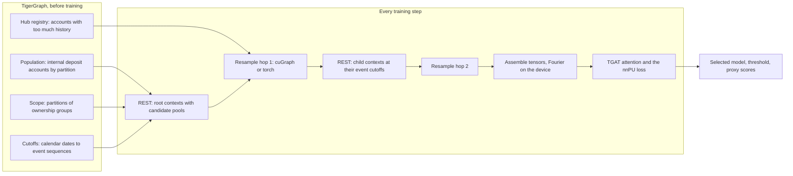

# Training

How one model learns to rank mule accounts from a few revealed examples, and how a run is
judged. [Sampling](sampling.md) covers how neighbourhoods are drawn,
[Feature design](feature-design.md) what the model reads, and
[Leakage and scaling](leakage-and-scaling.md) why none of it sees the future or a
held-out account.

## The idea

Every account is scored at a calendar cutoff from its own and its counterparties' history
before it. TigerGraph filters events by time and experiment partition, computes the
features and returns a bounded pool of candidate neighbours per account over REST; the
client resamples a fixed fan-out (cuGraph on a CUDA GPU), expands time deltas into
Fourier features on the device, and trains a memoryless
[TGAT](https://arxiv.org/abs/2002.07962)-style attention model with a non-negative
positive-unlabelled (nnPU) loss. No account id is a parameter, so the weights score
accounts never seen in training.

## The labels it learns from

Only the mules revealed in the graph (`pu_label`): 20 in train, 11 in validation and 20
in test on the reference graph, each usable only if known before the scoring cutoff,
chosen once by the [label reveal](label-reveal.md) as a bank would have found them.
Every other account is unlabelled, never a negative: a mixture of non-mules and hidden
mules. Ground truth stays in the graph for the audit and never reaches training code.

## The model

`model.tgat.TGAT`, the built-in `tgat` architecture (101,121 parameters at hidden 64, 4
heads, dropout 0.15):

1. Project the nine node columns of `x` (entity type, `is_external`, `is_deposit`,
   `history_withheld`) of every context, and of the outermost counterparties, to 64.
2. Embed each message: a linear map of its 142 columns plus a relation embedding (18
   relations) and a rail embedding (7 rails).
3. Attention block 1: every context attends over itself and its hop-2 messages.
4. Attention block 2: every root attends over itself and its hop-1 neighbours (their
   block-1 outputs plus the hop-1 message embeddings).
5. Slot sum: the same hop-1 tokens through a small MLP (64 to 64, GELU, 64 to 64);
   padded slots zeroed, the rest summed and divided by the hop-1 fan-out, 16.
6. Summary branch: the root's 15 pool counts projected to 64.
7. A head on the attention output, slot sum and summary (192 wide): one logit per root.

The slot sum exists because attention is a weighted average of linear projections: it
cannot separate a condition combining several inputs of one slot (an internal, first-time,
large inflow, say) before pooling, nor count the slots meeting it. A per-slot MLP then a
sum can, since mean and max cannot tell apart multisets that differ only in multiplicity
([Xu, Hu, Leskovec and Jegelka, "How Powerful are Graph Neural Networks?", ICLR
2019](https://arxiv.org/abs/1810.00826)). The divisor is the configured fan-out, so
padding changes nothing, and as most roots fill all 16 slots the sum is mostly the share
of slots meeting the condition; counts beyond 16 come through the pool groups. Hop 2 has
no sum: it would need its own merge into the tokens, over a fan-out of only 4. The slot
sum is provisional (the `no_slot_sum` variant measures it). Without it the model has
88,705 parameters, and without the pool groups as well 83,457.

Input widths follow the feature groups (`contract.feature_groups`): a group left out has
no columns and no projection weights, and without node inputs there is no node
projection. The controls train with the same loss, selection and pipeline:

| Architecture | Class | Parameters | What it is |
|---|---|---|---|
| `summary` (the `no_attention` control) | `model.summary_mlp.SummaryMLP` | 5,953 | An MLP of only the root's own 24 node and pool columns, fetching no children: does attention add anything beyond them? |
| `linear` | `model.linear.LinearModel` | 25 | One linear layer of the same 24 columns; no children |
| `wide_and_deep` | `model.linear.WideAndDeep` | 101,146 | The graph model plus that linear layer's output on its logit; the graph part is built first, so a seed gives it the built-in model's initial weights |

## The loss

Imbalanced nnPU ([Su, Chen and Xu, IJCAI
2021](https://www.ijcai.org/proceedings/2021/0412.pdf)): the nnPU risk of [Kiryo et al.,
2017](https://arxiv.org/abs/1703.00593) reweighted as if the classes were balanced
(`model.loss.NonNegativePULoss`, `training.objective`).

- `loss.class_prior = 0.001`: an explicit assumption of the share of mules among all
  accounts (the simulated data has 233 mules in 317,840 internal deposit accounts, about
  0.00073), neither the revealed-label rate nor inferred from hidden truth.
- `loss.positive_weight = "balanced"`: `1 - class_prior` on the positive risk, the
  paper's objective with a balanced target prior of 0.5, up to a constant factor.
- Each step draws a quarter of its roots (16 of 64) from the revealed training positives,
  with replacement, and the rest from the label-blind training marginal, visited once per
  epoch.

Textbook nnPU (`"prior"`) collapsed here: with a prior of 0.001 the unlabelled accounts
push scores down 500 times harder than the positives pull them up, and scoring everything
near zero costs only the prior, so within the first epoch it did (loss at the prior,
selected threshold about 1.7e-7; [the nnPU positive weight](../research/nnpu-positive-weight.md)).
The balanced weight makes that state cost `1 - class_prior`. Its scores rank accounts and
are not probabilities; only the validation-selected threshold gives them a cut-off.

The balanced weight is provisional too (the `prior_weight` variant compares it over
seeds). With 20 positives each drawn about 80 times per epoch, its main risk is
memorising them. Signs in `history.csv` (`objective` is the unclamped risk,
`corrected_steps` the steps whose non-negative correction fired): a training loss far
below the first epoch's, rising corrections, a validation AP that peaks early and falls,
and an early stop. The saved model is still the best validation epoch.

## A run

`training.trainer.train` runs one configuration on one prepared dataset into one run
directory ([Configuration](../reference/configuration.md) has the settings).

- **Checks first:** the dataset's manifest and file hashes; its query hashes and dataset
  settings against the configuration; the installed query texts and endpoints; the
  frozen-source check (vertex counts, the scope and its unowned rule); and that the
  context source requests every input the model reads, with its pools, at both hops.
- **Schedule:** drawn up front per epoch from the saved generator (date, roots, step
  seed): up to `training.steps_per_epoch` (100) steps per train cutoff, of which the
  built-in run has one. The line that starts training gives the step count.
- **Prefetch:** `runtime.prefetch_batches` threads build the next batches during the
  current step, sharing one bounded pool of REST requests; results are used in order, so
  a run is reproducible.
- **Determinism:** `runtime.deterministic` turns on deterministic algorithms (warning on
  CUDA-only gaps; `"strict"` fails on them), and every step reseeds torch from a stable
  hash of seed, epoch and step, so dropout and sampler draws never depend on history. The
  command line reserves cuBLAS's deterministic workspace before any CUDA work. On CUDA,
  attention uses the math kernel of scaled dot-product attention, since the backward pass
  of the fused memory-efficient kernel torch would pick is not deterministic; with one
  query per root the extra cost should be small. CPU and MPS keep their kernels.
- **Validation** after each epoch scores the revealed validation positives (11 on the
  reference graph) and a fixed sample of 2,000 unlabelled validation accounts at the
  validation cutoff in phase 2: proxy AP, proxy ROC AUC and the run's own nnPU risk
  (lower is better), in `epochs.csv`. `training.selection` keeps the epoch with the best
  AP (default), ROC AUC or risk, stopping after `training.patience` (6) epochs without a
  better one, or with `"none"` the last epoch. With so few revealed mules an epoch's AP
  hangs on where the top few rank, so which rule picks better models is a question for
  the control experiments' `methods` suite. The threshold maximises validation F1.
- **Weight averaging:** validation scores, and `model.pt` keeps, an exponential moving
  average of the weights; training follows the raw weights. After n steps the decay is
  `min(0.99, (1 + n) / (10 + n))`: the average spans about the last n / 10 steps until
  0.99 at step 890, then about one epoch. The reference run's raw-weight AP swung between
  0.011 and 0.096 from epoch to epoch. `training.weight_average_decay = 0` validates the
  raw weights.
- **Resume:** `resume.pt` is written atomically after every epoch (and every
  `runtime.checkpoint_every_steps` steps) and reproduces the uninterrupted run exactly on
  the same device, threads and determinism (tested to every digit of the epoch-2 loss and
  validation AP). Transport and logging settings and `runtime.max_rejected_root_fraction`
  may change on a resume; settings that change results may not.
- **The end:** the selected model is saved before any test context is requested, then
  the test split (the 2025-01-01 cutoff, phase 3) is scored once with the frozen model
  and threshold, and `metrics.json` is written. Test never influences selection.

### Rejected roots

TigerGraph can reject a context (missing, not yet visible, or over the history cap). A
rejected child is masked out of its root's first hop and counted. A rejected root is
dropped from its batch only within `runtime.max_rejected_root_fraction` (0 in the
built-in run, so any rejected root fails the run):

- a training epoch fails once its rejected roots exceed the limit times its requested
  roots, or when a rejected root is an observed positive;
- validation (every epoch) and test apply the same rules to the whole split, and
  validation must keep both observed classes;
- a run where no epoch produced a value of its selection rule (by default a finite
  validation AP) refuses to save weights.

The limit decides only whether a run may go on, never its numbers, so a resume may raise
it ([Train and evaluate](../how-to/train-and-evaluate.md#when-tigergraph-rejects-roots)).

## Proxy metrics and the ground-truth audit

Training sees only revealed labels, so everything it records is a proxy: the metrics in
`epochs.csv` and `metrics.json` score the revealed mules against up to 2,000 unlabelled
accounts counted as negatives, some of them hidden mules. With 11 validation positives
AP is coarse: across random draws of 11 positives, a simulated model of constant quality
(ROC AUC 0.89) spans 0.04 to 0.35.

### The ground-truth audit

`mule evaluate` audits the frozen model against the ground truth, after selection, on
each held-out split ([the audit files](../reference/outputs.md#the-audit-files) list the
metrics):

- **Sample:** every mule of the split's population and 2,000 uniformly sampled
  non-mules, depending only on the scope, the truth and `dataset.split_seed`, so every
  run of a dataset is audited on the same accounts and runs compare account by account.
- **Metrics** estimate the whole split, each account weighted by 1 / its inclusion
  probability: AP, ROC AUC, precision, recall and F1 at the frozen threshold, and
  precision and recall when reviewing the top 1, 5 or 10%. Tied scores form one block, as
  in one AP threshold: a review budget ending inside it takes the same share of each
  account, the expected result of a random order.
- **Intervals:** 90% bootstrap from 1,000 replicates; mules are resampled by ring, since
  a ring's mules are not independent (a mule without a ring alone; the reference load
  recorded no rings, the mule-temporal export records each mule's).
- **Hidden mules lead.** The model exists to find the mules nobody knows on the scoring
  date, so every audit first ranks the hidden mules (not revealed by the split's cutoff)
  against the non-mules, with the revealed mules removed as an investigator would remove
  known cases; the same metrics over every mule follow. On the reference graph the
  built-in run ranked the revealed mules far above the hidden ones, which is not the
  detector a bank needs.
- **Bounds:** at most 1,000,000 accounts of a split's partition held and 100,000 scored
  (`contract.bounds`): a bounded audit of a frozen graph, not a production truth service.
  It needs complete 0/1 truth and one cutoff per split.

**Decisions use the validation audit's hidden mules; the test audit is for reporting.**
A suite ranks, compares and ensembles its variants by their validation AP of the hidden
mules; choosing anything on the test audit would make its number optimistic. It already
is for the pool groups, which were designed after [the diagnostic
study](../research/diagnostic-study.md) read test-split mules, so their test results
overstate what a fresh split would show.

One run establishes no mule-detection quality. The reference run of the built-in
settings reached a test audit AP of 0.134 and ROC AUC of 0.931 against a prevalence of
0.00084 ([the reference runs](../research/reference-run.md)); the control experiments
measure its parts over ten seeds.
