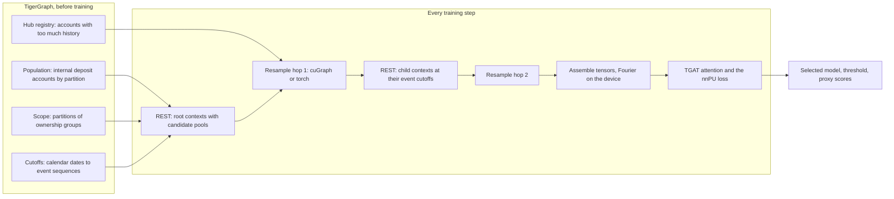

# Training

How one model learns to rank mule accounts from a few revealed examples, and how a run is
judged. [Sampling](sampling.md) explains how a batch's neighbourhoods are drawn,
[Feature design](feature-design.md) what the model reads, and
[Leakage and scaling](leakage-and-scaling.md) why none of it sees the future or a
held-out account.

## The idea

Every account is scored at a calendar cutoff from its own payment history and the
history of its counterparties, exactly as they looked before that cutoff. TigerGraph does
the heavy work: it filters events by time and by experiment partition, computes the
features and returns a bounded pool of candidate neighbours for each account over REST.
The client resamples a fixed fan-out from those pools (with cuGraph on a CUDA GPU),
expands time deltas into Fourier features on the device, and trains a memoryless
[TGAT](https://arxiv.org/abs/2002.07962)-style attention model with a non-negative
positive-unlabelled (nnPU) loss. No account id is a model parameter, so the same weights
score accounts that never appeared in training.

## The labels it learns from

The model trains only on the mules revealed in the graph (`pu_label`): 20 in train, 11 in
validation and 20 in test on the reference graph, each usable only once it was known
before the scoring cutoff. The [label reveal](label-reveal.md) chose them once, the way a
bank would have discovered them. Every other account is unlabelled, never a negative:
positive-unlabelled learning treats the unlabelled set as a mixture of non-mules and
hidden mules. Ground truth stays in the graph for the audit and never reaches training
code.

## The model

`model.tgat.TGAT`, the `tgat` architecture of the built-in run (101,121 parameters at
hidden 64, 4 heads and dropout 0.15):

1. Project the nine node columns of `x` (entity type, `is_external`, `is_deposit`,
   `history_withheld`) of every context to 64, and the same columns of the outermost
   counterparties.
2. Embed each message: a linear map of its 142 columns plus a relation embedding (18
   relations) and a rail embedding (7 rails).
3. Attention block 1: every context attends over itself and its hop-2 messages.
4. Attention block 2: every root attends over itself and its hop-1 neighbours (their
   block-1 outputs plus the hop-1 message embeddings).
5. Slot sum: the same hop-1 tokens go through a small MLP (64 to 64, GELU, 64 to 64);
   padded slots are zeroed and the rest summed and divided by the hop-1 fan-out, 16.
6. Summary branch: project the root's 15 pool counts to 64.
7. A head on the attention output, the slot sum and the summary (192 wide) gives one
   logit per root.

Attention averages linear projections of the slots with weights that sum to one, so a
condition that combines several inputs of one slot (an internal, first-time and large
inflow, say) cannot be separated before the slots are pooled, and how many slots meet it
shows only indirectly. The slot sum applies an MLP to each slot first and sums the
results, so it counts the slots that meet such a condition: mean and max aggregators
cannot tell apart multisets that differ only in multiplicity, while a sum can ([Xu, Hu,
Leskovec and Jegelka, "How Powerful are Graph Neural Networks?", ICLR
2019](https://arxiv.org/abs/1810.00826)). The divisor is the configured fan-out, not the
number of filled slots, so padding changes nothing; under the built-in sampler most roots
fill all 16 slots, so the sum is mostly the share of slots that meet the condition.
Counts beyond the 16 drawn slots reach the model through the pool groups. Only the hop-1
slots get a sum: a hop-2 sum would need its own merge back into the tokens, over a
fan-out of only 4. The slot sum is provisional; the `no_slot_sum` variant measures it.
Without it the model has 88,705 parameters, and without the pool groups as well 83,457.
Input widths follow from the feature groups (`contract.feature_groups`): a group left out
has no columns and no projection weights, and a model without node inputs has no node
projection at all.

The `summary` architecture (`model.summary_mlp.SummaryMLP`, 5,953 parameters) reads only
the root's own node and pool columns and fetches no children. It exists for the
`no_attention` control, which asks whether attention adds anything beyond the root's own
inputs.

## The loss

The loss is imbalanced nnPU ([Su, Chen and Xu, IJCAI
2021](https://www.ijcai.org/proceedings/2021/0412.pdf)): the nnPU risk of [Kiryo et al.,
2017](https://arxiv.org/abs/1703.00593) reweighted as if positives and negatives were
balanced (`model.loss.NonNegativePULoss`, `training.objective`).

- **The class prior**, `loss.class_prior = 0.001`, is an explicit assumption of the share
  of mules among all accounts (the simulated data holds 233 mules in 317,840 internal
  deposit accounts, about 0.00073). It is neither the revealed-label rate nor inferred
  from hidden truth.
- **The positive weight**, `loss.positive_weight = "balanced"`, puts `1 - class_prior` on
  the positive risk. That is the paper's objective with a balanced target prior of 0.5, up
  to a constant factor.
- **Each step** draws a quarter of its roots from the revealed training positives, with
  replacement (16 of 64), and the rest from the label-blind training marginal, visited
  once per epoch. Unlabelled accounts are never negatives.

`"prior"` is textbook nnPU, and on this graph it collapsed. With a prior of 0.001 the
unlabelled accounts push scores down 500 times harder than the revealed positives pull
them up, and scoring every account near zero costs only the prior, so within the first
epoch every score went there: the loss settled at the prior and the selected threshold
was about 1.7e-7 ([the nnPU positive weight](../research/nnpu-positive-weight.md)). Under
the balanced weight that state costs `1 - class_prior`, so nothing draws the model to it.
Under this weight the scores rank accounts; they are not probabilities, and only the
validation-selected threshold gives them a cut-off.

The balanced weight is provisional too: the `prior_weight` variant compares it over
seeds. With 20 revealed positives drawn about 80 times each per epoch, its main risk is
memorising them. Watch `history.csv`: `objective` is the unclamped risk and
`corrected_steps` counts the steps whose non-negative correction fired. A training loss
far below the first epoch's, rising corrections, a validation AP that peaks early and
falls, and an early stop all point to memorisation; the saved model is still the best
validation epoch.

## A run

`training.trainer.train` runs one configuration on one prepared dataset into one run
directory.

- **Checks before anything runs:** the dataset's manifest and file hashes, its query
  hashes and dataset settings against the configuration, the installed query texts and
  endpoints, the graph's vertex counts and the scope with its unowned rule (the frozen-source
  check), and that the context source requests every input the model reads, with the
  model's pools, at both hops.
- **The schedule** is drawn up front for each epoch from the saved generator: the date,
  the roots and the step seed. An epoch has up to `training.steps_per_epoch` steps for
  each train cutoff, 100 in the built-in run, which has one; the line that starts
  training gives the steps the schedule takes.
- **Prefetch:** `runtime.prefetch_batches` worker threads build the next batches while
  the current step trains, sharing one bounded pool of REST requests; results are used in
  order, so a run is reproducible.
- **Determinism:** `runtime.deterministic` turns on deterministic algorithms (warning on
  CUDA-only gaps; `"strict"` fails on them), and every step reseeds torch from a stable
  hash of the seed, the epoch and the step, so dropout and sampler draws never depend on
  history. The command line reserves cuBLAS's deterministic workspace before any CUDA
  work. On CUDA, attention runs on the math kernel of scaled dot-product attention: the
  fused memory-efficient kernel torch would pick has a backward pass that is not
  deterministic. Each root attends with one query over its sampled slots, so the math
  kernel's extra cost should be small; CPU and MPS keep their kernels.
- **Validation** after each epoch scores the revealed validation positives (11 on the
  reference graph) and a fixed sample of 2,000 unlabelled validation accounts, at the
  validation cutoff in phase 2, and records three criteria in `epochs.csv`: the proxy
  average precision, the proxy ROC AUC and the run's nnPU risk on the same sample, with
  its own prior and positive weight (the non-negative risk the loss estimates, lower being
  better). `training.selection` chooses the epoch that is kept: by default the one with the
  best proxy average precision, or the best ROC AUC, or the lowest risk, and training stops
  after `training.patience` (6) epochs without a better one; or `"none"`, which trains
  every epoch and keeps the last. With so few revealed mules the AP of an epoch hangs on
  where the top few rank, so which rule picks better models is a question the control
  experiments' `methods` suite asks. The threshold maximises validation F1.
- **Weight averaging:** validation scores an exponential moving average of the weights,
  and the selected epoch's average is what `model.pt` keeps; training itself follows the
  raw weights. After n steps the decay is `min(0.99, (1 + n) / (10 + n))`, so the average
  spans about the last n / 10 steps until it reaches 0.99 at step 890, then about one
  epoch. In the reference run the raw weights' AP swung between 0.011 and 0.096 from
  epoch to epoch. `training.weight_average_decay = 0` validates the raw weights.
- **Resume:** `resume.pt` is written atomically after every epoch (and every
  `runtime.checkpoint_every_steps` steps) with the model, optimizer, weight average,
  random generators, schedule position, selection so far and counters. Continuing from
  it on the same device, threads and determinism reproduces the uninterrupted run
  exactly; a resumed run reproduced an uninterrupted run's epoch-2 loss and validation AP
  to every digit. Transport and logging settings and `runtime.max_rejected_root_fraction`
  may change on a resume; a setting that changes results may not.
- **The end:** the selected model is saved before any test context is requested, then
  the test split (the 2025-01-01 cutoff, phase 3) is scored once with the frozen model and
  threshold, and `metrics.json` is written. Test never influences selection.

### Rejected roots

TigerGraph can reject a context (missing, not yet visible, or over the history cap). A
rejected child is masked out of its root's first hop and counted. A rejected root is
dropped from its batch only within `runtime.max_rejected_root_fraction` (0 in the built-in
run, so any rejected root fails the run):

- a training epoch fails as soon as its rejected roots exceed the limit times the epoch's
  requested roots, or when any rejected root is an observed positive;
- validation (every epoch) and test apply the same rules to the whole split, and
  validation must keep both observed classes;
- a run in which no epoch produced a value of its selection rule (a finite validation AP,
  by default) refuses to save weights.

The limit decides only whether a run may go on, never its numbers, so a resume may raise
it ([Train and evaluate](../how-to/train-and-evaluate.md#when-tigergraph-rejects-roots)).

## Proxy metrics and the ground-truth audit

Training sees only revealed labels, so everything it records is a proxy: the validation
and test metrics in `epochs.csv` and `metrics.json` score the revealed mules against up to
2,000 unlabelled accounts, which count as negatives although some are hidden mules. With
11 validation positives, AP is coarse: across random draws of 11 positives, a simulated
model of constant quality (ROC AUC 0.89) spans 0.04 to 0.35.

### The ground-truth audit

`mule evaluate` audits the frozen model against the ground truth, after selection, on
each held-out split:

- **The sample** holds every mule of the split's population and 2,000 uniformly sampled
  non-mules, each with its probability of being included. It depends only on the scope,
  the truth and `dataset.split_seed`, so every run of a dataset is audited on the same
  accounts and two runs can be compared account by account.
- **The metrics** estimate the whole split: each sampled account stands for 1 / its
  inclusion probability accounts. Average precision, ROC AUC, precision, recall and F1 at
  the frozen threshold, and precision and recall when reviewing the highest-scored 1, 5 or
  10% of the estimated population. Tied scores form one block, as they form one threshold
  of the average precision: a budget that ends inside the block takes the same share of
  each of its accounts, the expected result of ordering them at random.
- **The intervals** are 90% bootstrap intervals from 1,000 replicates: mules are
  resampled by ring, since mules of one ring are not independent (a mule without a ring
  alone; the reference load records none), and non-mules within their class, each keeping
  its inclusion weight.
- **Revealed and hidden mules** are reported apart: a model that ranks only the mules
  like those it was shown is not the detector a bank needs.
- **Its bounds:** an audit holds at most 1,000,000 accounts of a split's partition and
  scores at most 100,000 (`contract.bounds`). It is a bounded audit of a frozen graph, not
  a production truth service, and it needs complete 0/1 truth and one cutoff per split.

**Decisions use the validation audit; the test audit is for reporting.** Choosing a
variant, a setting or a threshold on the test audit would make the test number
optimistic. It is optimistic already for one reason: the pool groups were designed after
a diagnostic study read test-split mules ([the diagnostic
study](../research/diagnostic-study.md)), so test results for them overstate what a fresh
split would show.

No mule-detection quality is established by one run. The reference run of the built-in
settings reached a test audit AP of 0.134 and ROC AUC of 0.931 against a prevalence of
0.00084 ([the reference runs](../research/reference-run.md)); the control experiments
measure its parts over ten seeds.
