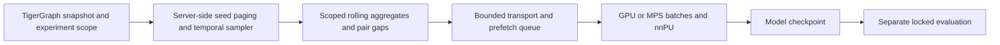

# Leakage controls and scalable temporal training

## Current status

The strict sampler is implemented. `temporal_training_context` checks frozen
server-side Account/Party partitions before payment aggregation, association
summaries, neighbor selection and pair-history calculations. The default
`strict_inductive` experiment withholds existing ownership groups from training.
Shared auxiliary entities are allowed, with held-out account/party contributions
removed. Explicit `shared_history` mode is a different evaluation protocol.

The live fixture in `scripts/temporal/verify_strict_isolation.py` adds and changes
held-out payments and shared-identifier associations, then compares complete
training contexts. It also checks future-event exclusion, an accelerator update,
and inference for an account inserted after that update. Fixture vertices are
UUID-prefixed and removed afterwards. Unit/integration tests check scope propagation,
label separation, bounded seed selection and batch-local IDs. These checks do not
establish production-scale performance or rule out missing source availability data.

The model has no per-account learned parameters. `score-new` can score new IDs
without a prepared training cohort, using history before the requested cutoff.
Successful inference demonstrates architectural induction; measured quality on
newly arriving accounts requires its own chronological evaluation cohort.

## Leakage is broader than target labels

For a strict experiment, held-out accounts must not contribute to training
neighborhoods **or** rolling counts, amounts, unique-counterparty counts, degree
statistics, pair histories or association summaries. A model can exploit an
excluded account's activity through a feature even when its node is omitted.
Apply the visibility predicate before all aggregation and sampling operations.
Audit shared devices/tokens separately: an auxiliary entity that existed in the
training graph can be legitimate context for a newly arriving test account;
information added by that test account cannot be present in training features.

Event time and knowledge time are separate. A relationship effective in March
but only received in May must not appear in a March backtest. Valid-time filters
alone cannot enforce this. Require arrival/discovery timestamps or immutable
snapshots with a documented ingestion watermark. Unknown availability cannot be
made safe by setting a flag in configuration.

Account-label availability, effective time, feature preprocessing, model selection
and repeated inspection of hidden test scores are additional leakage channels.
Use forward time splits; fit preprocessing only on permitted training facts;
freeze class-prior assumptions, threshold and checkpoint before final evaluation.

## Three defensible evaluation protocols

| Protocol | What training may see | Question answered |
|---|---|---|
| New-account chronological holdout | Only accounts/events observable before training ends | Can the model score accounts first observed later? |
| Withheld existing ownership groups | An induced training graph with held-out account groups and their contributions removed | Can the model generalize to intentionally unseen existing groups? |
| Shared-history chronological evaluation | Earlier unlabeled context from accounts later used as test seeds | Can the model forecast risk using the observable network? |

Recommend the first as the primary operational inductive test, and the second as
a controlled stress test. They are different from recovering masked labels on
training accounts. Inspect source coverage first: a generator that creates every
mule account before the training cutoff may provide no positive cold-start test
cohort. Change the simulation or observation period rather than silently moving
old accounts into a supposedly new-account cohort. The third remains useful, but
must be reported by its own name.

The implementation stores withheld-group membership in the dedicated
`Temporal_Training_Scope` vertex and `Entity_In_Training_Scope` relation.
Keep this independent of production account attributes. Sending a huge exclusion
list on every request and filtering only returned neighbors are unsuitable.
Every entity-time context and materialized feature must include the visibility
scope/snapshot identity in its key. Old full-graph features cannot be reused.

Regression requirements (source arrival-time replay still needs arrival-time data):

- Add/delete/alter held-out accounts and assert every training feature, neighbor
  and time vector remains unchanged.
- Add future transactions and future/late-arriving associations; earlier inputs
  must remain unchanged.
- Change hidden evaluation truth with observed labels fixed; training weights and
  checkpoint selection must remain unchanged.
- Check train/validation/test ownership-group isolation and available positive
  counts without changing budgets automatically.
- Compare scoped pair gaps, frequency counts and visibility against a small
  independently computed oracle.

## Observed labels and evaluation truth are different interfaces

The trainer depends on `ObservedLabelSource`, not a generator or masking
algorithm. Its rows contain `account_id`, `known_positive`, `known_from_ms`.
Unlisted/zero accounts are unlabeled, not confirmed legitimate accounts.
Production's graph adapter maps confirmed `is_mule=1` plus an explicit known-label
flag and discovery timestamp to this contract. If production uses a different
label table or only an `is_mule` field, implement an adapter and supply the
availability semantics there; the model and loss need no rewrite.

Complete simulation `is_mule` values are oracle truth. A local simulation utility
may read them once to create the desired observed-label budget. That utility is
outside the production dependency tree and ignored by Git. It emits an
observed-label file and a separate evaluation-truth file. The trainer rejects
oracle columns and does not load the latter. When an external observed-label
provider is used, the population query skips reading graph label attributes.

A separate `evaluate` command joins truth with saved predictions and applies the
checkpoint's already selected threshold. Do not interpret an unknown production
label as a negative for evaluation. A bare production 0/1 column cannot represent
both unknown and adjudicated-negative states without an external contract.
Historical truth changing over time should be supplied per account/date; a static
truth file is appropriate only when that is the declared target definition.

## Bounded transport rather than full feature replication

`ContextSource` is the model-facing interface. Two implementations exist:

- `StreamingContextSource`: requests the current batch from TigerGraph, retains
  64 contexts in memory by default (hard maximum 256), and writes no disk context
  cache. Each HTTP request is capped at 16 contexts; query concurrency and queued
  results are bounded to two by default, with a configurable maximum of four.
- `ContextStore`: the earlier compressed SQLite implementation, retained as an
  explicit offline experiment option (`context_storage = "sqlite"`).

The default example uses streaming. Preparation pages partition metadata from
TigerGraph and retains label-blind seed reservoirs plus observed positives, then
resolves cutoffs. It does not precompute a feature cache or retain all account IDs.
Training and evaluation query the source as needed. Stream mode requires a frozen
source or a future snapshot-aware service; it does not provide database snapshot
isolation by itself. Manifests and count checks cannot detect same-count edits.

The current client bounds both seed metadata and feature batches. At default
settings it retains at most 24,000 uniformly selected seed records plus the
observed-positive pool, with 10,000-row pages discarded after selection. Server-side
membership controls the wider graph, independent of this small seed sample.
A disposable typed/temporal ID map allocates only the current batch's dense
indices. At 64 roots and fanouts 8/4, there are at most 576 queried contexts.
Admission checks reject oversized root counts, context counts and tensor/model
working estimates before allocation. See the [training guide](live_temporal_training.md)
for exact limits. This does not guarantee available system RAM or bounded
TigerGraph server memory for every degree distribution.

Hundred-billion-vertex scalability has not been demonstrated. Server-side scope
construction still visits ownership components, population pages can rescan
membership, cutoff resolution scans event clocks, and GSQL scans adjacency
histories. Indexed cutoff watermarks, time-organized adjacency and scalable
partition/seed selection remain production work. Per-epoch step limits and fixed
evaluation samples bound work but do not prove population performance. Oracle
AP on a cohort enriched with revealed positives is still cohort-specific unless
corrected for selection probability.

Current architecture, with future indexing/staging options below:

TigerGraph should apply scope and time predicates, find neighbors/predecessors,
aggregate activity and compute requested Fourier vectors. Neural-network forward
passes, gradients and optimization remain in PyTorch. A GSQL calculation is not
a learned model embedding.

## Transport alternatives and trade-offs

| Option | Advantages | Costs / unresolved work |
|---|---|---|
| Bounded custom REST requests | Simple, existing implementation, minimal client retention | Round trips, JSON overhead and repeated query scans |
| TigerGraph GDS with Kafka-backed batches | Bounded batch delivery and prefetch, decoupled producer/consumer | Broker/security/Cloud configuration; custom temporal and visibility semantics still required |
| Scoped sharded exports to shared storage near GPUs | Repeatable multi-epoch training, distributed readers, database decoupling | Snapshot refresh/storage cost; export only relevant partitions, not a laptop mirror |
| Sampler service with bounded shared cache | Reuse across GPU workers and epochs | Operational complexity; keys must include snapshot, scope and cutoff |

The installed-version documentation must be checked before choosing GDS:
`filter_by` selects **seeds**, not all traversed neighbors. A seed filter alone is
not an inductive boundary. A temporal transform applied after fetching likewise
cannot undo leaked server-side aggregates. The [documented HTTP/Kafka distinction](https://www.tigergraph.com/docs/pytigergraph/1.6/gds/dataloaders)
also matters: HTTP may collect batches before iteration, while Kafka delivers
batches incrementally. Verify behavior in the installed client. Do not infer bounded streaming merely
from an iterator API.

Reducing scans matters more than simply moving Python arithmetic into GSQL:
maintain time buckets or suitable temporal indexes, maintain directed-pair
predecessor state for in-order ingestion, and handle late events/backfills
explicitly. A heap bounds returned rows but can still scan the entire history.
Do not promise indexed time-range reads until supported query plans are measured
on the deployed TigerGraph version.

## References

- [TGAT: Inductive Representation Learning on Temporal Graphs](https://arxiv.org/abs/2002.07962)
- [Temporal Graph Benchmark](https://arxiv.org/abs/2307.01026)
- [TGB evaluation rules](https://tgb-website.pages.dev/docs/leader_rules/)
- [TigerGraph data loaders](https://www.tigergraph.com/docs/pytigergraph/1.8/gds/dataloaders)
- [TigerGraph GDS factory functions](https://www.tigergraph.com/docs/pytigergraph/1.8/gds/factory-functions)
- [GSQL SELECT evaluation and sampling](https://www.tigergraph.com/docs/gsql-ref/4.2/querying/select-statement/)
