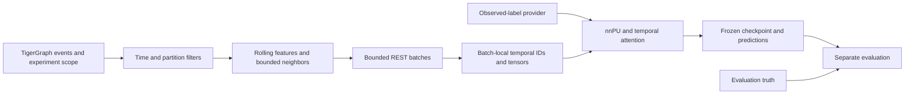

# Training from the live temporal graph

The [feature-group redesign](feature_redesign.md) documents the window-free feature groups, optional summaries and migration. Fixed 83/135 dimensions below describe the legacy control profile (the recent sampler, legacy feature groups and the single architecture). The built-in v5 run (`DEFAULT_RUN` in `config_schema.py`) adds per-hop candidate pools, per-step resampling and a hub registry; see [candidate pools and resampling](#candidate-pools-and-resampling).

The live path is `mule_pattern_learner.temporal.live`: cutoff-aware GSQL features,
two layers of temporal attention and nnPU learning. Source belongs in Git, and the
settings are built into it (`DEFAULT_RUN`). Data, checkpoints and JSON reports are
ignored.

The default protocol, `strict_inductive`, withholds entire ownership groups from
training. TigerGraph removes held-out Account/Party contributions **before**
computing features or selecting neighbors. This is an unseen-existing-group
benchmark. It does not imply the held-out accounts were first opened after
training. Arbitrary new-account prediction is supported separately.

## Architecture and feature flow

This is a [TGAT-style adaptation](https://arxiv.org/abs/2002.07962), with fixed
64-dimensional Fourier time features and learned heterogeneous relation/rail
embeddings. It has no learned account-ID table and no recurrent TGN memory.
Shared weights can score accounts absent from the training batches.



The model receives 83 entity/context features and 135 numerical features per
sampled relationship. The [GSQL catalog](gsql_feature_catalog.md) lists every
family and the Fourier formula. GSQL computes activity, amounts, connectivity,
recency, amount ratios, pair frequency and time vectors. Python applies fixed transforms and
trains shared attention weights; labels are never input features.

A payment neighbor is represented using history strictly before that payment's
sequence. The same account at two historical cutoffs is therefore two contexts.
Associations use their valid interval and retain their parent's cutoff.
Valid-time filtering cannot reconstruct when a backdated fact became known;
real historical replay needs arrival/discovery history as well.

## Strict experiment scope

`Temporal_Training_Scope` and `Entity_In_Training_Scope` hold experiment
membership separately from business attributes. Scope creation groups Account
and Party vertices connected by any ownership tenure and assigns each component
a deterministic 70/15/15 partition. It never reads mule truth. All ownership
history is used conservatively for grouping, not as a model feature. Membership
is frozen and verified before the scope becomes ready.

An Account without an ownership edge has no Party in its component. Where such
unowned accounts go is decided by `scope_unowned` when the scope is created:

| `scope_unowned` | Unowned external accounts | Unowned internal accounts |
|---|---|---|
| `"independent"` | Own hash partition, like any component | Own hash partition |
| `"shared"` | Partition 1 (visible in every phase), group ID `shared:<component>` | Own hash partition |
| `"linked"` (default) | As `"shared"` | The partition and group ID of their only owned internal deposit counterparty, when there is exactly one; otherwise their own hash partition |

For `"linked"`, the counterparties of an unowned internal account are the other
Account endpoints of all its Payment_Transaction and Zelle_Transfer events, over
all time and without labels, restricted to internal deposit accounts that have an
owner. The link is assigned after the ownership components are final. Components
that contain a Party therefore keep the same component, partition and group ID
under every rule. Linking reads every event of every unowned internal account
once. This happens only in the one-off creation call, which has a one-hour timeout
and a single attempt, and its server time has not been measured yet.

The rule is read back from the stored membership by the read-only
`temporal_scope_policy` query. It counts the scope's unowned member Accounts by
class and side (internal or external). An account is shared when its group ID
starts with `shared:`, independent when its group ID is its own component, and
linked otherwise. The counts map to a rule as follows:

- `"independent"`: nothing shared and nothing linked.
- `"shared"`: every unowned external account shared, nothing linked.
- `"linked"`: every unowned external account shared (if there are any), at least
  one internal account linked.
- No rule: anything else, such as shared internal accounts (an early draft rule).

Preparation checks the inferred rule against `scope_unowned` when it reuses a
scope and right after it creates one. Every streamed run checks it again, and a
mismatch names the stored rule and asks for either that `scope_unowned` value or a
new `scope_id`. Scopes created before the rule existed, such as `strict_mule_v1`,
read as `"independent"`. Rules that write identical membership cannot be told
apart and read as the simplest of them: a `"linked"` scope in which no internal
account qualified reads as `"shared"`, and a scope with neither unowned external
accounts nor links reads as `"independent"`. Set `scope_unowned` to the inferred
value to use such a scope; its membership is the same.

Visibility is cumulative:

| Phase | Context may use | Optimizer updates? |
|---|---|---|
| Training | Training Account/Party members only | Yes |
| Validation | Training and validation members | No |
| Test | All members of the frozen scope | No; checkpoint and threshold already fixed |

Shared tokens/devices/IPs/addresses are allowed. An excluded Account/Party's
payments, associations, amount contributions and pair histories are removed from
their training contexts. A payment with any excluded account endpoint is removed
entirely. New accounts outside the frozen scope cannot silently enter training.

Scope identity includes a source ID and split seed. Component partitioning uses
TigerGraph internal IDs only during server-side setup; those IDs are not model
features or tensor indices. After reloading or materially changing the graph,
use a new dataset ID and scope. Count/source fingerprints detect several mistakes
but cannot detect all same-count edits. Live query definitions, counts, the
scope header and the scope's unowned rule are rechecked when opening a streamed
run, including reuse of prepared metadata. Keep the source frozen for the
experiment.

## Observed labels and masking

The trainer depends on `ObservedLabelSource`, not on a masking implementation.
Its table contains `account_id`, `known_positive`, `known_from_ms`. Unlisted
accounts are unlabeled; usable positives must be known before the scoring cutoff.
Oracle `is_mule`, mask and ring columns are rejected from this interface. The
built-in run uses `label_policy = "graph_observed"`; an experiment may configure
a Parquet source instead.

- `observed_labels = "<parquet>"` (relative to the repository root) selects
  `ParquetObservedLabels`, an observed-only table. The population queries then
  skip graph label reads completely.
- `label_policy = "graph_observed"` selects `GraphObservedLabels`. It is the only
  source that runs the population queries with `include_observed = TRUE`. An
  observed positive is then the revealed positive of the
  [account label contract](account_mule_labels.md):
  `pu_label == 1 AND is_mule == 1 AND mule_label_known AND NOT is_mule_masked`.
  Only those accounts carry a discovery time (`known_from_ms`, from
  `mule_label_available_ts_ms`); masked mules and every other account come back
  with `observed_positive` false and `known_from_ms` 0. The client fails fast when
  any other row carries `known_from_ms > 0`, which means an older population query
  that also revealed masked labels is still installed. Strict preparation checks
  this on every population page, and there any label information in a page
  requested without `include_observed` is refused too. On a fresh load the first
  run fills those fields with the [label reveal](label_reveal.md), which simulates
  when a bank would have discovered each mule.
  Datasets prepared with it before the masked-label predicate counted masked mules
  as positives and must be prepared again.

A configured `observed_labels` file that does not exist stops `prepare`, `train`
and the batch benchmark with "Observed-label source file not found at <path>: point
observed_labels at an existing file (paths are relative to the repository root), or
remove observed_labels to use the labels revealed in the graph". Its content hash
is a preparation setting, so the check cannot be skipped.

The reveal (`temporal_reveal_mule_labels`) is the only place that reads complete
synthetic truth before training. It reveals up to 20 positives per split among
the mules discovered before each split's cutoff (20, 11 and 20 on the 2024
snapshot) and writes them into the graph's label contract; the trainer reads only
the revealed positives. Oracle truth is used by the separate evaluator after
checkpoint selection, never to select an epoch or threshold. Production
substitutes its real label feed; no masking dependency is required.

`is_mule=0` in production must mean unlabeled unless independently adjudicated
negative. Full synthetic 0/1 truth has different semantics. Unknown evaluation
truth must be absent or -1, not silently converted into a legitimate account.

## Bounded cohorts and nnPU

TigerGraph pages preassigned partition metadata in pages of at most 10,000 rows.
Python keeps deterministic, label-blind seed reservoirs: by default 20,000 train,
2,000 validation and 2,000 test seeds, plus observed positives. It does not collect
the full graph or all ownership IDs. The allowed maximum is 20,000 reservoir
records per split plus 40,000 observed positives; prepared metadata is capped at
100,000 rows. The graph neighborhoods still come from the wider permitted graph.

Each nnPU batch draws observed training positives and a separate uniform training
marginal. Positives retained outside the reservoir are not inserted into the
marginal, which would bias its risk estimate. Unknown accounts are not negative
training targets. The `class_prior` is an explicit prevalence assumption, not
the observed-label fraction and not inferred from hidden truth. Sensitivity to
that assumption remains part of the experiment.

Checkpoint and threshold selection use validation observed-positive/unlabeled
proxy metrics. They are not true-label detection metrics. Evaluation retains
known positives and a bounded unlabeled sample, so AP/precision describe that
cohort, not population prevalence. Test results do not select the checkpoint.
A representative evaluation or appropriate sampling weights is necessary for
population claims, including when using complete synthetic truth.

## Memory, IDs and transport

The default `context_storage="stream"` makes bounded installed-query HTTPS/REST
requests. It never writes a full feature cache. `ContextSource` separates transport
from batching/model/loss: `fetch(keys, hop=1|2)` returns rows in key order, `None`
where TigerGraph rejected a request, and counts rejections by status
(`rejections`, once per rejected key and fetch) and per hop (`rejections_by_hop`,
1 for roots and 2 for children). Several batch-builder threads share one bounded
request pool; a key already being fetched is awaited instead of requested twice,
and the LRU is keyed by `(hop, key)`. The pool's workers are daemon threads.
After an error or Ctrl-C, training and scoring close the source without waiting:
queued requests are cancelled, and requests already in flight finish on their own
or are dropped when the process exits, so neither the error nor the exit waits for
a REST retry chain.

Optional SQLite staging remains available for small, repeated experiments; it is
not required by training or new-account prediction. For the `resample` policy it
caches every candidate child, because training draws different children each step.

Every failure is classified before it is retried, and each class has its own
budget:

| Class | Examples | Budget |
|---|---|---|
| Availability | Connection errors, HTTP 502, 503, 504, 408, 429 and every other 5xx except 500, HTML error pages (including the page TigerGraph Cloud serves while a workspace starts), chunked-encoding errors, overload and not-ready messages | Retried with jittered exponential backoff (from 4 s, capped at 60 s) until `max_outage_s` seconds (default 900) have passed since the operation's first such failure |
| Server timeout | Code REST-3002 (also inside a JSON 5xx body), a timeout message, a client read timeout | Retried once, then `ServerTimeoutError` |
| Suspected deterministic | A bare HTTP 500, a response that is neither JSON nor HTML, query out of memory | Retried once |

Contract and validation errors, per-request statuses and every other error are
permanent and raise on the first attempt; writes (scope creation) get exactly one
attempt. `max_query_attempts` (default 6) caps the attempts that count: every
attempt except an availability failure that failed within 30 s. A fast-failing
outage is therefore bounded by the wall clock and a request that hangs on every
attempt by the attempt cap. Worker threads share one "backoff until" time, so when
one of them finds TigerGraph unavailable the others pause too, and any success
ends the pause. Retry logs name the query and its key count.

The TigerGraph client raises `requests.HTTPError` for a 5xx, 408 or 429 response
before pyTigerGraph reads the body. pyTigerGraph would otherwise turn a JSON error
body into an exception without a status, so a JSON-bodied 503 would look like a
permanent query error. 401, 404 and the other 4xx responses are left to
pyTigerGraph (token refresh and endpoint fallbacks need them). Every HTTP session
has finite timeouts (30 s connect, 600 s read).

A context request that TigerGraph times out on is not repeated as a whole. A block
of several keys is split in half at once (without a timeout retry) and each half is
requested on its own, which isolates a slow key in a logarithmic number of extra
calls; `diagnostics["timeout_splits"]` counts the splits and `query_calls` counts
successful REST calls. A single key gets one retry and then raises
`ContextTimeoutError`, which names the context key and hop. It is fatal on purpose:
which keys time out depends on server load, so dropping one would make the
training data depend on it. Retry when the server is less busy, or prepare again
with a lower `max_history`.

`BatchIndex` maps `(vertex_type, public_id, cutoff_seq, cutoff_ms, scope_id, phase)`
to dense integers for the current batch only. Duplicate contexts reuse an index;
different types, cutoffs or visibility scopes get distinct indices. A new batch
can reuse integers starting at zero. Global uniqueness across all training
batches is neither necessary nor desirable because the model has no per-ID
parameters. TigerGraph's largest internal ID never determines a tensor size.

| Limit | Default or hard cap |
|---|---|
| Root batch / fanouts (v5 profile) | 64 roots; 16 then 4 neighbors |
| Queried unique contexts at those settings | At most 1,088 per batch |
| Contexts per REST request (`request_batch_size`) | 16; maximum 64 |
| Concurrent requests (`query_concurrency`) | 8; maximum 16 |
| Retained context LRU (`context_lru_capacity`) | 256 contexts; maximum 4,096 |
| Counted attempts per request (`max_query_attempts`) | 6; maximum 20 |
| Outage budget per request (`max_outage_s`) | 900 s; maximum 86,400; backoff capped at 60 s |
| Accepted roots / unique contexts | 128 / 2,048 |
| Candidate messages per batch (both hops) | 524,288 |
| Input tensor admission budget | 64 MiB |
| Estimated model working budget | 512 MiB |

Large requests fail before database access or tensor allocation. Input and model
working budgets are admission checks, not a guarantee of free RAM in other
processes or a bound on TigerGraph's server memory. MPS shares system memory.
`choose_device()` selects CUDA, then available Apple MPS, then CPU. No full graph
is copied to the accelerator.

With the legacy profile, inputs include `x[N,83]`, `first_edge[B,8,135]`,
`second_edge[N,4,135]` and `second_x[N,4,9]`, plus relation/rail indices and masks,
where `N <= 9*B`. The v5 profile gives `x[N,9]`, `first_edge[B,16,142]`,
`second_edge[N,4,142]` and `second_x[N,4,9]`, with `N <= 17*B`. The outermost peers
carry base metadata; the intermediate contexts carry the requested node features.
Learned account embeddings are outputs of these layers, not persisted time
encodings from GSQL.

Client memory is bounded by cohort and batch limits, but server work still needs
measurement. Scope setup scans ownership, cutoff resolution scans event clocks,
and context aggregation can scan long adjacency histories. Time buckets/rollups,
better sampling access and shared staging near GPUs are later production work;
see [leakage and scaling](leakage_and_scaling.md).

## Candidate pools and resampling

TigerGraph returns a bounded, cutoff-safe candidate pool per context and hop, and
the client selects the fanout from it. `[sampler]` pool keys (`recent`, `older`,
`distinct`, `associations`, `max_history`) describe the roots pool (hop 1);
`[sampler.children]` describes the children pool (hop 2). A context returns at
most `4*(recent+older+distinct) + 14*associations` messages.

The `recent` and `stratified` policies are the deterministic legacy selections
and keep their exact outputs. The `resample` policy draws, per context and payment
relation, at most `relation_fanouts[0]` candidates (hop 1) or `relation_fanouts[1]`
(hop 2) uniformly without replacement, and at most `association_fanout` per
association relation at hop 1. It then merges them into the `K` fanout slots:
payments interleaved by position across the four payment relations, associations
across the association relations, `reserve = min(association_slots, n_assoc, K // 4)`,
`chosen = P[:K - reserve] + A[:reserve]`, then backfill from the remaining payments
and associations up to `K`. The second hop is payments only: `chosen = P[:K]`.

- Training steps (`mode="train"`) draw from the step seed, a stable hash of
  `(seed, epoch, step)`, mixed with the hop. The torch sampler takes its keys from
  a CPU `torch.Generator`, so with `backend = "torch"` a fixed seed gives the same
  neighborhoods on every device. cuGraph draws a different, equally distributed
  subset for the same step seed, so only `backend = "torch"` reproduces
  neighborhoods across devices and backends.
- Evaluation and scoring (`mode="eval"`) always take the torch path with hash keys
  built from `hop_seed(evaluation_seed, hop)`, the context key and the item, so
  scores do not depend on the machine, the torch version or the backend. A root's
  hop-2 draw is independent of its hop-1 draw. Hop-1 keys are unchanged from
  earlier versions; hop-2 draws changed, and the resample fingerprint records the
  key scheme (`selection_keys = 2`). A resample preparation with SQLite storage made
  before this change reports a changed `sqlite_selection` and must be prepared
  again. `model.pt` records the fingerprint as `sampler_fingerprint`.
- `backend = "auto"` uses cuGraph only on a CUDA device whose functional probe
  passed. The probe runs once per process and device: it subsets a tiny candidate
  table with both hops' default quotas, twice with one random state, and requires
  exactly min(candidates, fan-out) rows per (context, relation), identical draws
  and the leakage checks. Otherwise `auto` uses the torch sampler, with a
  RuntimeWarning when cuGraph is installed but failed the probe (when cupy or
  pylibcugraph is simply not installed it falls back silently). `backend =
  "cugraph"` raises with the probe's reason instead, and `"torch"` always uses the
  torch sampler. After every cuGraph call the client checks that each (context,
  relation) got exactly min(visible candidates, quota) rows, so over- and
  under-sampling both fail loudly; a run never switches backend midway. cuGraph
  time keys are `2*event_seq` for payments, `2*cutoff_seq - 1` for associations and
  `2*cutoff_seq` for the context seed, so its strict comparison matches the
  visibility contract.

`event_channel` is no longer a default group: live data carries only `digital`,
`branch_or_atm`, `bank` and `unknown`, one to one with rail. The `CHANNELS` order
changed with the v5 contract, so checkpoints trained with that group under the v4
contract are incompatible (the contract fingerprint refuses them).

### Hub accounts and rejected contexts

Preparation runs `temporal_hub_registry` for the dataset cutoffs and saves
`hubs.parquet` with the columns `account_id`, `cutoff_seq`, `visibility_phase`,
`max_visible`, `max_degree` and `reason`. An Account is a hub at a root cutoff and
phase when its visible history in some payment relation, counting only events
before that cutoff, exceeds `min(roots.max_history, children.max_history)`; the
reason is always `visible_history`. All-time degree never decides hub status:
`max_degree` is informational only, and the former all-time `scan_cap` rule (with
its `hub_scan_cap` key) is gone.

For `strict_inductive` the registry is computed for the preparation's `scope_id`
and has rows per visibility phase 1, 2 and 3. A phase counts only the events whose
Account endpoints are all allowed in that phase, the endpoint rule of the context
query, and the hub itself must be allowed in the phase. A held-out partition
therefore cannot change a training-phase stub decision. Without a scope
(`shared_history` preparations and `score-new`) the counts are unscoped and every
row has phase 3. Counts cover all currencies, an upper bound of the context
query's USD-only capacity check, so an account whose USD history would fit can
still be stubbed; that costs history, never leaks it. The manifest records
`hub_scope_id`, `hub_threshold` and `hub_counts` (`{cutoff_seq: {phase: count}}`),
and loading checks them against the file and the dataset's scope. A dataset
prepared before the scoped registry must be prepared again (train into a new
output).

A hub child is never fetched: the batch uses a local stub with peer metadata and
`history_withheld = 1` (the client-only `hub_indicator` group). The lookup
`is_stub(node_type, node_id, root_cutoff_seq, phase)` uses the root's cutoff and
the batch's phase (3 for unscoped roots), so it only counts history visible before
the prediction time and in that phase. A cutoff or phase that the registry does not
cover is an error, never a silent "not a hub". A non-stub child can never exceed
`max_history`, because a child's cutoff precedes its root's and a child inherits
its root's phase. When the registry lists hubs but the feature plan has no
`hub_indicator` group, training and scoring warn once at start: such a model
cannot tell a stub from a dormant account.

A child that TigerGraph rejects is masked out of the first hop. A rejected root is
dropped from its batch, but only within `max_rejected_root_fraction` (default 0.0,
so any rejected root fails the run):

- A training epoch fails as soon as its rejected roots exceed the limit times the
  epoch's requested roots, or when any rejected root is an observed positive.
- Validation (every epoch) and test apply the same rules to the whole split, and
  validation must still have both observed classes after its rejections.
- A run in which no epoch produced a finite validation AP refuses to save weights.
- The test split is scored after `model.pt` is saved, so a test-split failure
  leaves `model.pt` without `metrics.json`. Resume with a higher limit to finish it:
  the limit decides only whether a run may go on, never its numbers, so a resume
  may change it.

`metrics.json` reports `rejected_roots` per split (`requested`, `rejected`,
`positive`, `unlabeled`) and `max_rejected_root_fraction`. A non-finite model
probability for an accepted root raises instead of counting as a rejection.
Scoring commands list rejected IDs in `<output>.rejected.txt`. Their results
report `rejected` (roots not scored), `rejected_roots_by_status`,
`rejected_children` (child contexts masked out of scored batches),
`rejected_children_by_status`, `stub_children` and `rejection_events_by_status`.
The last is the source's raw counter over both hops, cache replays included, and
replaces the former `rejected_by_status`.

## Commands

Install dependencies with `pip install -e '.[all]'` (Python 3.12 or newer) and
supply the TigerGraph connection in the repository `.env`; environment variables
override it. That is the only input: the settings are built in (`DEFAULT_RUN` in
`config_schema.py`), and an optional `--config overrides.toml` changes only the
keys it sets. Tables merge key by key (`[sampler] backend = "torch"` keeps every
other sampler setting), lists and scalars replace the default, and a `[sampler]`
table that names another `policy` replaces the whole sampler table. Every command
validates the result and rejects unknown keys by name.

`train` installs stale queries itself. To install them ahead of time:

```bash
.venv/bin/python -m mule_pattern_learner.temporal.live.cli install
```

Installation is incremental. A query is stale when its `SHOW QUERY` text differs
from the repository, its REST endpoint is missing or disabled, or the endpoint's
parameters differ. Queries that call a stale query are installed with it (a change
to `temporal_fourier64_values` also reinstalls `temporal_training_context`). Only
stale definitions are created again, because `CREATE OR REPLACE` disables an
installed endpoint until it is installed again, and the command prints which
queries it installs and which are up to date. `--force` treats every query as
stale; `--include-optional` also installs the pair_time64 parity queries.

On TigerGraph 4.2.5 the install request answers only when compilation finishes,
so it runs with a 45-minute read timeout. When the client gives up first (read
timeout, dropped connection or gateway error), the endpoint listing is polled every
30 s until every installed query is enabled. If the 45 minutes pass first, the
command fails and asks you to run `install` again later; the new run installs only
what is still stale. Success is decided by checking every endpoint against the
repository text and parameters, not by a status message.

Preparation writes to `<run>/prepared/` inside the run directory (or to
`artifacts/temporal/<prepared_id>` when a shared `prepared_id` is set). The dataset
identity is the scope's recorded source, or for a new scope the graph name plus a
hash of its vertex counts; a `dataset_id` pinned in an overrides file must match the
prepared dataset. A ready directory is reused without connecting, but only
when its GSQL hashes and its preparation settings still match; otherwise train into
a new output. Preparation
settings are the dates, seed limits, protocol, scope, split and cohort seeds, label
source (content hash), storage, sampler pools, extraction groups, `scope_unowned`
and, for SQLite storage, the fanouts, sampler and architecture that decide what the
cache holds. Model, optimisation and transport settings may change freely.
Set `cohort_seed` to train several model `seed` values on one prepared cohort
(it defaults to `seed`). A missing strict scope is created by the first run (set
`create_scope = false` to forbid that write), and a strict run on a graph without
known labels gets its one-time [label reveal](label_reveal.md). A `shared_history`
run has no scope partitions to reveal by and reads whatever labels the graph has.

`scope_unowned` (default `"linked"`) places the accounts without an owning Party
when the scope is created; see [strict experiment scope](#strict-experiment-scope).
An existing scope keeps the rule it was created with, and preparation checks it
against the configuration, so a different rule needs a new `scope_id`.

The ordinary command prepares bounded metadata if necessary, then trains:

```bash
mule-temporal train
```

It writes `models/temporal/model.pt` and a sibling `model_run/` directory (with the
prepared cohort in `model_run/prepared/`), both ignored. Running it again resumes an
interrupted run; a finished run is refused, so pick another `--output`. Old unscoped
datasets/checkpoints are not compatible; use fresh artifacts. Do not delete valid
prepared metadata just to change model hyperparameters in a separate experiment.
Use the advanced `--dataset` argument to reuse existing metadata with a different
model configuration. The trainer still checks the preparation settings, that the
source requests every input the model reads at both hops, and that it uses the
training sampler.

The run directory holds `config.json` (the validated configuration),
`progress.jsonl` (start, training intervals, evaluation, epoch and completion
records with REST calls, rejection, stub and rejected-child counts, sampler
backend, seconds per step and batch wait time) and `checkpoint_last.pt`, written
atomically every epoch and every `checkpoint_every_steps` steps. Running `train`
again continues from it and reproduces the uninterrupted run exactly. It refuses a
changed result-affecting setting but allows transport (including `max_outage_s`),
prefetch and logging settings and `max_rejected_root_fraction` to change. REST
calls, rejections, rejected-root counts and sampler totals are kept in
`checkpoint_last.pt`, so `progress.jsonl` and `metrics.json`
(`database_calls_during_training`, `rejections`, `sampler_totals`,
`rejected_roots`) cover every segment of a resumed run. `patience = 0` disables
early stopping.

The sampler backend is resolved once per run on the main thread, before batches
are prefetched, and passed to every batch. It is recorded in `progress.jsonl`,
`metrics.json`, `checkpoint_last.pt` and `model.pt`. A resume on a host that
resolves another backend than the checkpoint's is refused, unless an overrides
file names the new backend explicitly (`[sampler] backend = "torch"`, for example);
the remaining steps then sample a different stream, and the run says so.

Batches are built ahead by `prefetch_batches` daemon worker threads. On an error or
Ctrl-C the prefetcher cancels queued builds and re-raises at once, without waiting
for builds in progress, and the context source is closed without waiting for
requests in flight. `deterministic = true` enables deterministic algorithms
(warn-only on CUDA), `"strict"` makes CUDA gaps fail, and `false` turns them off;
the CLI sets `CUBLAS_WORKSPACE_CONFIG=:4096:8` before torch loads unless it is
already set.

Qualify one configured batch without saving a model. The report has REST calls,
retries, seconds, stub and rejected counts and the sampler backend;
`--train-step` adds one optimizer step on the chosen device:

```bash
.venv/bin/python scripts/temporal/benchmark_live_batch.py --train-step
```

On a CUDA host, install the GPU sampler with the extra that matches the CUDA major
version of the torch wheel: `pip install -e '.[all,cuda12]'
--extra-index-url=https://pypi.nvidia.com` (pylibcugraph-cu12 from pypi.nvidia.com, with
torch cu129) or `pip install -e '.[all,cuda13]'`
(pylibcugraph-cu13 from pypi.org, with torch 2.13 or newer on cu130/cu132). Then
check it before relying on `backend = "auto"`:

```bash
.venv/bin/python scripts/temporal/verify_cugraph_sampler.py
.venv/bin/python scripts/temporal/verify_cugraph_sampler.py --live
```

The script starts with the functional probe that `backend = "auto"` runs, then
compares cuGraph with the torch sampler on a synthetic table (exact counts,
temporal validity, uniform inclusion, determinism and latency). Exit code 0 means
every check passed, 1 a failed check, 2 that cuGraph cannot run on the host.
`--live` builds one real batch per backend from the prepared dataset (read-only
queries) and runs one deterministic CUDA training step twice.

Score IDs absent from training, using an ID text file with one account per line:

```bash
mule-temporal score-new \
  --checkpoint models/temporal/model.pt \
  --accounts new_accounts.txt \
  --date 2025-02-01 \
  --output artifacts/new_account_scores.parquet
```

This command streams ID batches and writes scores/embeddings incrementally. It
uses history available before the requested date without the experimental scope,
as an operational scorer would, and computes the hub registry for that cutoff (a
date before the graph's first visible event is refused). It needs neither the
training cohort nor labels. IDs that TigerGraph rejects
(missing, not yet visible, over capacity) are not scored; they go to
`<output>.rejected.txt`, and the result reports root and child rejections apart
(see [hub accounts and rejected contexts](#hub-accounts-and-rejected-contexts)).
The command uses the checkpoint's `max_query_attempts` and `max_outage_s`. An
account with no history can be scored from available metadata, but accuracy on
such accounts must be measured separately.

Evaluate frozen predictions separately:

```bash
mule-temporal evaluate \
  --predictions models/temporal/model_run/test_predictions.parquet \
  --checkpoint models/temporal/model.pt \
  --output artifacts/oracle_evaluation.json
```

Truth comes from the graph's label contract (`temporal_get_account_supervision`,
the oracle endpoint training never calls); an account whose label is not known
counts as unknown, never as a negative. `--truth <parquet>` supplies it instead,
with `account_id`, integer `is_mule` and optionally `date`. Duplicate keys fail
validation. The current evaluator is for bounded experiment prediction
files; it is not a distributed full-population metrics service.

`evaluate-final` scores all test positives and weighted sampled negatives of the
frozen test partition. It takes the test cutoff and hub registry from the
checkpoint's prepared dataset (`--dataset`, or the path recorded in `model.pt`),
and the retry budgets from the checkpoint. It fails before writing anything when a
test positive is rejected or the rejected fraction exceeds the checkpoint's
`max_rejected_root_fraction`, because weighted metrics would then describe a
censored population. Rejected negatives within the limit are listed in
`<output>.rejected.txt`, and the metrics' `evaluation_cohort` ends in
`_minus_rejected_negatives`.

### Upgrading earlier preparations

- Install the changed and new queries first (`temporal_training_population`,
  `temporal_scope_population`, `temporal_create_training_scope`,
  `temporal_hub_registry` and the new `temporal_scope_policy`); `install` finds
  them by itself.
- Prepared datasets without a scoped hub registry (no `hub_scope_id` in the
  manifest) are refused; prepare them again by training into a new output.
- Datasets prepared with `label_policy = "graph_observed"` before the masked-label
  predicate count masked mules as positives; prepare them again.
- Configurations may no longer set `hub_scan_cap`.
- A scope keeps its unowned rule: set `scope_unowned = "independent"` for scopes
  created before the rule existed, such as `strict_mule_v1`, or create a new scope.
