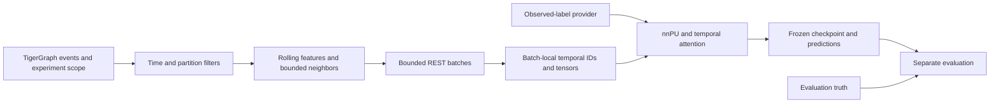

# Training from the live temporal graph

The live path is `mule_pattern_learner.temporal.live`: cutoff-aware GSQL features,
two layers of temporal attention and nnPU learning. Source and generic TOML
configuration belong in Git. Data, local configuration, masks, checkpoints and
JSON reports are ignored.

The default protocol, `strict_inductive`, withholds entire ownership groups from
training. TigerGraph removes held-out Account/Party contributions **before**
computing features or selecting neighbors. This is an unseen-existing-group
benchmark. It does not imply the held-out accounts were first opened after
training. Arbitrary new-account prediction is supported separately.

## Architecture and feature flow

This is a [TGAT-style adaptation](https://arxiv.org/abs/2002.07962), with fixed
64-dimensional Fourier time features and learned heterogeneous relation/rail
embeddings. It has no learned account-ID table and no recurrent TGN memory.
Shared weights can score accounts absent from the training batches.



The model receives 83 entity/context features and 135 numerical features per
sampled relationship. The [GSQL catalog](gsql_feature_catalog.md) lists every
family and the Fourier formula. GSQL computes activity, amounts, connectivity,
recency, amount ratios, pair frequency and time vectors. Python applies fixed transforms and
trains shared attention weights; labels are never input features.

A payment neighbor is represented using history strictly before that payment's
sequence. The same account at two historical cutoffs is therefore two contexts.
Associations use their valid interval and retain their parent's cutoff.
Valid-time filtering cannot reconstruct when a backdated fact became known;
real historical replay needs arrival/discovery history as well.

## Strict experiment scope

`Temporal_Training_Scope` and `Entity_In_Training_Scope` hold experiment
membership separately from business attributes. Scope creation groups Account
and Party vertices connected by any ownership tenure and assigns each component
a deterministic 70/15/15 partition. It never reads mule truth. All ownership
history is used conservatively for grouping, not as a model feature. Membership
is frozen and verified before the scope becomes ready.

Visibility is cumulative:

| Phase | Context may use | Optimizer updates? |
|---|---|---|
| Training | Training Account/Party members only | Yes |
| Validation | Training and validation members | No |
| Test | All members of the frozen scope | No; checkpoint and threshold already fixed |

Shared tokens/devices/IPs/addresses are allowed. An excluded Account/Party's
payments, associations, amount contributions and pair histories are removed from
their training contexts. A payment with any excluded account endpoint is removed
entirely. New accounts outside the frozen scope cannot silently enter training.

Scope identity includes a source ID and split seed. Component partitioning uses
TigerGraph internal IDs only during server-side setup; those IDs are not model
features or tensor indices. After reloading or materially changing the graph,
use a new dataset ID and scope. Count/source fingerprints detect several mistakes
but cannot detect all same-count edits. Live query definitions, counts and the
scope header are rechecked when opening a streamed run, including reuse of prepared
metadata. Keep the source frozen for the experiment.

## Observed labels and masking

The trainer depends on `ObservedLabelSource`, not on a masking implementation.
Its table contains `account_id`, `known_positive`, `known_from_ms`. Unlisted
accounts are unlabeled; usable positives must be known before the scoring cutoff.
Oracle `is_mule`, mask and ring columns are rejected from this interface.

- `GraphObservedLabels` maps `is_mule == 1 AND mule_label_known`, together with
  discovery time, to observed positives. Use it only when those graph fields
  represent actual available labels.
- `ParquetObservedLabels` accepts an observed-only table. With this provider the
  population query skips graph label reads completely.

Simulation masking lives under ignored `local_experiments/`. It may read complete
synthetic truth during setup to reveal 20 training, 20 validation and 20 test
positives. The trainer subsequently reads only that observed table. Oracle truth
is used by the separate evaluator after checkpoint selection, never to select
an epoch or threshold. Production substitutes its real observed-label provider;
no masking dependency is required.

`is_mule=0` in production must mean unlabeled unless independently adjudicated
negative. Full synthetic 0/1 truth has different semantics. Unknown evaluation
truth must be absent or -1, not silently converted into a legitimate account.

## Bounded cohorts and nnPU

TigerGraph pages preassigned partition metadata in pages of at most 10,000 rows.
Python keeps deterministic, label-blind seed reservoirs: by default 20,000 train,
2,000 validation and 2,000 test seeds, plus observed positives. It does not collect
the full graph or all ownership IDs. The allowed maximum is 20,000 reservoir
records per split plus 40,000 observed positives; prepared metadata is capped at
100,000 rows. The graph neighborhoods still come from the wider permitted graph.

Each nnPU batch draws observed training positives and a separate uniform training
marginal. Positives retained outside the reservoir are not inserted into the
marginal, which would bias its risk estimate. Unknown accounts are not negative
training targets. The `class_prior` is an explicit prevalence assumption, not
the observed-label fraction and not inferred from hidden truth. Sensitivity to
that assumption remains part of the experiment.

Checkpoint and threshold selection use validation observed-positive/unlabeled
proxy metrics. They are not true-label detection metrics. Evaluation retains
known positives and a bounded unlabeled sample, so AP/precision describe that
cohort, not population prevalence. Test results do not select the checkpoint.
A representative evaluation or appropriate sampling weights is necessary for
population claims, including when using complete synthetic truth.

## Memory, IDs and transport

The default `context_storage="stream"` makes bounded installed-query HTTPS/REST
requests. It never writes a full feature cache. `ContextSource` separates transport
from batching/model/loss. Optional SQLite staging remains available for small,
repeated experiments; it is not required by training or new-account prediction.

`BatchIndex` maps `(vertex_type, public_id, cutoff_seq, cutoff_ms, scope_id, phase)`
to dense integers for the current batch only. Duplicate contexts reuse an index;
different types, cutoffs or visibility scopes get distinct indices. A new batch
can reuse integers starting at zero. Global uniqueness across all training
batches is neither necessary nor desirable because the model has no per-ID
parameters. TigerGraph's largest internal ID never determines a tensor size.

| Limit | Default or hard cap |
|---|---|
| Root batch / fanouts | 64 roots; 8 then 4 neighbors |
| Queried unique contexts at those settings | At most 576 per batch |
| Contexts per REST request | 16 |
| Concurrent requests / queued results | 2; configurable maximum 4 |
| Retained context LRU | 64 contexts; maximum 256 |
| Accepted roots / unique contexts | 128 / 2,048 |
| Input tensor admission budget | 64 MiB |
| Estimated model working budget | 512 MiB |

Large requests fail before database access or tensor allocation. Input and model
working budgets are admission checks, not a guarantee of free RAM in other
processes or a bound on TigerGraph's server memory. MPS shares system memory.
`choose_device()` selects CUDA, then available Apple MPS, then CPU. No full graph
is copied to the accelerator.

At the default fanouts, inputs include `x[N,83]`, `first_edge[B,8,135]`,
`second_edge[N,4,135]` and `second_x[N,4,9]`, plus relation/rail indices and masks.
Here `N <= 9*B`. The outermost peers carry base metadata; the intermediate contexts
carry rolling features. Learned account embeddings are outputs of these layers,
not persisted time encodings from GSQL.

Client memory is bounded by cohort and batch limits, but server work still needs
measurement. Scope setup scans ownership, cutoff resolution scans event clocks,
and context aggregation can scan long adjacency histories. Time buckets/rollups,
better sampling access and shared staging near GPUs are later production work;
see [leakage and scaling](leakage_and_scaling.md).

## Commands

Install dependencies with `pip install -e '.[all]'` and supply the TigerGraph
connection in a local `.env`. The example is `configs/temporal/live_tgat.toml`.
If present, ignored `configs/local/live_tgat.toml` is selected automatically;
otherwise the example is used. Set source/scope identity, dates and observed-label
source in configuration rather than adding training flags.

After schema/query changes, install the reviewed sources:

```bash
.venv/bin/python -m mule_pattern_learner.temporal.live.cli install
```

The ordinary command prepares bounded metadata if necessary, then trains:

```bash
.venv/bin/python -m mule_pattern_learner.temporal.live.cli train \
  --output models/temporal/model.pt
```

It writes the checkpoint and a sibling `model_run/` report directory, both ignored.
It refuses to overwrite an existing run. Old unscoped datasets/checkpoints are
not compatible; use fresh artifacts. Do not delete valid prepared metadata just
to change model hyperparameters in a separate experiment. Automatic preparation
checks the complete configuration; use the advanced `--dataset` argument to
reuse existing metadata with a different model configuration. The trainer still
checks that dates, scope, feature and sampling contracts match.

Qualify one configured batch without saving a model:

```bash
.venv/bin/python scripts/temporal/benchmark_live_batch.py
```

Score IDs absent from training, using an ID text file with one account per line:

```bash
.venv/bin/python -m mule_pattern_learner.temporal.live.cli score-new \
  --checkpoint models/temporal/model.pt \
  --accounts local_experiments/new_accounts.txt \
  --date 2025-02-01 \
  --output artifacts/new_account_scores.parquet
```

This command streams ID batches and writes scores/embeddings incrementally. It
uses history available before the requested date without the experimental scope,
as an operational scorer would. It needs neither the training cohort nor labels.
An account with no history can be scored from available metadata, but accuracy
on such accounts must be measured separately.

Evaluate frozen predictions separately:

```bash
.venv/bin/python -m mule_pattern_learner.temporal.live.cli evaluate \
  --predictions models/temporal/model_run/test_predictions.parquet \
  --checkpoint models/temporal/model.pt \
  --truth local_experiments/evaluation_truth.parquet \
  --output artifacts/oracle_evaluation.json
```

Truth contains `account_id`, integer `is_mule` and optionally `date`. Duplicate
keys fail validation. The current evaluator is for bounded experiment prediction
files; it is not a distributed full-population metrics service.

## Difference from the main snapshot path

| Concern | Main snapshot path | Live temporal path |
|---|---|---|
| Model | Heterogeneous GATv2 | Recursive event-time temporal attention |
| History | Stored statistics and HAS_PAID bins | Events, cutoff-specific rolling statistics and Fourier age/gap |
| Training boundary | Neighbor filtering; stored full-history features remain a concern | Server-side Account/Party scope applied before features and sampling |
| Supervision | Legacy split/PU flags and local setup | Injected observed-only provider; separate oracle evaluation |
| Transport | PyG remote sampling and feature queries | Bounded ContextSource and disposable temporal ID mapping |
| New-ID serving | Legacy backend dependent | Dedicated bounded scorer without training-cohort dependence |

A score difference alone cannot isolate temporal attention: features, losses,
sampling and validation criteria also differ. Compare matched ablations and
label budgets on the same frozen scope before drawing conclusions.
