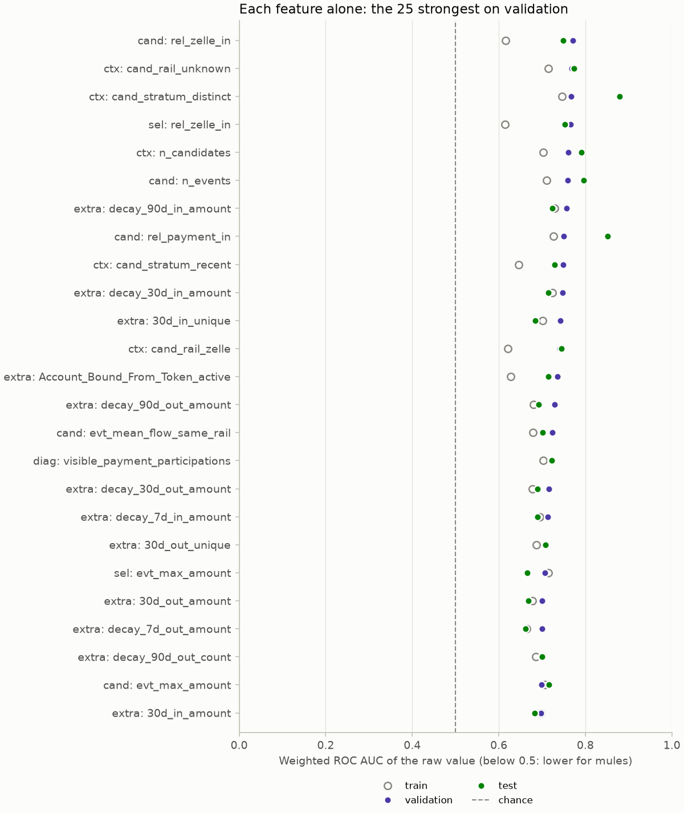
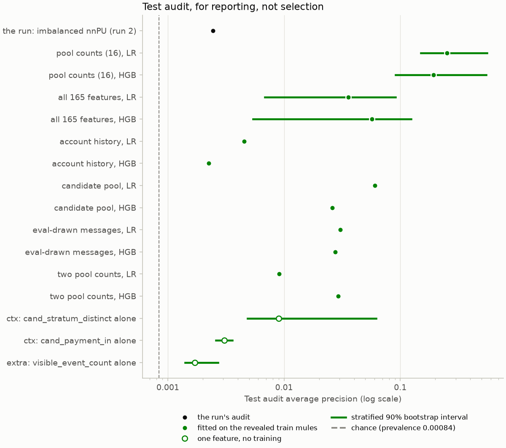
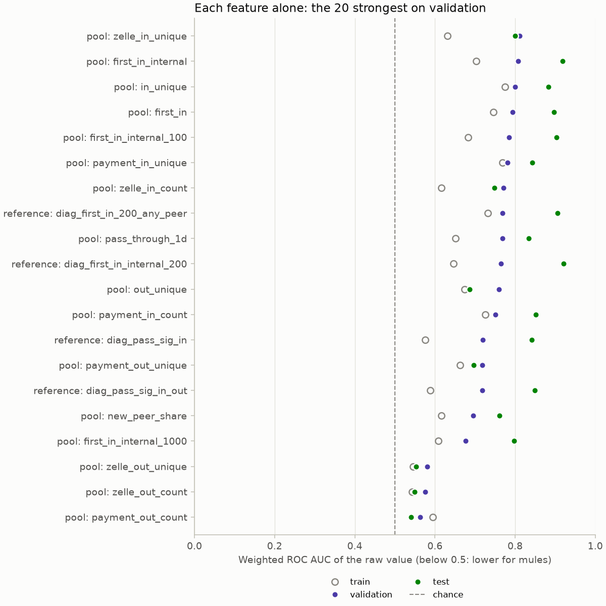
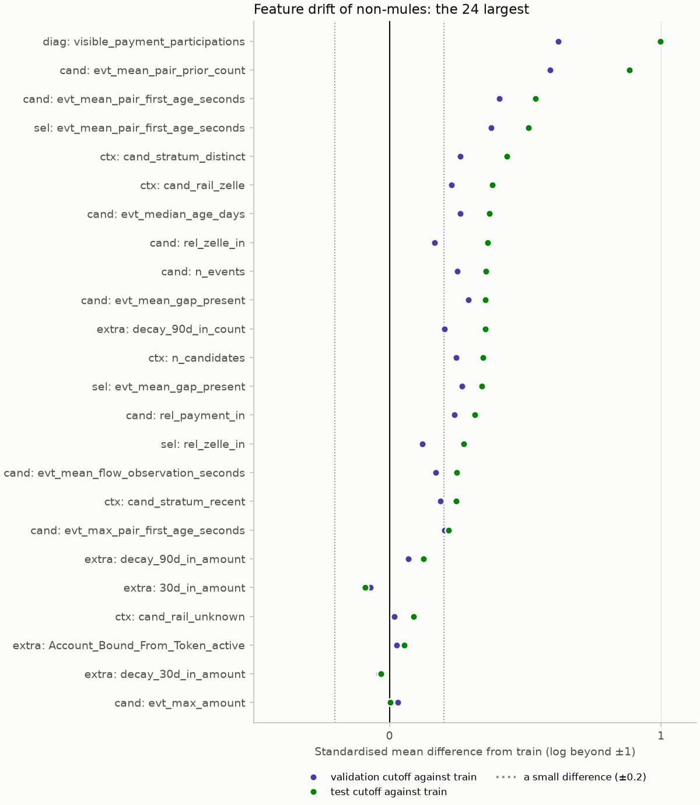

# The diagnostic study of September 2026

Why could the second reference run not detect mules, and what would? This note records
the study that answered it, between runs 2 and 3 of the [reference runs](reference-run.md).
Its scripts and notes were kept on the branch `archive/diagnostic-study` and its data
files outside the repository; everything worth keeping from them is here, in
[the mule profile](mule-profile.md) and in [the nnPU positive weight](nnpu-positive-weight.md).
The analyses that should run again whenever the dataset, the features or the model change
became `mule diagnose` (see [Where the study went](#where-the-study-went)).

## The question and the data

Run 2 (imbalanced nnPU, no pool counts) reached a ground-truth audit AP of 0.0024 and ROC
AUC of 0.782 on test, at a prevalence of 0.00084: 2.9 times a random ranking's AP. Its
threshold, chosen by F1 on 11 validation positives, sat above every test score.

The study used TigerGraph read-only, through the installed queries, and read the ground
truth for analysis only; nothing it computed fed a model.

- **The sample.** 8,233 accounts: all 233 mules (160 train, 33 validation, 40 test) and
  uniform non-mules, 3,000 of train, 2,000 of validation and 3,000 of test, drawn with
  seed 7. Each non-mule was weighted to its split's population (a test non-mule stands for
  15.9 of the 47,749 test accounts), as the audits weight theirs.
- **The cutoffs.** Each account was read at its own split's cutoff and visibility
  (2024-07-01 in phase 1, 2024-10-01 in phase 2, 2025-01-01 in phase 3). Revealed mules:
  20 train, 11 validation, 20 test, all known before their cutoff.
- **The features.** 219 columns per account: the model's root vector, aggregates of the
  hop-1 messages the model attends to at evaluation, the same over the whole candidate pool
  TigerGraph returns, pool counts by relation, stratum and rail, and the summary groups the
  model did not get (windows, decayed activity, recency, identity order). 0 of 8,233
  accounts were rejected, and 2,060 requests needed no retry.

**Caveat: the test numbers are optimistic.** The study scored the test split, and the
first-time and internal inflow counts it found were defined after reading the data
generator's mule typology and test-split mules. Every test number below that depends on
them is optimistic, and none of them was a decision. Decisions since use the validation
audit; the test audit is for reporting.

## What it found

### The root input was the same for every account

With the `split` architecture and no summary group in the feature list, the model's root
vector held only the entity flags. For all 8,233 sampled accounts it was
`type_Account = 1, is_deposit = 1` and zeros: one distinct vector. Every signal had to come
through softmax attention over at most 16 sampled hop-1 payments, a weighted average that
cannot count, and the number of filled slots saturated at 16 for every test mule and for
more than three quarters of the non-mules. A static review of the code at that commit found
no bug that misaligned scores and labels, mis-weighted the audit or leaked the future.

### Counts over the candidate pool separate mules best

Each feature alone, weighted, on the study's sample (from its `bl_univariate.csv`):

| Feature | Test ROC AUC | Train | Validation | Test AP | Test mule / non-mule median |
|---|---|---|---|---|---|
| distinct-peer candidate events (`ctx__cand_stratum_distinct`) | 0.880 | 0.746 | 0.767 | 0.0090 | 8 / 5 |
| incoming payments in the pool (`cand__rel_payment_in`) | 0.851 | 0.726 | 0.750 | 0.0031 | 16 / 13 |
| candidate events (`cand__n_events`) | 0.796 | 0.710 | 0.759 | 0.0043 | 41.5 / 30 |
| Zelle inflows in the pool (`cand__rel_zelle_in`) | 0.749 | 0.616 | 0.771 | 0.0042 | 5.5 / 0 |
| 90-day decayed inflow amount (`extra__decay_90d_in_amount`) | 0.723 | 0.729 | 0.757 | 0.0021 | 32,800 / 14,700 |
| visible event count (`extra__visible_event_count`) | 0.722 | 0.702 | 0.721 | 0.0017 | 459 / 320 |

The strongest signals are structural counts of the hop-1 candidate pool: how many distinct
peers, incoming payments and Zelle inflows fill it. A lower share of events with an
earlier event of the same pair (mules deal with more new counterparties) ranks next. The
account-level summaries the model did not get are weaker, ROC AUC 0.68 to 0.72. The ranking
holds on train and validation; it is not an artefact of the test split.

### Simple models on the same labels beat the model

PU baselines trained at the train cutoff on the 20 revealed train mules, every other
sampled train account unlabelled and weighted back to the population (the study's
experiment A2), scored on its test sample (from `bl_results.csv` and
`pool_activity_check_models.csv`, with stratified 90% bootstrap intervals):

| Features | Learner | Test AP (90% interval) | ROC AUC | Recall in the top 1% / 5% |
|---|---|---|---|---|
| all 165 account-level features | LR | 0.036 (0.0068 to 0.091) | 0.860 | 0.200 / 0.425 |
| all 165 account-level features | HGB | 0.057 (0.0054 to 0.124) | 0.840 | 0.175 / 0.375 |
| candidate-pool aggregates (59) | LR | 0.061 | 0.898 | 0.225 / 0.375 |
| aggregates of the eval-drawn messages (37) | LR | 0.031 | 0.803 | 0.100 / 0.325 |
| summary groups the model did not get (69) | LR | 0.0045 | 0.743 | 0.075 / 0.225 |
| the 16 pool counts (`pool_activity`) | LR | 0.252 (0.151 to 0.557) | 0.947 | 0.700 / 0.750 |
| the 16 pool counts (`pool_activity`) | HGB | 0.193 (0.091 to 0.549) | 0.912 | 0.650 / 0.700 |
| distinct-peer candidate events alone, no training | | 0.0090 (0.0048 to 0.062) | 0.880 | 0.215 / 0.356 |
| run 2's audit (2,000 seed-42 negatives, not paired) | | 0.0024 | 0.782 | 0.025 / 0.175 |

- A single untrained count beat the model on ROC AUC (0.88 against 0.78) and AP (0.009
  against 0.0024), and so did every PU baseline.
- Treating the 140 hidden train mules as negatives (A1), weighting the unlabelled to the
  population (A2) or dropping the hidden mules (A3) gave nearly the same numbers, so
  contamination by hidden mules did not matter at this scale.
- Logistic regression on the 16 pool counts, which the study's follow-up check computed
  with the repository's code from the saved rows, reached about 100 times the model's AP.
  Its lower AP bound (0.11 to 0.15 across the ways of treating the unlabelled) was above
  the upper bound of the all-feature logistic regressions (0.09).
  It also held on validation: AP 0.38 and ROC AUC 0.85 with 51.5% of the mules in the top
  1%.
- The signal is real but modest in absolute terms. At a prevalence of 0.084%, ROC AUC 0.90
  to 0.94 is 2 to 3% precision in the top 1% of accounts. The most reliable estimate free
  of shift, 5-fold cross-validation inside the test cutoff, gave ROC AUC 0.89 to 0.90, AP
  0.045 to 0.054 and 31 to 37% of the mules in the top 1%.

Which counts carry it:

- The internal first-time inflow count (incoming payments from an internal peer with no
  earlier event of the pair) was the strongest: test ROC AUC 0.918, and AP 0.237 for those
  of $100 or more. At $200 or more, the study's own definition, the raw count gives ROC
  AUC 0.921 and AP 0.233; the study's headline for it, 0.968 and 0.276, scored the count
  plus 0.001 times the distinct-peer count, a tie-break.
- The implemented pass-through count (inflows forwarded within 24 hours at an amount ratio
  of 0.5 to 1.0) flagged 46.6% of test non-mules against 8.3% for the study's signature
  (0.5 to 15.1 hours, ratio 0.88 to 0.96), so it carried little: AP 0.0097 against 0.153.
  The lower ratio bound dilutes it. Dropping it barely moved the logistic regression (AP
  0.2525 to 0.2491), so it was kept as a definitional choice.
- Train-cutoff ROC AUCs are much weaker (0.61 to 0.75 for the first-time counts): mid-year,
  many mules' bursts had not happened yet ([the mule profile](mule-profile.md)).

### More labels help, but labels were not what held the model back

Logistic regression and gradient boosting on all 165 features, trained on k train mules
drawn at random (revealed or hidden) against 3,000 train non-mules, five draws each and one
at k = 160 (from `bl_results.csv`):

| k train mules | 10 | 20 | 40 | 80 | 160 |
|---|---|---|---|---|---|
| LR test ROC AUC | 0.677 | 0.777 | 0.830 | 0.872 | 0.900 |
| LR recall in the top 5% | 0.130 | 0.245 | 0.300 | 0.450 | 0.525 |
| HGB test ROC AUC | 0.693 | 0.745 | 0.780 | 0.828 | 0.842 |

ROC AUC and the top-5% recall rise steadily and are not saturated at 160 labels, so more
labels would help. AP has no clean trend, since a mule or two at the very top moves it
(each mule that ranks above every sampled non-mule adds about 0.025). The 20 revealed mules
trained better models than 96 to 100% of 25 random draws of 20, hidden-only draws included:
they behave like 40 to 80 random labels, because they are the loud mules. The 20 revealed
labels already let simple models reach ROC AUC 0.86, so the model was not label-limited at
its level.

### Revealed and hidden mules

Each half of the test mules against every weighted test non-mule (from `bl_subgroup.csv`):

| Ranking | ROC AUC, 20 revealed | ROC AUC, 20 hidden | Mules in the top 1% (477 accounts) |
|---|---|---|---|
| distinct-peer count alone | 0.873 | 0.886 | 8 |
| PU, all features, HGB | 0.898 | 0.782 | 7 |
| PU, all features, LR | 0.846 | 0.873 | 8 |
| oracle, 140 hidden train mules only, HGB | 0.884 | 0.819 | 5 |
| run 2 (implied by its proxy and audit AUCs) | about 0.875 | about 0.69 | 1 |

Hidden test mules are somewhat harder for trees even when the trees train on hidden mules
only, so part of the gap is that hidden mules are quieter. Logistic regression and the raw
count score both halves about equally. Run 2's gap was much larger, which suggested it fit
something specific to the revealed mules rather than the broad count signal.

### Cutoff shift costs trees, not a log-linear model

Each split is read at its own cutoff, so its accounts have seen about 6, 9 and 12 months of
history. History volume shifts most (median visible payment participations of non-mules
145, 229 and 320), then the pair-history edge inputs the model consumes: for the maximum
age of a pair's first event, 94% of test non-mules lie above train's 90th percentile, and
the share of events with an earlier event of the same pair moves from 0.80 to 0.87. The
capped pool counts shift mildly (medians move by 1 or 2, shift ROC AUC 0.60 to 0.62).

| Training setup, scored on test | HGB ROC AUC | LR ROC AUC | HGB recall in the top 1% |
|---|---|---|---|
| train cutoff, 33 random mules (5 draws) | 0.80 | 0.85 | 0.065 |
| validation cutoff, its 33 mules | 0.88 | 0.86 | 0.375 |
| train and validation pooled, 193 mules | 0.895 | 0.914 | 0.400 |
| train cutoff, 160 mules, per-split percentiles | 0.866 | 0.896 | 0.100 |
| 5-fold CV inside the test cutoff (5 seeds) | 0.889 | 0.899 | 0.370 |

At matched label counts a tree trained at the validation cutoff beat one trained at the
train cutoff, while logistic regression on log features barely moved. Per-split percentiles
recover part of the trees' loss. Shift was second-order next to the missing counts: a
log-linear model trained at the train cutoff still reached ROC AUC 0.90 with all 160 mules.

The figure's standardised mean differences were computed for this note from the study's
feature table with `diagnostics.drift`, which reproduces the study's recorded shift ROC AUCs
and shares above train's 90th percentile exactly. The difference understates a shift that
moves a few accounts far: the maximum pair-first age differs by only 0.22 standard
deviations, because the accounts without a pair event (age 0) inflate the variance, while
its shift ROC AUC is 0.94.

### What AP to expect from an ROC AUC

Under an equal-variance binormal ranking, ROC AUC 0.78 at a prevalence of 0.00084 gives an
AP of about 0.0047, and the proxy's ROC AUC 0.875 at its prevalence of 0.0099 about 0.146.
Run 2's observed APs (0.0024 and 0.049) were 2 to 3 times lower, so the top of its ranking
was crowded with non-mules scoring very high, or with ties at the saturated top: its scores
were float32 probabilities, and any logit above about 16.6 became exactly 1.0.

## What changed because of it

- The `pool_activity` and `pool_internal_inflows` groups feed the counts over the
  candidate pool to the root, and the slot sum (a per-slot MLP summed over the hop-1 slots
  beside attention) lets the model count a combined condition. Run 3 with them reached an
  audit AP of 0.134 and ROC AUC of 0.931 ([reference runs](reference-run.md)).
- Scores are float64 from the logit, and the audit reports recall and precision at the
  review budgets of 1, 5 and 10% with ties shared.
- The control experiments test what the study suggested on validation: `no_pool_counts`,
  `drop_pool_internal_inflows`, `no_slot_sum` and `no_attention`.

## One-off answers

These answered a question once and are not rerun:

- **Contamination of the unlabelled by hidden mules** (A1 against A2 and A3 above): it does
  not matter at this scale.
- **Selection bias** (the random-20 draws): the revealed mules are the loud ones and train
  better models than random labels.
- **Training at another cutoff** (the shift table): the trees' gap, and pooling train and
  validation.
- **The pool-activity check**: the implemented group equals the study's definitions on all
  8,233 accounts, its batch path carries exactly the transformed values, and the query flags
  of the built-in run were unchanged.
- **The pass-through thresholds**: narrowing the ratio to 0.8 to 0.99 cut the share of
  non-mules flagged to 21% and raised test AP about tenfold, but that was found after
  reading test and validation labels, so it is a lead, not a tuned value.

## Where the study went

| Archived | Now |
|---|---|
| `mpl_diag/stage_*.py`, `common.py`, `probe.py` (the feature table) | `diagnostics/feature_table.py`, `mule diagnose features`: the audits' samples, the training query's inputs and the analytics query's account history |
| `bl_lib.py` (metrics and weighting) | `metrics.py`; `split_rank_transform` in `diagnostics/drift.py` |
| `bl_univariate.py` | `diagnostics/univariate.py`, `mule diagnose univariate`; it reproduces the study's 166 ROC AUCs to 1e-16 |
| `bl_models.py`, PU baselines (A) | `diagnostics/baselines.py`, `mule diagnose baselines`, the question of the retired `no_graph` control; on the study's table its A2 setup gives the recorded AP 0.0357 (LR) and 0.0570 (HGB) |
| `bl_models.py`, the label-count curve (B) | `diagnostics/learning_curve.py`, `mule diagnose learning-curve` |
| `bl_models.py`, cutoff shift (D), and `bl_shift.py` | `diagnostics/drift.py`, `mule diagnose drift` |
| `bl_subgroup.py`, `mpl_arms/audit_summary.py` (revealed and hidden) | `diagnostics/subgroups.py`, `mule diagnose subgroups`, which adds the AP concentration and the rings |
| `mpl_arms/audit_summary.py` (intervals) | `evaluation/audit.py`: ring-clustered intervals and tie-aware budgets |
| `bl_report.py`, `bl_template.md`, `bl_tables.md`, `baselines.md` | `reporting.report.write_diagnostics_report`, and this note |
| `pool_activity_check*.py`, `pool_activity_offline.py`, `pool_activity_passthrough.py`, `pool_activity_check.md` | this note; the `univariate` and `baselines` analyses and the `drop_pool_*` variants rerun what matters |
| `binormal_ap.py` | this note ([What AP to expect from an ROC AUC](#what-ap-to-expect-from-an-roc-auc)) |
| `shift_review.md` | this note and the shift analysis |
| `extract_notes.md` | this note ([The question and the data](#the-question-and-the-data)) |
| `profile/p1_groups.py` to `p11_misc.py`, `load_messages.py`, `mule_profile.md` | [the mule profile](mule-profile.md) |
| `nnpu_sim/sim.py`, `grid.py`, `traj.py` | `diagnostics/nnpu_simulation.py`, `mule diagnose nnpu-simulation`, and [the nnPU positive weight](nnpu-positive-weight.md); the live test is the `prior_weight` variant |
| `mpl_arms/tabular.toml`, `no_internal.toml`, `seed7.toml` | the variants `no_attention` and `drop_pool_internal_inflows`, and the fixed seeds 42, 43 and 44 |
| `scripts/temporal/simulate_label_reveal.py` | `diagnostics/reveal_spread.py`, `mule diagnose reveal-spread` |

### Not carried over

- **`mpl_diag/head_src/`**, a byte-identical copy of `src/` at commit 5770926, which the
  flag check compared with the working tree. That commit is in the repository's history.
- **`mpl_diag/flags_check.py`**, which compared the query flags of that copy with the
  working tree: the variant tests now build every variant's plan and flags offline.
- **The study's fetch of the extended context**, which asked the training query for the
  summary groups beside the model's: those groups now come from `fetch_analytics_context`.
- **The study's own evaluation sample** (3,000 test non-mules drawn with seed 7): the
  analyses now score the audits' samples (2,000 non-mules per split drawn with the split
  seed), so a baseline and a run's audit rank the same accounts.
- **The cross-validation of the revealed mules against the hidden ones, the top-scoring
  non-mules' profiles and the trace features** of the profile scripts: one-off answers,
  recorded in [the mule profile](mule-profile.md).
- **The data files** (the feature tables, the raw context rows, the logs and the CSVs):
  they stay on the owner's machine under `results/archive/diagnostic-study-2026-09/`,
  which is not tracked.
- **`mpl_arms/fake/`**, a test fixture that was never archived.

## The figures

Each was drawn for this note with the plot functions of `reporting.diagnostics` from the
study's archived files, which stay outside the repository:

| Figure | Function | From |
|---|---|---|
| `study_univariate_auc.png` | `plot_univariate` | `bl_univariate.csv` (raw ROC AUC per split; identical columns merged, the split-constant ages left out) |
| `study_pool_univariate_auc.png` | `plot_univariate` | `pool_activity_check_univariate.csv` (the reference definitions under `reference`) |
| `study_baselines.png` | `plot_baselines` | `bl_results.csv` (A2 and the untrained features) and `pool_activity_check_models.csv` (A2); run 2's audit AP; chance at the test prevalence |
| `study_label_curve.png` | `plot_label_curve`, ROC AUC | `bl_results.csv` (B, and A3 for the revealed mules); run 2's audit ROC AUC |
| `study_drift.png` | `plot_drift` | the study's `features.parquet`, through `diagnostics.drift.feature_shift`, for the 24 features of `bl_shift.csv` |
