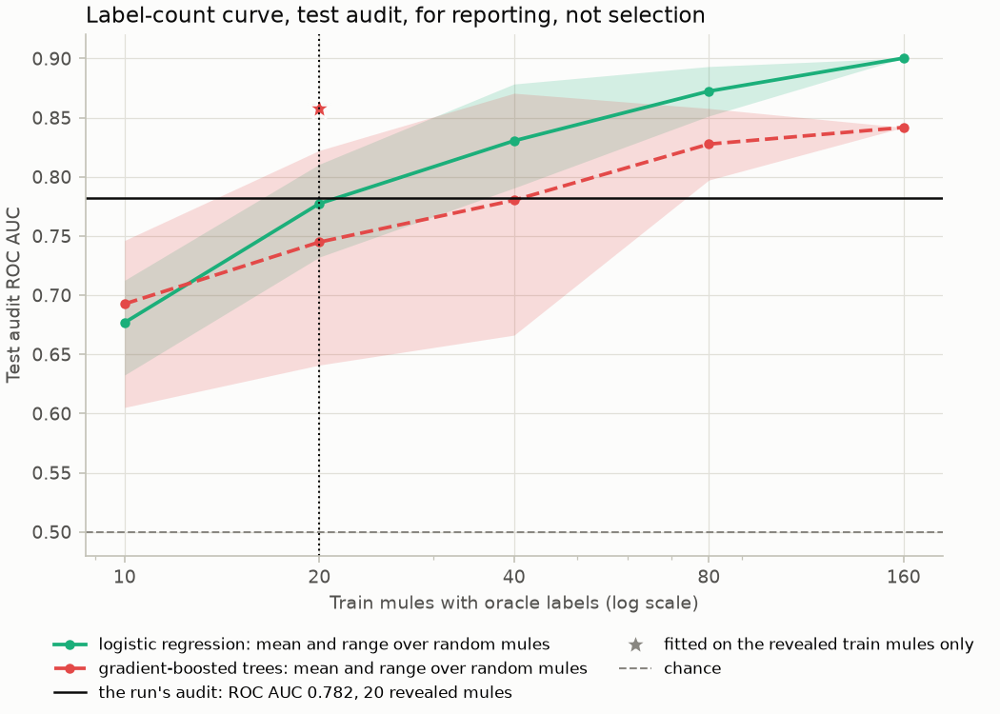

# The diagnostic study of September 2026

Why could [reference run](reference-run.md) 2 not detect mules, and what would? Studied
between runs 2 and 3; its scripts, notes and data stay untracked on the owner's machine under
`results/archive/diagnostic-study-2026-09/`. What matters is here, in [the mule
profile](mule-profile.md) and in [the nnPU positive weight](nnpu-positive-weight.md); the
repeatable analyses became `mule diagnose` ([Where the study went](#where-the-study-went)).

## The question and the data

- **Run 2** (imbalanced nnPU, no pool counts): test audit AP 0.0024 (2.9 times random), ROC
  AUC 0.782, prevalence 0.00084. Its F1 threshold, from 11 validation positives, sat above
  every test score.
- **Access.** TigerGraph read-only through the installed queries; ground truth for analysis
  only, fed to no model.
- **Sample.** 8,233 accounts: all 233 mules (160 train, 33 validation, 40 test) and uniform
  non-mules (3,000, 2,000, 3,000; seed 7) weighted to their split's population as in the
  audits (a test non-mule stands for 15.9 of the 47,749 test accounts).
- **Cutoffs and visibility.** 2024-07-01 (phase 1), 2024-10-01 (phase 2), 2025-01-01 (phase
  3). Revealed mules, all known before the cutoff: 20, 11, 20.
- **219 features.** The root vector; aggregates of the hop-1 messages attended at evaluation
  and of the whole candidate pool; pool counts by relation, stratum and rail; the summary
  groups the model lacked (windows, decayed activity, recency, identity order). No account
  rejected; 2,060 requests needed no retry.

**Caveat.** Test numbers that depend on the first-time and internal inflow counts are
optimistic (defined after reading the generator's mule typology and test mules), and none was
a decision. Decisions use the validation audit, now the hidden mules' AP; test is for
reporting.

## What it found

### The root input was the same for every account

With the `split` architecture and no summary group, all 8,233 root vectors were
`type_Account = 1, is_deposit = 1` and zeros. Signal had to pass softmax attention over at
most 16 sampled hop-1 payments, an average that cannot count, and all 16 slots were filled for
every test mule and over three quarters of non-mules.

### Counts over the candidate pool separate mules best

Each feature alone, weighted (`bl_univariate.csv`):

| Feature | Test ROC AUC | Train | Validation | Test AP | Test mule / non-mule median |
|---|---|---|---|---|---|
| distinct-peer candidate events (`ctx__cand_stratum_distinct`) | 0.880 | 0.746 | 0.767 | 0.0090 | 8 / 5 |
| incoming payments in the pool (`cand__rel_payment_in`) | 0.851 | 0.726 | 0.750 | 0.0031 | 16 / 13 |
| candidate events (`cand__n_events`) | 0.796 | 0.710 | 0.759 | 0.0043 | 41.5 / 30 |
| Zelle inflows in the pool (`cand__rel_zelle_in`) | 0.749 | 0.616 | 0.771 | 0.0042 | 5.5 / 0 |
| 90-day decayed inflow amount (`extra__decay_90d_in_amount`) | 0.723 | 0.729 | 0.757 | 0.0021 | 32,800 / 14,700 |
| visible event count (`extra__visible_event_count`) | 0.722 | 0.702 | 0.721 | 0.0017 | 459 / 320 |

Pool structure counts lead (distinct peers, incoming payments, Zelle inflows), then a lower
share of events with an earlier same-pair event (mules meet more new counterparties); the
summaries the model lacked reach ROC AUC 0.68 to 0.72. The ranking holds on train and
validation.

### Simple models on the same labels beat the model

PU baselines (A2: the 20 revealed train mules at the train cutoff, other sampled train
accounts unlabelled and weighted to the population) on test, with stratified 90% bootstrap
intervals (`bl_results.csv`, `pool_activity_check_models.csv`):

| Features | Learner | Test AP (90% interval) | ROC AUC | Recall in the top 1% / 5% |
|---|---|---|---|---|
| all 165 account-level features | LR | 0.036 (0.0068 to 0.091) | 0.860 | 0.200 / 0.425 |
| all 165 account-level features | HGB | 0.057 (0.0054 to 0.124) | 0.840 | 0.175 / 0.375 |
| candidate-pool aggregates (59) | LR | 0.061 | 0.898 | 0.225 / 0.375 |
| aggregates of the eval-drawn messages (37) | LR | 0.031 | 0.803 | 0.100 / 0.325 |
| summary groups the model did not get (69) | LR | 0.0045 | 0.743 | 0.075 / 0.225 |
| the 16 pool counts (`pool_activity`) | LR | 0.252 (0.151 to 0.557) | 0.947 | 0.700 / 0.750 |
| the 16 pool counts (`pool_activity`) | HGB | 0.193 (0.091 to 0.549) | 0.912 | 0.650 / 0.700 |
| distinct-peer candidate events alone, no training | | 0.0090 (0.0048 to 0.062) | 0.880 | 0.215 / 0.356 |
| run 2's audit (2,000 seed-42 negatives, not paired) | | 0.0024 | 0.782 | 0.025 / 0.175 |

- One untrained count beat the model (ROC AUC 0.88 against 0.78, AP 0.009 against 0.0024),
  and so did every PU baseline.
- The 140 hidden train mules as negatives (A1), weighted as unlabelled (A2) or dropped (A3)
  gave nearly equal numbers: contamination does not matter at this scale.
- LR on the 16 pool counts (the follow-up check, the repository's code on the saved rows)
  reached about 100 times the model's AP. Over A1 to A3: ROC AUC 0.946 to 0.947, AP 0.20 to
  0.26, top-1% recall 0.675 to 0.70, and a lower AP bound (0.11 to 0.15) above the
  all-feature regressions' upper bound (0.09). Validation: AP 0.38, ROC AUC 0.85, top-1%
  recall 51.5%.
- Modest in absolute terms: at 0.084% prevalence, ROC AUC 0.90 to 0.94 is 2 to 3% precision
  in the top 1%. The most reliable shift-free estimate, 5-fold CV inside the test cutoff:
  ROC AUC 0.89 to 0.90, AP 0.045 to 0.054, top-1% recall 31 to 37%.

Which counts carry it:

- **Internal first-time inflows** (from an internal peer, no earlier event of the pair):
  strongest, ROC AUC 0.918, AP 0.237 at $100 or more. At $200 or more (the study's
  definition) the raw count gives 0.921 and 0.233; the study's headline, 0.968 and 0.276,
  added 0.001 times the distinct-peer count as a tie-break.
- **Pass-through.** The implemented count (forwarded within 24 hours, amount ratio 0.5 to
  1.0) flags 46.6% of test non-mules against 8.3% for the study's signature (0.5 to 15.1
  hours, ratio 0.88 to 0.96): AP 0.0097 against 0.153, diluted by the lower ratio bound. Kept
  as a definitional choice, since dropping it barely moved the LR (AP 0.2525 to 0.2491). A
  ratio of 0.8 to 0.99 flagged 21% of non-mules and raised test AP about tenfold, but was
  found after reading test and validation labels: a lead, not a tuned value.
- **Train cutoff.** The first-time counts reach only ROC AUC 0.61 to 0.75: by mid-year many
  bursts had not happened ([the mule profile](mule-profile.md)).
- **The pool-activity check.** The implemented group matches the study's definitions on all
  8,233 accounts, its batch path carries exactly the transformed values, and the built-in
  run's query flags were unchanged.

### More labels help, but labels were not what held the model back

LR and HGB on all 165 features, k random train mules (revealed or hidden) against 3,000 train
non-mules; five draws, one at k = 160 (`bl_results.csv`):

| k train mules | 10 | 20 | 40 | 80 | 160 |
|---|---|---|---|---|---|
| LR test ROC AUC | 0.677 | 0.777 | 0.830 | 0.872 | 0.900 |
| LR recall in the top 5% | 0.130 | 0.245 | 0.300 | 0.450 | 0.525 |
| HGB test ROC AUC | 0.693 | 0.745 | 0.780 | 0.828 | 0.842 |

Still rising at 160, so more labels would help; AP has no clean trend (each mule above every
sampled non-mule adds about 0.025). The 20 revealed mules beat 96 to 100% of 25 random draws
of 20, hidden-only draws included: being the loud mules, they act like 40 to 80 random labels
and already give simple models ROC AUC 0.86. The model was not label-limited at its level.

### Revealed and hidden mules

Each half of the test mules against all weighted test non-mules (`bl_subgroup.csv`):

| Ranking | ROC AUC, 20 revealed | ROC AUC, 20 hidden | Mules in the top 1% (477 accounts) |
|---|---|---|---|
| distinct-peer count alone | 0.873 | 0.886 | 8 |
| PU, all features, HGB | 0.898 | 0.782 | 7 |
| PU, all features, LR | 0.846 | 0.873 | 8 |
| oracle, 140 hidden train mules only, HGB | 0.884 | 0.819 | 5 |
| run 2 (implied by its proxy and audit AUCs) | about 0.875 | about 0.69 | 1 |

Trees find hidden test mules harder even when trained only on hidden mules, so hidden mules
are partly quieter; LR and the raw count score both halves alike. Run 2's far larger gap
suggests it fit something specific to revealed mules, not the count signal.

### Cutoff shift costs trees, not a log-linear model

The splits see about 6, 9 and 12 months of history. History volume shifts most (non-mules'
median visible payment participations 145, 229, 320), then the pair-history edge inputs: 94%
of test non-mules exceed train's 90th percentile of the maximum age of a pair's first event,
and the share of events with an earlier same-pair event goes from 0.80 to 0.87. The capped
pool counts shift mildly (medians by 1 or 2, shift ROC AUC 0.60 to 0.62).

| Training setup, scored on test | HGB ROC AUC | LR ROC AUC | HGB recall in the top 1% |
|---|---|---|---|
| train cutoff, 33 random mules (5 draws) | 0.80 | 0.85 | 0.065 |
| validation cutoff, its 33 mules | 0.88 | 0.86 | 0.375 |
| train and validation pooled, 193 mules | 0.895 | 0.914 | 0.400 |
| train cutoff, 160 mules, per-split percentiles | 0.866 | 0.896 | 0.100 |
| 5-fold CV inside the test cutoff (5 seeds) | 0.889 | 0.899 | 0.370 |

At matched label counts trees gain from the validation cutoff, while LR on log features
barely moves; per-split percentiles recover part of the trees' loss. Shift is second-order to
the missing counts: LR at the train cutoff reached ROC AUC 0.90 with all 160 mules.

The figure's standardised mean differences come from `diagnostics.drift` on the study's
feature table, which reproduces the study's shift ROC AUCs and shares above train's 90th
percentile exactly. They understate a shift that moves few accounts far: the maximum
pair-first age differs by 0.22 standard deviations (accounts without a pair event, age 0,
inflate the variance) but has shift ROC AUC 0.94.

### What AP to expect from an ROC AUC

Under an equal-variance binormal ranking, ROC AUC 0.78 at prevalence 0.00084 implies AP about
0.0047, and the proxy's 0.875 at 0.0099 about 0.146. Run 2's APs (0.0024, 0.049) were 2 to 3
times lower: very high-scoring non-mules at the top, or ties at a saturated top (float32
probabilities turn any logit above about 16.6 into exactly 1.0).

## What changed because of it

- **Constant root, missing counts.** `pool_activity` and `pool_internal_inflows` feed the pool
  counts to the root, and the slot sum (a per-slot MLP summed over the hop-1 slots beside
  attention) lets the model count a combined condition. Run 3: audit AP 0.134, ROC AUC 0.931
  ([reference runs](reference-run.md)).
- **Float32 ties.** Scores are float64 from the logit; the audit reports recall and precision
  at review budgets of 1, 5 and 10%, ties shared.
- **Noisy audit AP.** Ring-clustered intervals.
- **Shift.** [The mule profile](mule-profile.md) measures the visibility-phase shift, and
  `mule diagnose drift` the cutoff shift.
- **Controls.** `no_pool_counts`, `drop_pool_internal_inflows`, `no_slot_sum` and
  `no_attention` test the study's suggestions on validation.

## What the static review left open

The study began with a static review of commit 5770926 (`shift_review.md` in the archive). It
found no bug (no misaligned scores and labels, audit mis-weighting or future leak) and ranked
the problems of the inputs and training. Those not acted on above still hold:

- **One neighbourhood draw per scored account.** Evaluation keys candidates by
  `sampler.evaluation_seed`, so a score rests on one subset of the pool, while training saw
  many. Averaging logits over a few evaluation seeds would cost scoring time, not new contexts.
- **Every hub stub looks the same.** A hub child becomes a local stub with only `is_external`,
  `is_deposit` and `history_withheld`, so all stubs embed alike and only the edge differs. In
  run 2's test audit stubs filled about 6.4 of a root's 16 hop-1 slots (12,974 stub children,
  2,040 roots).
- **Association slots carry no event.** Every event field is zero and the children's pool
  takes no associations, so a Party, Token or Device child (no payments) brings no hop-2
  message: the slot says only that the relation exists.
- **Repeated inputs.** `amount_present` repeats `is_event` (every amount in the reference
  graph is present), `pair_first_present` repeats `gap_present` for Account contexts, and
  `flow_observation_seconds` repeats the event's age.
- **Unstandardised edge inputs.** Fourier coordinates (-1 to 1), 0 or 1 flags and log-seconds
  up to about 17 enter the first linear layer as they are.
- **Confidently low positives learn little.** The sigmoid surrogate's gradient for a positive,
  σ(f)(1 - σ(f)), vanishes for f far below zero, and each batch's 16 positives are drawn with
  replacement from the 20 loud revealed mules: hard mules are left behind, easy ones
  memorised.

## Where the study went

One-off and not rerun: contamination (A1 to A3), the random-20 draws, training at another
cutoff, the pool-activity check and the pass-through thresholds.

| Archived | Now |
|---|---|
| `mpl_diag/stage_*.py`, `common.py`, `probe.py` (the feature table) | `diagnostics/feature_table.py`, `mule diagnose features`: the audits' samples, the training query's inputs and the analytics query's account history |
| `bl_lib.py` (metrics and weighting) | `metrics.py`; `split_rank_transform` in `diagnostics/drift.py` |
| `bl_univariate.py` | `diagnostics/univariate.py`, `mule diagnose univariate`; reproduces the study's 166 ROC AUCs to 1e-16 |
| `bl_models.py`, PU baselines (A) | `diagnostics/baselines.py`, `mule diagnose baselines` (the retired `no_graph` control's question); its A2 setup on the study's table gives the recorded AP 0.0357 (LR) and 0.0570 (HGB) |
| `bl_models.py`, the learning curve (B) | `diagnostics/learning_curve.py`, `mule diagnose learning-curve` |
| `bl_models.py`, cutoff shift (D), and `bl_shift.py` | `diagnostics/drift.py`, `mule diagnose drift` |
| `bl_subgroup.py`, `mpl_arms/audit_summary.py` (revealed and hidden) | `diagnostics/subgroups.py`, `mule diagnose subgroups`, adding the AP concentration and the rings |
| `mpl_arms/audit_summary.py` (intervals) | `evaluation/audit.py`: ring-clustered intervals and tie-aware budgets |
| `bl_report.py`, `bl_template.md`, `bl_tables.md`, `baselines.md` | `reporting.study_report.write_diagnostics_report`, and this note |
| `pool_activity_check*.py`, `pool_activity_offline.py`, `pool_activity_passthrough.py`, `pool_activity_check.md` | this note; the `univariate` and `baselines` analyses and the `drop_pool_*` variants rerun what matters |
| `binormal_ap.py`, `shift_review.md`, `extract_notes.md` | this note: [What AP to expect from an ROC AUC](#what-ap-to-expect-from-an-roc-auc), [What the static review left open](#what-the-static-review-left-open) (with the shift analysis), [The question and the data](#the-question-and-the-data) |
| `profile/p1_groups.py` to `p11_misc.py`, `load_messages.py`, `mule_profile.md` | [the mule profile](mule-profile.md) |
| `nnpu_sim/sim.py`, `grid.py`, `traj.py` | `diagnostics/nnpu_simulation.py`, `mule diagnose nnpu-simulation`, [the nnPU positive weight](nnpu-positive-weight.md); tested on the graph by the `prior_weight` variant |
| `mpl_arms/tabular.toml`, `no_internal.toml`, `seed7.toml` | the variants `no_attention` and `drop_pool_internal_inflows`, and the fixed seeds 42, 43 and 44 |
| `simulate_label_reveal.py`, the repository's script until commit 8afad48 | `diagnostics/reveal_spread.py`, `mule diagnose reveal-spread` |

### Not carried over

- **`mpl_diag/head_src/`** (a byte-identical copy of `src/` at commit 5770926, which is in the
  history) and **`mpl_diag/flags_check.py`**, which compared its query flags with the working
  tree: the variant tests now build every variant's plan and flags offline.
- **The study's fetch of the extended context** (the summary groups from the training query):
  they now come from `fetch_analytics_context`.
- **The study's evaluation sample** (3,000 test non-mules, seed 7): the analyses now score the
  audits' samples (2,000 non-mules per split, the split seed), so a baseline and a run's audit
  rank the same accounts.
- **The profile scripts' cross-validation of revealed against hidden mules, top-scoring
  non-mules' profiles and trace features**: one-off, in [the mule profile](mule-profile.md).
- **The data files** (feature tables, raw context rows, logs, CSVs) and **`mpl_arms/fake/`**
  (a smoke run on the fake graph): untracked, under
  `results/archive/diagnostic-study-2026-09/`.

## The figures

Drawn for this note with `reporting.diagnostics` from the study's archived files:

| Figure | Function | From |
|---|---|---|
| `study_univariate_auc.png` | `plot_univariate` | `bl_univariate.csv` (raw ROC AUC per split; identical columns merged, the split-constant ages left out) |
| `study_pool_univariate_auc.png` | `plot_univariate` | `pool_activity_check_univariate.csv` (the reference definitions under `reference`) |
| `study_baselines.png` | `plot_baselines` | `bl_results.csv` (A2 and the untrained features) and `pool_activity_check_models.csv` (A2); run 2's audit AP; chance at the test prevalence |
| `study_learning_curve.png` | `plot_learning_curve`, ROC AUC | `bl_results.csv` (B, and A3 for the revealed mules); run 2's audit ROC AUC |
| `study_drift.png` | `plot_drift` | the study's `features.parquet`, through `diagnostics.drift.feature_shift`, for the 24 features of `bl_shift.csv` |
