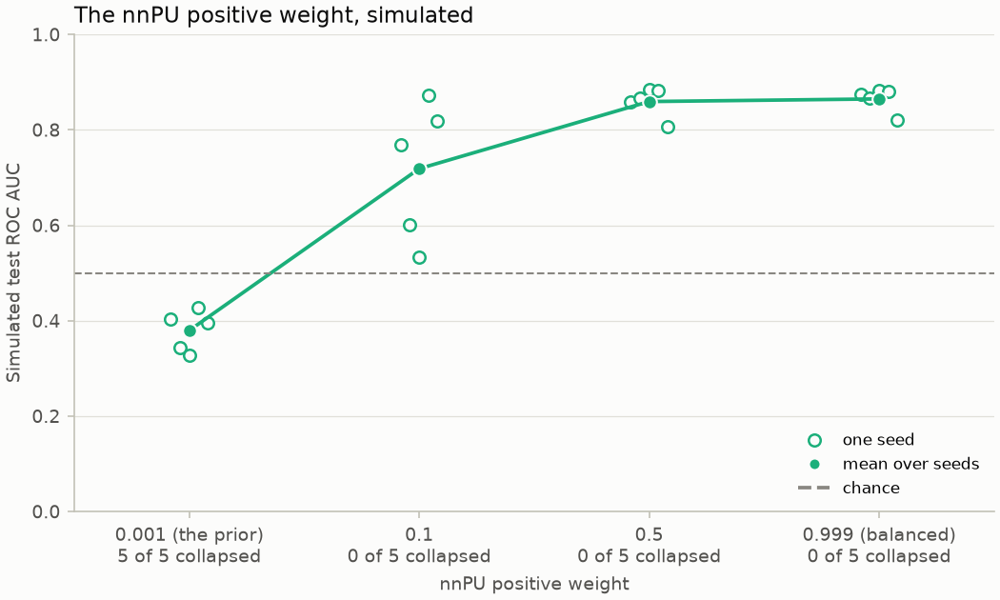

# The nnPU positive weight

Why does the built-in run weight its revealed mules by one minus the class prior
(`loss.positive_weight = "balanced"`) rather than by the prior, as textbook nnPU does?

## The run that collapsed

Run 1 of the [reference runs](reference-run.md) trained textbook nnPU, the positive risk
weighted by the prior (0.001). The unlabelled accounts pushed scores down about 500 times
harder than the 20 revealed mules pulled them up, and scoring every account near zero costs
the objective only the prior, so it collapsed within one epoch.

The balanced weight is imbalanced nnPU (Su, Chen and Xu, IJCAI 2021) with a balanced target
prior of 0.5, up to a constant factor. A 40-step run on the graph with it reached validation
proxy AP 0.063 (ROC AUC 0.90) and test proxy AP 0.050 (ROC AUC 0.87), and it became the
built-in setting, used by runs 2 and 3.

## The simulation

Does the weight alone explain the collapse? The study simulated a problem of the dataset's
proportions with the repository's loss (`model.loss.NonNegativePULoss`), no graph and no
ground truth:

- 16 features, the positives shifted by 2 along 4 of them;
- 20 labelled positives, and a label-blind marginal of 20,000 accounts with positives at the
  true prevalence, 0.00073;
- a validation proxy of 11 labelled positives against 2,000 negatives, and a test set of 300
  positives and 300,000 negatives (the class prior, 0.001);
- a small MLP trained, like the trainer, on batches of 16 positives drawn with replacement and
  48 marginal accounts, for up to 30 epochs of 100 steps, keeping the epoch of best validation
  proxy AP and stopping after 6 without improvement;
- a run is collapsed when its labelled positives score below 0.05 on average: it scores even
  its training positives near zero, the constant scorer.

`mule diagnose nnpu-simulation` (`diagnostics/nnpu_simulation.py`) runs it for the weights
0.001 (the prior), 0.1, 0.5 and 0.999 (balanced) over seeds 1 to 5. The study's own runs
(`nnpu_sim/grid.py`, three seeds per weight) printed results without keeping them, so the
numbers and figure here are the module's, run offline at its defaults for this note:

| Positive weight | Collapsed seeds | Test ROC AUC, mean (range) | Test AP, mean | Labelled positives' mean score | Kept epoch, mean |
|---|---|---|---|---|---|
| 0.001 (the prior) | 5 of 5 | 0.379 (0.327 to 0.427) | 0.0008 | 0.0048 | 1.2 |
| 0.1 | 0 of 5 | 0.719 (0.533 to 0.872) | 0.0102 | 0.387 | 5.2 |
| 0.5 | 0 of 5 | 0.859 (0.807 to 0.884) | 0.0296 | 0.904 | 2.2 |
| 0.999 (balanced) | 0 of 5 | 0.865 (0.820 to 0.882) | 0.0288 | 0.956 | 2.0 |

With the prior as weight every seed collapses within an epoch or two and ranks worse than
chance; its non-negative correction never fires. From 0.5 up every seed learns, and the
balanced weight ranks best on average, at a test AP about 30 times the prevalence. The weight
alone reproduces the collapse, and the balanced weight is the one to keep.

## Testing it again

The simulation is a model of the problem: its positives are one shifted Gaussian and its
labelled positives a uniform draw of them, so its hidden positives resemble the labelled
ones, whereas the graph reveals the loud mules and hides quieter ones. On the graph the test
is the `prior_weight` control variant (`loss.positive_weight = "prior"`), which
`python scripts/run_experiments.py` trains over the seeds and compares with the baseline on
the validation audit. Over its first three seeds it ranked mules near chance in every seed ([the
control experiments](control-experiments.md)).

## Not carried over

- **The logistic surrogate** (`nnpu_sim/sim.py`), which swapped the loss's sigmoid surrogate
  for a softplus one to see whether the collapse was the surrogate's: the repository's loss
  has one surrogate, and the weight alone reproduces the collapse.
- **The per-epoch trajectories** (`nnpu_sim/traj.py`), which printed the loss, corrected steps
  and scores of three settings epoch by epoch: a one-off look at how fast the collapse
  happens, summarised by the kept epochs above.
