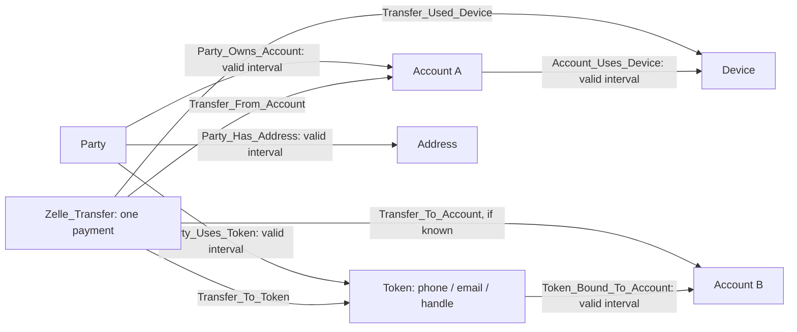

# Temporal payment schema: valid-time associations and Zelle

The current schema is [temporal_schema.gsql](../gsql/schema/temporal_schema.gsql).
The schema defines eight vertex types, nineteen forward relationships and
nineteen reverse types, with seven valid-time discriminators. Connect using the
project's local `.env`; deployment reports and source data remain local artifacts.

GSQL time calculations are documented in [Temporal encoding](temporal_encoding.md).
For the model, query catalog and current evaluation limitations, see
[Live temporal training](live_temporal_training.md).

## Zelle is an event vertex

Each individual Zelle payment is a `Zelle_Transfer` vertex. It is not a single
shared Zelle service vertex. Ten payments from A to B are ten transfer vertices
with their own time, sequence, amount, and sender/recipient links.

| Vertex | Contents |
| --- | --- |
| Party | Stable ID, immutable party type, first-seen sequence/time. |
| Account | Stable ID, account type/external flag, first-seen clocks, mule ground truth, mask/PU label, supervision clocks and ring provenance. |
| Token | Tokenized ID, first-seen sequence/time, token kind (`phone`, `email`, `handle`) and network. |
| Address | Tokenized address ID, first-seen sequence/time, immutable country code. |
| Device, IP | Stable opaque IDs and first-seen sequence/time; Device also has immutable device type. |
| Zelle_Transfer | Transfer ID, event time/milliseconds/sequence, amount and presence flag, currency, channel, and supervision metadata. |
| Payment_Transaction | Non-Zelle payment event with the same event clock, amount/presence, currency, rail, and channel. |

A Zelle transfer is stored only in `Zelle_Transfer`, not duplicated in
`Payment_Transaction`. An unknown external account does not require a fake
Account vertex: preserve the actual sender/recipient token and omit the unknown
account role. Known account roles and the tokens actually used by the payment
can coexist. Set token network to `zelle` for Zelle routing tokens; namespace and
normalize opaque token IDs consistently before loading. A party contact token
is not automatically evidence of enrollment or account ownership.



## One valid-time rule for all association histories

All seven association types are directed, with explicitly named reverse edges:

- `Party_Owns_Account`
- `Party_Uses_Token`
- `Token_Bound_To_Account`
- `Party_Uses_Device`
- `Account_Uses_Device`
- `Party_Uses_IP`
- `Party_Has_Address`

Every association has `DISCRIMINATOR(valid_from_seq UINT)`,
`valid_to_seq UINT DEFAULT 0`, `confidence`, and `source_system`. Its key is the
edge type, endpoints, and start sequence. That preserves repeated tenures for
the same pair without overwriting an earlier one.

All future association traversals, including reverse traversals, must use:

```gsql
WHERE rel.valid_from_seq <= @@seed_seq
  AND (rel.valid_to_seq == 0 OR @@seed_seq < rel.valid_to_seq)
```

Intervals are `[valid_from_seq, valid_to_seq)`. Zero end means still open.
For example, bindings `(Token X, Account A, start=10, end=20)` and
`(Token X, Account A, start=30, end=0)` are separate rows. The token is bound to
A at sequence 15 and 30, but not at sequence 20 or 25. Deregistration closes the
first row; re-enrollment inserts the second. Do not delete the first tenure.

A shared `@@seed_seq` is appropriate only when the query's seeds share one
cutoff. Mixed-cutoff batches must carry each seed's cutoff separately; using
one later cutoff for the whole batch would admit future relationships.

All sequences must share a common chronological domain across Zelle payments,
other payments, and association changes. Do not assign independent counters per
rail or treat sequence differences as elapsed time. Values must be positive;
zero is reserved for unavailable metadata or open interval ends. They need not
be dense. Millisecond timestamps measure actual elapsed time.

The schema supports this contract; it does not automatically validate intervals
or filter queries. Before loading, define the sequence assignment and enforce
positive start sequences, end greater than start, idempotent event IDs,
nonoverlapping tenures where appropriate, and confidence/provenance semantics.
Do not impose exclusive ownership on joint accounts or shared devices. Validate
conflicting confirmed Zelle token enrollments across accounts separately.

TigerGraph discriminators cannot be changed through `ALTER ... ADD ATTRIBUTE`.
Changing their identity requires replacement/reload, which is why this update
is being made while the graph is empty.
[Schema changes](https://www.tigergraph.com/docs/gsql-ref/4.2/ddl-and-loading/modifying-a-graph-schema).

## Event participation is different from an association tenure

Zelle transfers have six participation relations:
`Transfer_From_Account`, `Transfer_To_Account`, `Transfer_From_Token`,
`Transfer_To_Token`, `Transfer_Used_Device`, and `Transfer_Used_IP`.
Non-Zelle events have the corresponding `Transaction_*` relations.

All twelve event relations repeat `event_seq` and `event_ts_ms` from their
source event and have reverse edges. These describe one occurrence, not an
ongoing tenure. Historical context uses `event_seq < seed_seq`; the target
transfer must not enter its own history. The loader must keep edge clocks equal
to vertex clocks and enforce canonical role cardinalities. If the source cannot
establish ordering within an equal-timestamp group, exclude those peers with a
strict timestamp cutoff rather than invent causal order from an ID tie-break.

`Transfer_Used_Device` records an observation at a specific transfer;
`Account_Uses_Device` represents a source-supported association interval.
A device observation alone is not proof of an exclusive, continuing association.
For historical account resolution, use the event's observed account role or the
cutoff-visible token binding, never today's token mapping.

There are eight vertex types, nineteen forward relationship definitions, and
nineteen paired reverse types (38 catalog edge types). The schema API reports
reverse types through each forward edge's `REVERSE_EDGE` configuration; GSQL
`LS` lists both directions.

## Known time is deferred, not inferred

The optional second clock remains a source-data decision. There are currently
no `known_from_seq` fields in this deployment. Valid-time history cannot tell
whether a backdated correction was available to a historical prediction. This
schema therefore does not claim to reconstruct knowledge-safe historical audits
from mutable, retrospectively corrected master data.

If the feeds provide reliable observation/availability history, discuss known
intervals and revision identity before the first load. `known_from_seq` alone
is insufficient if an old validity interval is overwritten: both the earlier
assertion and its knowledge end must be reconstructable. The current
`valid_from_seq` discriminator cannot hold two corrections of the same tenure
with the same start; adding that capability changes the key design. If such
history is unavailable, retain immutable source extracts and state the
backtesting limitation rather than fabricating when a fact was learned.

## Retired feature storage and supervision

The large Account feature block of the retired static snapshot schema was not
carried into the live schema. Account stores account type, external flag, first-seen metadata,
and explicit mule ground truth with separate masking/availability fields.
See [Account mule labels and masking](account_mule_labels.md) for the corrected
schema and regenerated-data contract. No PageRank, WCC/community features, embeddings, full-history
counts/ratios, label-derived features, or train/validation/test flags are added.
Treat immutable entity metadata as first-observation values and gate entity
visibility using `first_seen_seq <= seed_seq`; never overwrite those values with
later mutable state and then use them for historical scoring.

The initial valid-time update removed the previously empty `delta_t_ms` and
`time_encoding_64` slots from Payment_Transaction, and removes its current-status
field. Query results should carry features calculated for the selected cutoff.
The raw `event_ts_ms` and `event_seq` remain available for either GSQL feature
calculation or a future temporal GNN/TGN. The subsequent encoding migration adds
explicit `pair_delta_t_ms`, its presence mask, `pair_time_encoding`, the basis ID,
and pair/predecessor provenance to both payment types. These are causal pair-gap
caches; cutoff-dependent age encodings remain query outputs.

The requested `Zelle_Transfer` fields `fraud_label`, `label_known`,
`label_available_seq`, and `label_available_ts_ms` are supervision metadata.
A default label of -1 means unknown, not negative. These fields must never enter
model inputs, neighborhood selection, or aggregate features. Label availability
must be gated by the permitted training/evaluation cutoff, distinct from the
feature cutoff for each seed. They describe transfer labels. Account-level mule
truth now lives in `Account.is_mule`, qualified by `mule_label_known`, with
`is_mule_masked` and `pu_label` as separate masking state. Its effective and
availability clocks, ring ID and provenance are supervision only. Keeping
labels in the graph does not make them model features.

## GSQL time encoding

The temporal queries select prior visible payments, compute A-to-B trailing
counts, and calculate both pair gaps and age at a cutoff as 64-dimensional
fixed Fourier features. GSQL supports `sin`, `cos`, and `log`.
The implementation returns 32 ordered sine/cosine pairs. See
[query usage and the exact basis](temporal_encoding.md).
[GSQL mathematical functions](https://www.tigergraph.com/docs/gsql-ref/4.2/querying/func/mathematical-functions).

Subtract integer millisecond timestamps before conversion to floating point.
Distinguish payment-to-payment gaps from age relative to a scoring cutoff, and
choose/document time units and frequencies. If a future TGN learns frequencies,
that optimization remains in training. The GSQL encodings are fixed numerical
features, not learned model embeddings.

## Deployment artifacts

- [Canonical fresh-graph DDL](../gsql/schema/temporal_schema.gsql).
- [Applied migration](../gsql/schema/migrations/temporal_valid_time.gsql), scoped
  to the empty previous schema; it does not drop the graph or database.
- [Additive encoding migration](../gsql/schema/migrations/temporal_encoding_attributes.gsql).
- [Account supervision migration](../gsql/schema/migrations/account_mule_supervision.gsql).

Do not rerun the fresh-graph DDL or the empty-graph migration on a populated
graph.
