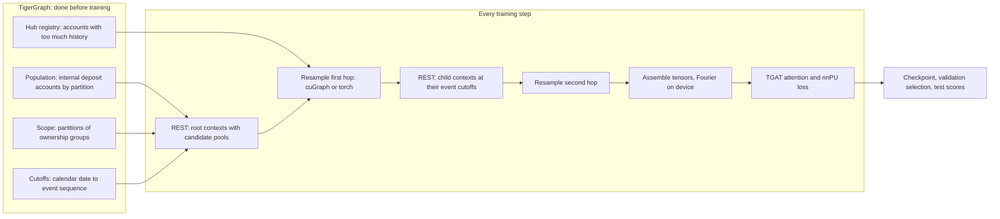
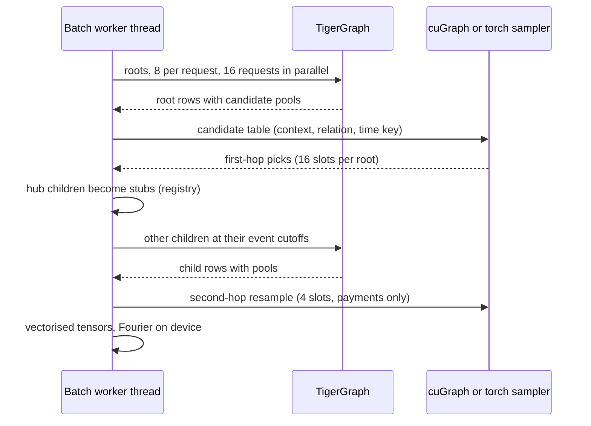

# Temporal mule detection: end-to-end guide

This guide explains how the live temporal training pipeline works from the data in
TigerGraph to a trained checkpoint, what every query reads and returns, how batches are
sampled (with cuGraph on CUDA), and how to run training on a CUDA machine. It describes
the v5 contract (`CONTRACT_VERSION = "temporal_live_v5_candidate_pools"`).

Deeper references: [live temporal training](live_temporal_training.md) (behaviour details
and configuration semantics), [GSQL feature catalog](gsql_feature_catalog.md) (every
feature formula), [temporal schema](temporal_schema.md), [leakage and
scaling](leakage_and_scaling.md) and the [feature redesign](feature_redesign.md).

## The idea in one paragraph

Every account is scored at a calendar cutoff from its own payment history and the history
of its counterparties, exactly as it looked before that cutoff. TigerGraph does the heavy
work: it filters events by time and by experiment partition, computes all features, and
returns a bounded pool of candidate neighbours for each context over REST. The client
resamples a fixed fanout from those pools (with cuGraph on the GPU during training on
CUDA), expands time deltas into Fourier features, and trains a memoryless
[TGAT](https://arxiv.org/abs/2002.07962)-style attention model with a non-negative
positive-unlabeled (nnPU) loss. No account ID is a model parameter, so the same weights
score accounts that never appeared in training.



## The data in TigerGraph

Graph `Mule_Pattern_Learner` on TigerGraph 4.2.5, built from
[temporal_schema.gsql](../gsql/schema/temporal_schema.gsql). Counts measured on 24
September 2026:

| Vertex type | Count | Role |
|---|---|---|
| Payment_Transaction | 114,515,477 | One non-Zelle payment event (rails card, unknown, cash, internal, ach, check) |
| Zelle_Transfer | 1,225,864 | One Zelle payment event |
| Account | 788,283 | 317,840 internal deposit (the scored population), 434,783 internal credit, 35,660 external |
| Party | 200,000 | Account owner |
| Token | 144,910 | Zelle token (email or phone alias) |
| Device | 374,192 | Device seen on payments and tenures |
| IP | 1,311,576 | IP address seen on payments and tenures |
| Address | 196,409 | Party address |
| Temporal_Training_Scope | 2 | Experiment metadata (`strict_mule_v1`, `strict_mule_v2`) |

Every event carries `event_ts_ms` (millisecond time) and `event_seq` (a single global
chronological sequence shared by events and association changes). Events run from
2024-01-01 to 2024-12-31, about 8.4 to 11.0 million payments per month. All amounts are
present and all currencies are USD.

Participation edges connect each event to its accounts and tokens with explicit roles and
repeated clocks: `Transaction_From_Account` / `Transaction_To_Account` /
`Transaction_From_Token` / `Transaction_To_Token` and `Transfer_From_Account` /
`Transfer_To_Account` / `Transfer_From_Token` / `Transfer_To_Token`, plus `*_Used_Device` and
`*_Used_IP`. The context query requires exactly one sending account and at most one
recipient account and one recipient token (at least one of them) per event. On this graph
every payment has one From and one To account and no token edges, and every Zelle transfer
has one of each of the four roles.
Their reverse edges (`Account_Initiated_Transaction`, `Account_Received_Transaction`,
`Account_Sent_Zelle_Transfer`, `Account_Received_Zelle_Transfer`) are the four payment
relations the model sees: `payment_out`, `payment_in`, `zelle_out`, `zelle_in`.

Valid-time association edges (`Party_Owns_Account`, `Party_Uses_Token`,
`Token_Bound_To_Account`, `Party_Uses_Device`, `Account_Uses_Device`, `Party_Uses_IP`,
`Party_Has_Address`, each with a reverse edge) carry `valid_from_seq` and `valid_to_seq`
(0 means still open). They give 14 association relations.

Label attributes on Account (`is_mule`, `is_mule_masked`, `pu_label`, `mule_ring_id`,
`mule_label_*`) and Zelle_Transfer (`fraud_label`, `label_*`) are supervision only. No
training or scoring query reads them, with one opt-in exception described under
[labels](#labels-and-what-the-model-never-sees).

### Hubs

Some accounts are enormous: 4,988 have more than 2,048 incoming payments and the
largest has 3,814,933. Every one of them is an external account. In a sample of
2,000 internal deposit accounts, 95% had a hub among their eight most recent payments, so
hubs appear as neighbours in almost every batch. Scanning a hub's history for each
neighbour context would cost seconds per context and exceed the per-relation history cap.
The pipeline handles them with a hub registry and client-side stubs (see [hubs and
stubs](#hubs-and-stubs)).

## What runs where

| Stage | Command | TigerGraph work | Writes to TigerGraph? |
|---|---|---|---|
| Install queries | first `train` (or `mule-temporal install`) | Creates and compiles the training queries that are stale, plus the queries that call them | Query catalog (and the Temporal_Training_Scope schema if it is missing) |
| Create the experiment scope | first `train`, when the scope is missing | Partitions every Account and Party into train, validation or test | One scope vertex and one membership edge per Account and Party |
| Reveal known mules | first strict `train`, when the graph has no known labels | Simulates each mule's discovery and reveals up to 20 per split ([label reveal](label_reveal.md)) | The label-contract attributes of every internal Account |
| Prepare the dataset | every `train` (or `mule-temporal prepare`) | Pages the population, resolves cutoffs, builds the hub registry | No |
| Train | `mule-temporal train` | Two rounds of context queries per step | No |
| Score, evaluate | `score`, `score-new`, `evaluate-final` (and `evaluate`) | Context queries for the scored accounts; `evaluate-final` also pages the test population; `evaluate` reads saved predictions and the graph's label contract (or a `--truth` file) | No |

`mule-temporal` is `python -m mule_pattern_learner.temporal.live.cli` (the entry point exists
after `pip install -e .`; the project needs an editable install because it reads `gsql/`
from the repository). Every setting is built in (`DEFAULT_RUN` in
[config_schema.py](../src/mule_pattern_learner/temporal/live/config_schema.py)), so no
command needs a configuration file; `--config overrides.toml` changes only the keys it
sets. The dataset identity is the scope's recorded source (or, for a new scope, the graph
name plus a hash of its vertex counts), and the prepared cohort is written to
`<run>/prepared/` inside the run directory. Only `.env` is required.

## The queries and the data they pull

All training queries live in `gsql/temporal/` and `gsql/features/`. Installation checks
the server text against the repository and refuses to train if they differ or if an
endpoint is not enabled. The context query is generated from
[queries.py](../src/mule_pattern_learner/temporal/live/queries.py) by
`scripts/temporal/render_training_queries.py`; `--check` and the test suite fail if the file
and the Python feature contract drift apart.

### temporal_create_training_scope (once per experiment)

- **When:** the first `train` or `prepare`, only if the configured `scope_id` does not
  exist (set `create_scope = false` to forbid the write).
- **Reads:** every Account and Party, all `Party_Owns_Account` tenures (all time), and,
  for the `linked` rule, every Payment_Transaction and Zelle_Transfer of unowned internal
  accounts with their counterparty accounts. Never reads labels.
- **Computes:** ownership components (label propagation of the minimum internal vertex ID
  over ownership edges). Each component gets partition 1 (train, 70%), 2 (validation,
  15%) or 3 (test, 15%) from a seeded hash of the component ID.
- **Unowned accounts** (`unowned_policy`, config `scope_unowned`):
  - `independent`: each unowned account is its own component (the old rule; `strict_mule_v1`).
  - `shared`: unowned external accounts and unowned bank ledger accounts
    (`account_type = "gl"`, the bank's income books for fees and interest) get partition 1
    (visible in every phase), like tokens and devices.
  - `linked` (the config default; the query parameter defaults to `independent`; used by
    `strict_mule_v2`): as `shared`, and an unowned internal account
    whose only owned internal deposit counterparty is one account D joins D's component
    and partition. Internal credit accounts are not owned in this data but almost always
    transact with exactly one deposit account (their holder); linking them keeps a held-out
    holder's card activity out of training and keeps a training root's own card payments
    visible in training.
- **Writes:** one `Temporal_Training_Scope` vertex (`ready = false`) and one
  `Entity_In_Training_Scope` edge per Account and Party with `partition` and `group_id`.
- **Result for strict_mule_v2:** 988,283 members; 414,074 internal accounts linked,
  20,709 internal accounts left independent, 35,660 external accounts shared. The owned
  components (every internal deposit account) kept exactly the partitions of
  `strict_mule_v1`, so the observed-label splits are unchanged.

### temporal_finalize_training_scope and temporal_scope_policy

- `temporal_finalize_training_scope(scope_id, expected_members)` reads every membership
  edge, checks the count and that each partition is 1 to 3 with a group ID, then sets
  `ready = true`. Queries refuse unready scopes.
- `temporal_scope_policy(scope_id)` (read-only, about 0.7 s) counts unowned member
  accounts by class (shared, independent, linked) and side (internal, external). The
  client infers the stored rule from these counts and refuses to run when it differs from
  `scope_unowned`. It runs at preparation and at the start of every streamed run.

### temporal_scope_population (preparation)

- **Reads:** the scope's membership edges (partition, group_id) and, for each internal
  deposit Account, `id`, `first_seen_seq`, `first_seen_ts_ms`. With
  `include_observed = TRUE` (only for `label_policy = "graph_observed"`) it also reads the
  revealed-positive label (see [labels](#labels-and-what-the-model-never-sees)).
- **Returns:** pages of at most 10,000 rows ordered by account ID:
  `account_id, first_seen_seq, first_seen_ts_ms, partition, group_id, observed_positive,
  known_from_ms`.
- **Client side:** keeps label-blind hash reservoirs (20,000 train, 2,000 validation,
  2,000 test accounts opened before their split's cutoff) plus the observed positives. For
  `strict_mule_v2`: population 222,337 / 47,754 / 47,749 by split, 24,059 prepared rows.

`temporal_training_population` is the unscoped equivalent used only by the legacy
`shared_history` protocol, which cannot prepare on this graph (it caps at 100,000 accounts).

### temporal_training_cutoffs (preparation, score-new)

- **Reads:** `event_ts_ms` and `event_seq` of every event, `first_seen_*` of every entity.
- **Returns:** for each calendar cutoff (midnight minus 1 ms) the largest sequence visible
  at that time. The client uses `cutoff_seq = value + 1`, so history is
  `event_seq < cutoff_seq AND event_ts_ms <= cutoff_ms`.
- **Result:** the query returned 61,035,551, 89,141,830 and 120,799,197, so the client
  `cutoff_seq` is 61,035,552 for 2024-07-01, 89,141,831 for 2024-10-01 and 120,799,198 for
  2025-01-01 (every event, since the data ends on 2024-12-31). About 6.6 s installed.

### temporal_hub_registry (preparation, score-new)

- **Reads:** all-time `outdegree()` of the four payment relations for every Account (an
  O(1) prefilter), then, for the candidates only, the `event_seq` of each payment edge
  and, in a scope, the partitions of each event's From and To accounts.
- **Returns:** rows `account_id, cutoff_seq, visibility_phase, max_visible, max_degree,
  reason` for every (account, cutoff, phase) whose largest per-relation count of events
  visible before the cutoff in that phase exceeds the threshold (the sampler's
  `max_history`, 2,048). Counting uses the same endpoint-blocking rule as the context
  query, so no event after the cutoff and no event hidden in the phase can make an
  account a hub. `max_degree` is informational only.
- **Result for strict_mule_v2 (hubs per cutoff and phase):**

  | Cutoff | Phase 1 (train) | Phase 2 (validation) | Phase 3 (test) |
  |---|---|---|---|
  | 2024-07-01 (61,035,552) | 3,336 | 3,726 | 4,019 |
  | 2024-10-01 (89,141,831) | 4,055 | 4,399 | 4,765 |
  | 2025-01-01 (120,799,198) | 4,662 | 5,180 | 5,602 |

### temporal_training_context (every batch)

This is the query that produces the model inputs. One REST call carries 1 to 64 requests,
each an entity at its own cutoff:

| Parameter | Meaning |
|---|---|
| `node_types`, `node_ids` | Entity type (Account, Token, Party, Device, IP, Address) and primary ID per request |
| `cutoff_seqs`, `cutoff_times` | Exclusive sequence and inclusive millisecond watermark per request |
| `per_relation`, `k_old`, `k_div` | Candidate pool per payment relation: most recent events, rank-stratified older events, events with new counterparties |
| `k_assoc` | Most recent active tenures per association relation (0 for children) |
| `max_history` | Visible events allowed per payment relation (2,048) |
| `scope_id`, `visibility_phase` | Experiment scope and phase (1 train, 2 validation, 3 test); empty scope means unscoped |
| `emit_encodings` | Also print the 64-dimensional Fourier vectors (only for periodic parity checks) |
| `include_*` (14 flags) | Which feature groups to compute |

Per request, the query:

1. Resolves the ID with a typed lookup; an unknown ID returns `missing_entity`.
2. Checks the entity was first seen at or before the cutoff and, in a scope, that its
   partition is at most the phase; otherwise `invisible_entity`.
3. For each payment relation, scans the entity's adjacency once with
   `event_seq < cutoff_seq AND event_ts_ms <= cutoff_ms`, drops every event with a From or
   To account outside the visible partitions (before any feature or sampling), keeps USD
   events, validates roles and clocks, and fails the request with
   `history_capacity_exceeded` when more than `max_history` events are visible.
4. Keeps the pool: `per_relation` most recent events, `k_old` older events at evenly spaced
   recency ranks, and `k_div` more recent events whose canonical counterparty is new.
5. Computes pair history (for Accounts one ascending pass over the retained history; for
   Tokens a scan of the sender's history) and flow timing (Accounts only).
6. Reads active association tenures at `cutoff_seq - 1` and keeps the `k_assoc` most
   recent per relation.
7. Enriches all kept events in set-based selects: counterparty type, ID, first-seen time,
   external and deposit flags, and optional device and IP first-seen times.
8. Prints one row. A per-request failure prints `{status, request_index}` and the query
   continues with the next request, so one bad key never costs the others.

The row returned for a request:

- `status: "ok"`, `request_index`, `contract_version`, `basis_id`, the request key
  (`node_type`, `node_id`, `cutoff_seq`, `cutoff_ms`, `scope_id`, `visibility_phase`),
  `diagnostics` (non-USD and visible participation counts, never model inputs).
- `features`: node features of the entity (v5 default: `is_external`, `is_deposit`;
  optional summary groups add rolling windows, recency, association counts, decayed
  activity and more; see the [catalog](gsql_feature_catalog.md)).
- `messages`: the candidate pool. Each message has 34 fields: identity (`node_type`,
  `node_id` of the counterparty, `relation`, `rail`, `channel`, `event_id`, `event_seq`,
  `event_ts_ms`, `stratum`), payload (`amount`, `amount_present`), time (`age_ms` = cutoff
  minus event time; `gap_ms`, `gap_present` = time since the previous event of the same
  directed pair and rail), pair history (`pair_prior_count`, `pair_first_age_seconds`,
  `pair_first_present`, legacy `pair_count_1h/1d/7d`), flow timing (`flow_delay_seconds`,
  `flow_present`, `flow_censored`, `flow_observation_seconds`, `flow_amount_ratio`,
  `flow_ratio_present`, `flow_same_rail`), counterparty metadata (`peer_first_ms`,
  `peer_external`, `peer_deposit`) and optional device and IP ages. Association messages
  carry the tenure target with the parent's cutoff clocks.
- `age_encoding`, `gap_encoding`: empty unless `emit_encodings` is set.

Flow timing measures coincidence, not the movement of the same dollars (the schema has no
balances): for an incoming payment, the delay to the account's next outgoing payment
before the cutoff (censored when there is none yet); for an outgoing payment, the time
since the previous incoming payment, with an amount ratio and a same-rail flag.

Pool sizes in the v5 configuration:

| Context | per_relation / k_old / k_div / k_assoc | Largest pool |
|---|---|---|
| Root (hop 1) | 8 / 4 / 4 / 2 | Contract bound 4 x 16 + 14 x 2 = 92; an Account root has 3 association relations, so at most 4 x 16 + 3 x 2 = 70 messages |
| Child (hop 2) | 4 / 2 / 2 / 0 | 4 x 8 = 32 messages |

Children use the same query with `include_*` flags limited to what the model reads for a
child (node metadata and message groups; root-only summaries are skipped).

### temporal_fourier64_values and temporal_fourier64

The fixed time basis shared by GSQL and Python: `u = ln(1 + delta_ms / 1000) /
ln(1 + 34,560,000)` (400 days in seconds), 32 frequencies `f_i = 0.125 * 16^(i / 31)`,
output `sin(2 pi f_i u), cos(2 pi f_i u)` for i = 0..31. The context query calls it only
when `emit_encodings` is set. The client computes the same basis on the device from
`age_ms` and `gap_ms`, which cuts the REST payload by about 70%. The first request of every
source and every 64th request ask TigerGraph for the vectors and fail the run if any
coordinate differs from the client's by more than 1e-5 + 1e-5 x |value| (at most 2e-5;
measured: 3.7e-7).

## Building one training batch

`make_live_batch` in [batching.py](../src/mule_pattern_learner/temporal/live/batching.py)
builds a two-hop computation tree for the batch's roots (64 in the v5 configuration, at most
128; internal deposit accounts at the
split's cutoff, all in one scope phase).



### Resampling the fanout

The sampler policy is `resample`. For every context and relation it keeps a uniform random
subset of at most `relation_fanouts[hop - 1]` payment candidates (8 at hop 1, 4 at hop 2),
or `association_fanout` (1) per association relation, then fills the fixed slots:

- Hop 1 (16 slots): payments interleaved position by position across `zelle_out`,
  `zelle_in`, `payment_out`, `payment_in`; up to `association_slots` (2, and at most a
  quarter of the slots) reserved for associations; empty slots backfilled.
- Hop 2 (4 slots per child): payments only.

Training draws a fresh subset every step from a step seed (a stable hash of seed, epoch
and step), so the model sees different neighbours of the same account in every epoch
without extra queries beyond the per-step REST calls. Evaluation, validation and scoring
use device-independent hash keys (`splitmix64` of an evaluation seed, the hop, the context
and the candidate), so every machine produces the same scores.

The deterministic `recent` and `stratified` policies of the legacy profile remain
available and unchanged.

### cuGraph on CUDA

With `backend = "auto"` on a CUDA device, the training sampler is `CuGraphSampler` in
[sampler.py](../src/mule_pattern_learner/temporal/live/sampler.py), built on pylibcugraph
26.8 (26.10 is also supported):

- The candidate table becomes a batch-local graph: one vertex per context, one vertex per
  candidate, one edge per candidate, edge type = relation (int32), edge time key (int64) =
  `2 * event_seq` for payments and `2 * cutoff_seq - 1` for associations.
- `heterogeneous_uniform_temporal_neighbor_sample` (26.8) or `neighbor_sample` with
  `starting_vertex_end_times` (26.10) samples with seeds = contexts, seed time
  `2 * cutoff_seq`, `temporal_sampling_comparison = "strictly_decreasing"`, a fan-out per
  relation, no replacement and `random_state` = the hop seed (the step seed at hop 1, a
  derived stream at hop 2).
- Host arrays are copied to the device once and passed zero-copy through DLPack as
  contiguous CuPy arrays; each thread keeps its own
  ResourceHandle.
- The result is checked. On the GPU: every sampled edge is strictly earlier than its seed
  time (a leakage assertion), every edge belongs to its seed, no candidate is drawn twice,
  and every (context, relation) gets exactly `min(candidates, fan-out)` picks.
- A functional probe runs once per process and device before cuGraph is chosen. If it
  fails, `auto` falls back to the torch sampler (with a warning when cupy and pylibcugraph
  are installed); `backend = "cugraph"`
  raises instead. The resolved backend is recorded in the checkpoint; resuming with a
  different backend is refused unless the config names the new one explicitly.

Elsewhere (CPU, Apple MPS, or no pylibcugraph) the torch grouped sampler implements the
same distribution. For one step seed the two backends draw different but equally
distributed subsets.

### Hubs and stubs

A child is a stub when the registry lists it at the earliest cutoff among the roots that
reach it, in the batch's phase. A stub is built locally without a query: type Account,
`is_external` and `is_deposit` from the connecting message, `history_withheld = 1`, no
messages. Outermost counterparties get the same `history_withheld` flag in their base
features. Because a child's cutoff is always before its root's cutoff, a non-stub Account
child can never exceed `max_history`; a Token child above the cap (none exist here) would
be rejected and masked like any other rejected child. In a measured 64-root batch, 357 of about 960 contexts were
stubs.

A child that TigerGraph still rejects is masked out of the first hop and counted. A
rejected root fails the run unless `max_rejected_root_fraction` allows it (default 0.0; a
rejected observed positive always fails).

### Tensors

The v5 profile (`feature_groups = entity_meta, hub_indicator, message_core, time_encoding,
pair_history, flow_timing`, `architecture = "split"`) produces, for B roots and N unique
contexts:

| Tensor | Shape | Content |
|---|---|---|
| `x` | N x 9 | Six entity-type indicators, `is_external`, `is_deposit`, `history_withheld` |
| `first_edge` | B x 16 x 142 | Hop-1 message features |
| `second_edge` | N x 4 x 142 | Hop-2 message features |
| `second_x` | N x 4 x 9 | Base features of the outermost counterparties |
| `*_relation`, `*_rail`, `*_channel`, `*_stratum` | slot indices | Categorical embeddings |
| `*_mask`, `root_positions`, `neighbor_positions` | | Padding masks and batch-local positions |

The 142 message columns are `amount`, `amount_present`, `is_event`, `gap_present`, 64 age
Fourier, 64 pair-gap Fourier, three pair-history and seven flow-timing values. Counts,
amounts, durations and the flow amount ratio get `log1p`; flags and Fourier coordinates pass
through. Batch-local
positions come from `BatchIndex`: the same account at two cutoffs is two contexts, and no
global ID table exists.

## The model and the loss

`LiveTGAT` ([model.py](../src/mule_pattern_learner/temporal/live/model.py), 83,457
parameters in the v5 profile, hidden 64, 4 heads, dropout 0.15):

1. Project node features (9 to 64) for every context and base features (9 to 64) for
   outermost peers.
2. Message embedding = `Linear(142 to 64)` of the message features plus relation (18) and
   rail (7) embeddings.
3. Attention block 1: every context attends over itself and its hop-2 messages.
4. Attention block 2: every root attends over itself and its hop-1 neighbours (their
   block-1 outputs plus the hop-1 message embeddings).
5. An MLP head gives one logit per root.

Loss: nnPU ([Kiryo et al., 2017](https://arxiv.org/abs/1703.00593)) with the class prior
`class_prior = 0.001` as an explicit prevalence assumption and `positive_weight = "prior"`
(the textbook objective). Each step uses 16 observed training positives (with replacement)
and 48 accounts from the label-blind training marginal. Unlabeled accounts are never
treated as negatives.

## The training loop

`train()` in [training.py](../src/mule_pattern_learner/temporal/live/training.py):

- **Checks before anything runs:** the prepared manifest, the query hashes, the
  preparation keys, the installed query texts and endpoints, live vertex counts (excluding
  experiment metadata), the scope header and its unowned rule, and that the context source
  extracts the prepared feature groups, covers every model input and uses the model's pools.
- **Schedule:** deterministic per epoch (date, root indices, step seed). `steps_per_epoch`
  bounds an epoch (100 in the v5 configuration; when unset an epoch is one pass over the
  training reservoir, 417 steps of 48 accounts here).
- **Prefetch:** `prefetch_batches` (2) worker threads build upcoming batches while the
  current step trains; results are consumed in order, so the run is reproducible. All
  workers share one bounded pool of REST requests.
- **Determinism:** `deterministic = true` enables deterministic algorithms (warn-only on
  CUDA, `"strict"` to make it fatal); the CLI sets `CUBLAS_WORKSPACE_CONFIG=:4096:8` before
  CUDA starts. The deterministic-algorithm and thread settings are restored afterwards.
- **Validation and selection:** after each epoch, validation roots (the revealed validation
  positives, 11 on this graph, plus a fixed sample of 2,000 unlabeled accounts at 2024-10-01, phase 2) are scored in
  evaluation mode. The best epoch by validation average precision is kept; training stops
  after `patience` (6) epochs without improvement. The threshold maximises validation F1.
  These are observed-label proxy metrics, not true detection rates.
- **Checkpoints:** `<run>/checkpoint_last.pt` after every epoch (and every
  `checkpoint_every_steps`) with model, optimiser, all RNG states, schedule position, best
  weights, history and counters. Running `train` again continues exactly: a resumed run
  reproduced the uninterrupted run's epoch-2 loss and validation AP to every digit.
- **Failures:** availability errors (connection errors, HTTP 408, 429 and 5xx other than a
  bare 500, HTML gateway pages, the Cloud "Starting workspace" page) are retried with
  jittered backoff for up to `max_outage_s` (900 s), with a shared pause across threads.
  Suspected deterministic failures (a bare HTTP 500, a response that is neither JSON nor
  HTML, query out of memory) are retried once. A server timeout on a single-key request is
  retried once; a multi-key context request that times out is split in half at once, until
  the slow key is found and named. `max_query_attempts` (6) caps the attempts that count.
- **Outputs:** `models/temporal/<name>.pt` (selected weights, threshold, contracts and
  fingerprints) and `<name>_run/` with `prepared/` (the cohort, labels, cutoffs and hub
  registry this run was trained on), `config.json`,
  `checkpoint_last.pt`, `progress.jsonl` (start, train records per logging interval,
  evaluate, epoch and complete events), `validation_predictions.parquet`,
  `test_predictions.parquet` and `metrics.json`.

Test roots (the 2025-01-01 cutoff, that is 2024-12-31 23:59:59.999 UTC, phase 3) are scored
once with the frozen checkpoint and threshold; they never influence selection.

## Labels and what the model never sees

- Observed labels come from the graph (`label_policy = "graph_observed"`, the default): the
  revealed positive `pu_label == 1 AND is_mule == 1 AND mule_label_known AND NOT
  is_mule_masked` with its discovery time `mule_label_available_ts_ms`. An experiment may
  instead supply a Parquet table (`observed_labels`, with `account_id`, `known_positive`,
  `known_from_ms`).
- The first run's [label reveal](label_reveal.md) simulates when a bank would have
  discovered each mule (victim reports, network tracing, monitoring) and reveals up to 20
  per split among those discovered before the split's cutoff. On this graph that is 20
  training, 11 validation and 20 test positives: only 11 validation mules were
  discoverable by 1 October, and the shortfall is never filled. A positive is usable only
  when known before the scoring cutoff.
- Labels are never features. The context, cutoff, hub, scope-creation and scope-policy
  queries read no label attribute; the population queries read the revealed positive only
  with `include_observed = TRUE`. The test suite checks the rendered GSQL for oracle
  attribute names.

Leakage controls:

| Risk | Control |
|---|---|
| Future events | `event_seq < cutoff_seq AND event_ts_ms <= cutoff_ms` in every scan; associations at `cutoff_seq - 1`; cuGraph asserts strictly earlier edge times |
| Neighbour sees its own future | A child context uses the connecting event as its cutoff |
| Held-out groups | Scope partitions; any event with a held-out From or To account is removed before features and sampling |
| Hub decision uses the future | Hub counts use only events before the root's cutoff and visible in its phase |
| Label leakage | No label attribute in any training query; labels only via the observed-label source |
| Selection on test | Checkpoint and threshold come from validation only |

## Performance and scale

Measured on 24 September 2026 against the installed queries (TigerGraph Cloud, from a
MacBook with an M2 Max):

| Measurement | Result |
|---|---|
| One root context | 0.25 s |
| 64 root contexts in one request | 3.5 s |
| Feature parity (3 accounts, 33 to 972 events) against an independent Python reference | Passed |
| One 64-root training batch, 8 contexts per request, 16 in parallel | 11 to 12 s cold (76 REST calls, about 960 contexts, 357 stubs) |
| Same batch, 16 contexts per request, 8 in parallel | 19.6 s |
| Warm step with prefetch | 4.9 s in the smoke run |
| Optimiser step on MPS | 0.5 s (first step) |
| Two-epoch smoke run (3 steps per epoch, 60 validation and 60 test roots) | 90 s, 0 rejections |
| Scope creation plus preparation | 6 min 19 s |
| Installing every training query | about 50 min (the context query dominates). The command stops waiting after 45 min, so re-run `mule-temporal install` until it reports every query up to date; later installs only recompile changed queries |

Training is bound by TigerGraph, not the GPU. At about 11 s per step, an epoch of 100
steps plus validation of 2,020 accounts takes roughly 25 minutes, so 30 epochs is at most
about 12.5 hours before early stopping. Client memory is bounded: batch-local IDs, an LRU
of at most 256 contexts, seed reservoirs of at most 20,000 per split, and batch admission
limits checked before any request. Server work per context is proportional to the
context's all-time adjacency in each payment relation (scans are not indexed by time), and
at most 2,048 visible events per relation are kept. Hubs never reach the server as
children.

Levers when more speed is needed: raise `query_concurrency` on a larger TigerGraph
instance, shrink the child pool, or move to the future work listed below.

## Running on the CUDA machine

1. **Get the code.** The v5 work is in the `temporal` branch working tree; commit and push
   it, then clone or pull it on the CUDA machine.
2. **Environment.** Linux x86_64, an NVIDIA driver for CUDA 12 (525.60 or newer) or CUDA
   13 (580.65 or newer), Python 3.12 to 3.14.

   For CUDA 12, install the CUDA torch wheel first:

   ```bash
   pip install torch==2.13.0 --index-url https://download.pytorch.org/whl/cu129
   ```

   Then install the project with the cuGraph extra (the CUDA 12 cuGraph wheels are on
   pypi.nvidia.com):

   ```bash
   pip install -e '.[model,dev,cuda12]' --extra-index-url=https://pypi.nvidia.com
   ```

   For CUDA 13, use the cu130 torch wheel and the `cuda13` extra, which is on pypi.org:

   ```bash
   pip install torch==2.13.0 --index-url https://download.pytorch.org/whl/cu130
   ```

   ```bash
   pip install -e '.[model,dev,cuda13]'
   ```

3. **Copy `.env`** (`HOST`, `GRAPHNAME`, `SECRET`). Nothing else is copied: settings are
   built in, the known mules are in TigerGraph, and the run prepares its own cohort.
4. **Check cuGraph** (exit code 0 means every check passed, 2 means cuGraph cannot run):

   ```bash
   python scripts/temporal/verify_cugraph_sampler.py
   ```

   Then build one real batch per backend and run a deterministic CUDA step twice (this
   prepares the default run's cohort first, which `train` then reuses):

   ```bash
   python scripts/temporal/verify_cugraph_sampler.py --live
   ```

5. **Qualify one real batch** with the configured transport:

   ```bash
   python scripts/temporal/benchmark_live_batch.py --train-step --device cuda
   ```

6. **Train** (run it in `tmux` or with `nohup`; `progress.jsonl` shows progress):

   ```bash
   mule-temporal train
   ```

7. **Resume** after any interruption by running the same command again; it continues
   from `models/temporal/model_run/checkpoint_last.pt`.

8. **Score new accounts** (one ID per line; rejected IDs go to `<output>.rejected.txt`):

   ```bash
   mule-temporal score-new --checkpoint models/temporal/model.pt --accounts new_accounts.txt --date 2025-01-01 --output artifacts/new_scores.parquet
   ```

Keep the TigerGraph graph frozen during training. Every streamed run rechecks counts,
query texts and the scope when it starts (and on resume) and refuses to run if they changed;
changes made while a run is in progress are not detected.

## Configuration reference

The run settings are `DEFAULT_RUN` in
[config_schema.py](../src/mule_pattern_learner/temporal/live/config_schema.py) plus the
operational defaults beside it. An optional `--config` TOML or JSON file overrides keys.
Tables merge key by key, so `[sampler] backend = "torch"` or `[dates] train = [...]`
changes only that key; lists and scalars replace the default; a `[sampler]` table that
names another `policy` replaces the whole sampler table, because pool settings of one
policy do not apply to another. Unknown keys are rejected.

| Group | Keys (built-in value) |
|---|---|
| Scope | `scope_id` (strict_mule_v2), `scope_unowned` (linked), `create_scope` (true: created on first use), `evaluation_protocol` (strict_inductive); `dataset_id` is derived from the scope or the graph (a pinned value must match the prepared dataset) |
| Labels | `label_policy` (graph_observed), `reveal_per_split` (20), `reveal_salt` (defaults to `seed`), `evaluation_unlabeled_limit` (2000) |
| Dates | `[dates]` train 2024-07-01, validation 2024-10-01, test 2025-01-01; `[seed_limits]` 20000 / 2000 / 2000 |
| Sampler | `[sampler]` policy resample, recent 8, older 4, distinct 4, associations 2, max_history 2048, relation_fanouts [8, 4], association_fanout 1, association_slots 2, backend auto, evaluation_seed 0; `[sampler.children]` 4 / 2 / 2 / 0 / 2048 |
| Model | `fanouts` [16, 4], `feature_groups`, `architecture` split, `hidden` 64, `heads` 4, `dropout` 0.15 |
| Optimisation | `batch_size` 64, `epochs` 30, `steps_per_epoch` 100, `patience` 6, `learning_rate` 0.001, `weight_decay` 0.0001, `class_prior` 0.001, `positive_weight` prior, `seed` 42 |
| Runtime | `device` auto, `threads` 4, `deterministic` true, `prefetch_batches` 2, `checkpoint_every_steps` 0, `log_every_steps` 10, `max_rejected_root_fraction` 0.0 |
| Transport | `request_batch_size` 8, `query_concurrency` 16, `context_lru_capacity` 256, `encoding_check_every` 64, `max_query_attempts` 6, `max_outage_s` 900 |

Preparation keys (the derived dataset_id, an optional shared `prepared_id`,
evaluation_protocol, scope_id, scope_unowned, dates, seed_limits, split_seed, cohort_seed,
label_policy and any observed-label file hash, context_storage, the candidate pools, and
the extraction groups derived from feature_groups) must match between preparation and
training; other settings may change between runs. A new `--output` prepares its own
cohort; `--dataset <run>_run/prepared` reuses another run's.

## Troubleshooting

| Message | Meaning and fix |
|---|---|
| `Installed query differs from repository source or is not installed` | Run `mule-temporal install`; it recompiles only the stale queries (the context query alone takes most of the roughly 50 minutes a full install needs) |
| `Prepared dataset ... was built from different GSQL sources` | The GSQL changed after preparation; train into a new `--output` (the first run installs the current queries) |
| `Account label contract violated after the reveal` | The label attributes are inconsistent; see [label reveal](label_reveal.md) and run `temporal_validate_account_supervision` |
| Scope rule mismatch | The scope was created with another `scope_unowned`; use the stored rule or a new `scope_id` |
| `Live graph counts changed; freeze the source and prepare a new dataset` | The graph was modified after preparation; freeze it and prepare a new dataset |
| `TigerGraph rejected ... training roots so far` or `validation: TigerGraph rejected ... roots` | Roots failed a per-request check beyond `max_rejected_root_fraction`, or an observed positive was rejected; the statuses name why (for example `history_capacity_exceeded`) |
| cuGraph probe warning | pylibcugraph or the GPU failed the probe; training continues with the torch sampler; run `verify_cugraph_sampler.py` |
| Retries in the log | TigerGraph was briefly unavailable or resuming; the run waits up to `max_outage_s` |

## Limitations and future work

- The cuGraph path has not run on real hardware yet; run the verification script on the
  CUDA machine first. At these batch sizes cuGraph's per-call overhead may exceed the torch
  sampler's; `backend = "torch"` is always a safe choice.
- Hub histories are withheld (the model sees only the flag and the connecting payments).
- 20,709 unowned internal accounts could not be linked to a single holder and keep
  independent partitions.
- Requests are processed one after another inside each REST call. Processing all
  requests of a call together, and materialising the event-intrinsic pair features (they
  do not depend on scope or cutoff), would reduce TigerGraph time per step.
- The legacy profile's pair-window counts scan each sender's full outgoing history; keep
  it as a control, not for large runs.
- `evaluate-final` needs complete 0/1 truth for the test population. The graph's label
  contract provides it by default; a `--truth` file must list negatives as well as
  positives.
- No mule-detection quality has been established. With 20 revealed training positives,
  compare `positive_weight` settings and several seeds on validation before drawing
  conclusions.
